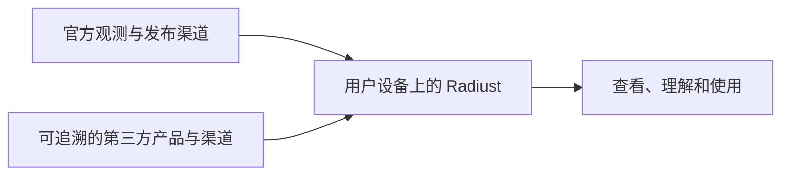

# Radiust 理念

**Radiust 让普通人能够方便地获取、理解和使用公共气象雷达观测。**

候选品牌标语：**Public radar, directly to you.**

公共雷达信息应当在实际使用中也对公众可用。用户不必了解接口、文件格式或编写代码，就应该能够查看自己关心的地区，知道观测有多新、信息来自哪里，以及图像能说明什么。

## 为公众完成访问路径

普通公众是项目的首要受众。Desktop 将承担查看、播放、理解和切换雷达观测的体验；CLI、SDK 和核心库提供可复用的获取与处理能力。开发者和研究者也可以使用这些能力，继续构建自己的工具。

Desktop 是规划中的产品入口，当前仓库主要交付 CLI、Python SDK 和 Rust 核心库。理念说明与[发展路线](ROADMAP.md)表达目标，不代表桌面功能已经交付。

## 用户掌握连接

数据获取默认发生在用户设备上。发现、下载、缓存、解码和展示在本地完成，核心观测功能无需 Radiust 账号，也不依赖 Radiust 运营的数据中转服务器。项目网站不可用时，已安装的软件仍应能够连接尚可用的数据源。

这里的去中心化指 Radiust 不成为必经的数据服务中心。所选上游本身可能是集中服务，也可能要求用户配置凭据。用户主动选择的远端存储属于输出能力，不改变默认本地获取的原则。

## 官方优先，多源互补

官方来源优先；可靠、来源透明的第三方产品也可以接入。同一区域的多个来源可改善稳定性、分辨率、更新频率和产品选择。Radiust 提供默认来源，允许用户切换，故障时可以回退，并明确显示来源变化。

来源选择同时考虑可用性、信息质量、访问条件和维护成本。接入工作的目标是可靠的公众体验；持续增加适配器数量不能替代这个目标。官方网页或浏览器获取能力按实际条件评估，不因“公开可访问”就推定可任意使用，也不绕过授权或访问限制。

第一阶段分别展示各来源产品。第三方或官方已经发布的合成产品可以作为一个来源产品使用；Radiust 自行跨来源拼接雷达图留待后续。

## 观测与预测有各自的出处

当前先打通公共雷达观测到用户的路径。应区分完成观测的机构、加工产品的提供方和实际分发渠道；第三方加工产品需要保留可核查的上游说明，尚未确认的部分明确标注。

未来预测可以来自开源模型、传统光流或用户自己的实现。观测接口应保留时间、空间坐标、物理量、单位、缺测和处理历史，让模型能够复用数据。现有接口仍处于演进期，稳定接口是后续交付目标；当前不建设完整模型插件或运行管理系统。

预测结果需要另外标注模型、输入观测、运行时间和未来有效时间。政府观测作为输入，不意味着模型输出是政府发布的预测。AI 解释也应能够追溯其依据。

## 让能力和局限都看得见

原始雷达图像本身具有观测价值，不要求每个来源先完成定量解码才提供原图查看。数值读取、地理叠加和定量解释则需要相应的色标、几何和时间证据。未经验证的颜色映射不能当作精确反射率或雨强。

缺测、过期、来源故障和已知无降雨应可区分。播放历史帧、保留本地缓存和切换来源，都应显示实际观测时间；获取时间不能替代观测时间。Radiust 的重投影、裁剪、拼接或其他处理需要留下记录。

## 开放工具与责任边界

项目欢迎商业使用，并持续为公众提供开放、可独立使用的选择。代码保留标准 [Apache-2.0](LICENSE)；软件许可不替代[上游数据授权](DATA_SOURCES.md)，也不构成对下游产品的背书。[品牌使用规则](TRADEMARKS.md)单独说明名称和未来视觉资产的使用边界。

Apache-2.0 第 7、8 条包含保证排除和责任限制，第 9 条规定下游额外承诺的责任安排，并有适用法律等例外；这些条款不能保证免于诉讼。正式权利义务以[许可证原文](https://www.apache.org/licenses/LICENSE-2.0.html)和适用法律为准。

## 思想背景与品牌表达

G2C 和开放数据可以帮助解释公共机构的信息如何抵达公众，但产品介绍直接说明雷达用途。项目借鉴 [Open Data Charter](https://opendatacharter.org/principles/) 对及时、可访问、可使用的数据的重视，不据此宣称组织合作、认证或获得 Digital Public Goods 资格。

名称沿用 Radiust；英文标语保持候选状态。Logo、配色、字体和完整视觉系统另行设计。当前产品范围聚焦气象雷达，持续增加数据源和国家／地区覆盖，不以泛公共信息平台作为当前交付范围。

本文件记录 2026-10-06 确认的方向。具体功能与验收见[发展路线](ROADMAP.md)，现有规格生命周期见 [Spec Roadmap](.specify/memory/roadmap.md)。
