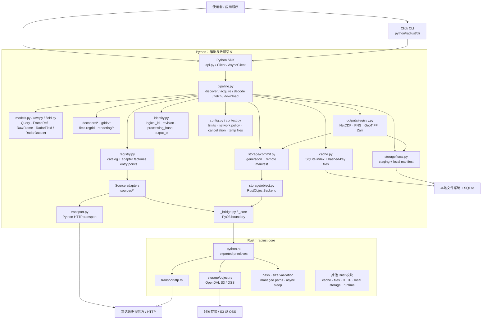
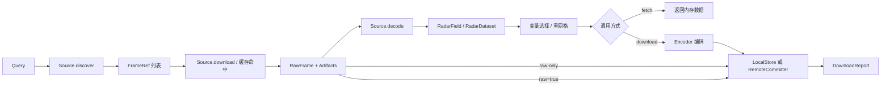
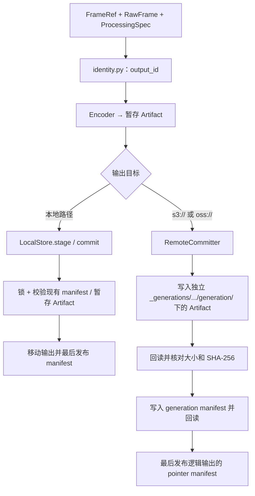

# radiust 当前架构

本文描述仓库中**已实现的代码结构**，而非目标设计或所有上游来源均已验收的声明。入口是 Python SDK/CLI，Python 负责来源适配、数据语义与流程编排；Rust Core 提供部分受限 I/O 和基础能力，通过 PyO3 暴露给 Python。项目目前是可离线验证的 `0.1.0 alpha`，不需要自建服务端。

## 1. 系统边界与模块图

**边界说明：**上图是依赖关系，不代表每条路径在一次调用中都会执行。`crates/radiust-core/src/lib.rs` 中存在缓存、瓦片、HTTP 等 Rust 模块，但当前 `python.rs` 并未把它们全部暴露为 SDK 的统一后端。例如 Python `CacheStore` 自己管理 SQLite 和文件；多数来源使用 Python `HTTPTransport`，`au` 来源使用 `_core` 的 Rust FTP；S3/OSS 的正式远端写入经 `_bridge.py` → `_core` → OpenDAL。`_bridge.py` 的哈希、校验等功能有源码开发回退，但远端对象存储要求已编译扩展。

## 2. 主要调用链

`discover` 只解析来源、产品、站点和时间等条件，得到 `FrameRef`；`acquire` 获取 `RawFrame` 并管理临时资源；`decode` 将原始资料转成带网格、质量标记和 provenance 的科学数据。`fetch` 返回独立加载的内存数据，**不进行正式输出提交**。`download` 才会选定 `ProcessingSpec`、执行编码并提交；`raw-only` 跳过科学解码，`raw=true` 同时保留原始资料。批量获取与有界预取分别由 `batch.py`、`streaming.py` 实现；同步 `Client` 使用私有事件循环，已有事件循环中的调用应使用 `AsyncClient`。

重要模型与契约：

| 对象 | 职责 | 定义位置 |
| --- | --- | --- |
| `Query` / `FrameRef` | 规范化查询及稳定的帧引用；区分有效时次、起报时次和来源定位信息 | `models.py`、`query.py` |
| `Source` | 插件契约：`discover`、`download`、`decode`；来源适配器不负责正式输出 | `sources/base.py` |
| `RawFrame` / `Artifact` | 原始文件、字节/路径载荷及临时资源的生命周期 | `raw.py`、`models.py` |
| `RadarField` / `RadarDataset` / `Grid` | NumPy/xarray 数据、坐标系、质量与重网格 | `field.py`、`grids/models.py` |
| `ProcessingSpec` / `DownloadReport` | 处理参数、格式和逐帧结果 | `models.py` |

## 3. 输出身份、存储与恢复

`identity.py` 将帧稳定字段（排除 URL、token 等易变定位信息）计算成 `logical_id`；上游 revision 或原始 Artifact 的内容摘要得到 `resolved_revision`；处理选项计算 `processing_hash`，三者参与 `output_id`。相同身份及处理配置的重复下载可以走幂等判断；原始字节或处理配置改变会产生新的输出身份。

本地输出由 `storage/local.py` 提供暂存、根目录锁、Manifest 完整性检查及重复提交处理；`storage/manifest.py` 定义 Artifact 的相对路径、大小、SHA-256、generation 与 raw-complete 等元数据。远端由 `storage/commit.py` 编排 generation 和最后发布 pointer；对象 `get/put` 经 `storage/object.py`、`_bridge.py` 调用 Rust OpenDAL。未显式覆盖的远端 Artifact 使用存储服务条件创建；已有 pointer 在跳过前会校验所引用的 Artifact，受损时只允许以 Manifest 所声明的相同内容修复。**Manifest-last 是发布协议，不等于跨多个对象的事务**；云端服务的真实并发及 provider 行为需要单独验证。

## 4. 缓存、运行时与安全约束

- `cache.py`：以缓存键的摘要命名原始 Artifact 文件，另记录内容 SHA-256 用于完整性校验；SQLite 管理索引、校验器、有效期和容量。`lease` 保护使用中的缓存项，文件锁协调写入、GC、clear 和启动修复。它与正式 output/manifest **不是同一存储层**。
- `config.py` / `context.py`：合并配置、提供操作上下文、限制 Artifact/帧大小与像素、管理取消及临时目录；`transport.py` 另实施网络访问、重定向与 HTTP 读取限制。具体来源可能采用自己的获取协议。
- `_bridge.py` / `crates/radiust-core/src/python.rs`：只公开有限的 Rust 接口（路径/大小/摘要、异步等待、FTP 与对象存储），不能假定所有 Rust 模块已经在 Python 调用链中使用。
- `outputs/registry.py`：NetCDF/PNG 为基础编码器；GeoTIFF 和 Zarr 由对应 optional extras 启用。`rendering/*` 和 `terminal/*` 提供显示相关能力，不参与所有数据下载。

## 5. 扩展点与验证状态

新增来源：在 `sources/` 中实现 `Source`，提供 `SourceInfo`、产品/时次及 `RawFrame`/解码约定，再接入 `registry.py` 和 `resources/catalog.json`；第三方来源可通过 `radiust.sources` entry points 注册。新增输出格式则应接入 `outputs/registry.py`，不应让来源适配器直接写最终路径。

仓库中的 fixture 测试验证离线获取、重放和处理契约，但**不自动证明上游在线可用、物理色标正确、原生地理定位或分发许可**。逐来源证据与阻塞项见 [`migration.md`](migration.md)、[`../migration/`](../migration/)；云端 Provider 与 live 测试需显式开启，见 [`live-provider-tests.md`](live-provider-tests.md)。

核心导航：[`../python/radiust/pipeline.py`](../python/radiust/pipeline.py)、[`../python/radiust/registry.py`](../python/radiust/registry.py)、[`../python/radiust/storage/`](../python/radiust/storage/)、[`../python/radiust/_bridge.py`](../python/radiust/_bridge.py)、[`../crates/radiust-core/src/python.rs`](../crates/radiust-core/src/python.rs)。
