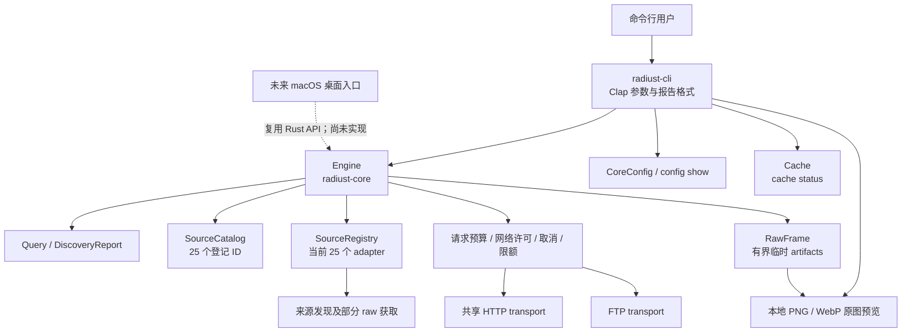
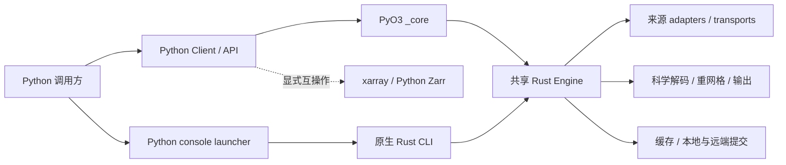

# radiust 当前架构

本文描述当前 checkout 的实现。Python console command 转发到 Rust CLI，Python SDK 通过 PyO3 调用共享 Rust Engine；Rust 迁移尚处于部分实现状态。目录登记、模块存在、离线 fixture 或一次 raw 获取成功，都不等于来源科学解码或输出格式已验收。项目为 `0.1.0 alpha`。

长期方向见[项目理念](../PHILOSOPHY.md)和[发展路线](../ROADMAP.md)。下文实现描述与未来 Desktop 目标分别理解；规划目标不表示现有功能或接口已经稳定。

## 原生 Rust 路径

```mermaid
flowchart TB
    User[命令行用户] --> CLI[radiust-cli<br/>Clap 参数与报告格式]
    CLI --> Engine[Engine<br/>radiust-core]
    CLI --> Config[CoreConfig / config show]
    CLI --> Cache[Cache<br/>cache status]
    Engine --> Query[Query / DiscoveryReport]
    Engine --> Catalog[SourceCatalog<br/>25 个登记 ID]
    Engine --> Registry[SourceRegistry<br/>当前 25 个 adapter]
    Engine --> Budget[请求预算 / 网络许可 / 取消 / 限额]
    Budget --> HTTP[共享 HTTP transport]
    Budget --> FTP[FTP transport]
    Registry --> Provider[来源发现及部分 raw 获取]
    Engine --> Raw[RawFrame<br/>有界临时 artifacts]
    CLI --> Preview[本地 PNG / WebP 原图预览]
    Raw --> Preview
    Desktop[未来 macOS 桌面入口] -. 复用 Rust API；尚未实现 .-> Engine
```

原生 CLI 的 `Engine` 由 [`crates/radiust-core/src/engine.rs`](../crates/radiust-core/src/engine.rs) 提供，命令解析与终端报告在 [`crates/radiust-cli/src/main.rs`](../crates/radiust-cli/src/main.rs)。Engine 当前可以校验配置、展开目录目标、运行有界且可取消的发现、获取单帧或批量原始 artifacts，并返回结构化 Rust 报告。`cat SOURCE` 将发现和 raw 获取接到原图预览；`cat --file` 直接调用图片预览器。`download --raw-only` 可正式提交原始输出；RainViewer composite 和 TW grid 支持 PNG+sidecar、NetCDF4、GeoTIFF 与 Zarr v2 正式提交。科学能力仍只对有保留样本验证的来源开放。

目录包含 25 个 source ID、当前展开为 74 个 discovery target；编译进 `SourceRegistry` 的 25 个 adapter 包含 `au`、`bmkg`、`ca`、`cam`、`es`、`fr`、`id`、`id_sidarma`、`kr`、`my`、`nz`、`opensnow`、`ph`、`pt`、`rdcap`、`rainviewer`、`sg`、`th`、`th_royalrain`、`tw`、`tw-http`、`uk`、`vn`、`windy` 和 `wunderground`。普通 `id` 与 `id_sidarma` 是独立来源。Windy 已有 latest HTTP 发现和四张原始 PNG 获取，时间为 5 分钟 cadence 假设，科学数值未验证；选择 `sources.windy.use_playwright` 时会以隔离 Chromium/CDP 捕获原始 tile 响应字节。PH 使用隔离 Chromium 的自动 CSRF 会话和站点签名模块获取 Hybrid Reflectivity timeline 与原始 data-image PNG；不再要求外部 timeline token，并拒绝 1×1 占位图。浏览器功能要求系统 Chromium 和显式网络 opt-in；它不会把浏览器路径升级成科学能力。RainViewer 的 Rust Universal Blue 科学解码已和保留 Python fixture 的整幅数值、质量摘要对齐，并可通过受并发/资源限额约束的 `Engine.decode_science()` 与 PyO3 异步绑定调用；TW grid 的 Rust 科学解码已按官方样本与 Python 值/质量数组精确对齐；`Engine.regrid()`/PyO3 提供受 worker 与像素预算约束的同 CRS 规则网格 nearest/bilinear（dBZ 按线性功率插值），并支持 EPSG:4326↔EPSG:3857 Web Mercator 坐标变换；其他 datum/projection 转换仍拒绝。TW observation 几何仍未验证。OpenSnow 在证据补齐前 fail-closed，UK 已退役，Weather Underground 需要外部 API key 且 raw 获取关闭。adapter 的发现、raw 获取和科学能力各有差异，不能把这些 ID 数量当作完整来源支持声明。实现见 [`source/mod.rs`](../crates/radiust-core/src/source/mod.rs) 和 [`source/catalog.rs`](../crates/radiust-core/src/source/catalog.rs)。

### 可复用的 Rust Core 边界

[`radiust-core`](../crates/radiust-core/README.md) 是普通 Rust library crate，同时提供 `rlib` 与 `cdylib`。桌面端或其他 Rust 调用方可依赖它，使用共享的 `Engine`、`CoreConfig`、`Query`、`FrameRef`、`DiscoveryReport`、`RawFrame`、错误、来源 adapter 接口、transport、限额和取消机制；报告数据不包含 provider locator 的 URL 或凭据。原始获取的临时文件由 `RawFrame` 持有，释放对象时清理。

这个边界让未来 macOS 桌面应用可以复用发现、网络策略、资源限额、来源调度、科学处理和结构化结果，并由自己的 UI 层呈现进度和报告。当前没有桌面 UI、后台服务、IPC 协议或 Swift/Objective-C 绑定。Engine 已接入 RainViewer 与 TW grid 的已验证科学解码，以及 PNG、NetCDF4、GeoTIFF、Zarr v2 输出和本地/远端提交；其他来源科学解码和真实 S3/OSS provider 尚未验收。`CoreConfig` 接受若干输出设置只代表配置值校验，不代表输出路径可用。

crate 的 PyO3 支持由可选 `extension-module` feature 打开；Python wheel 构建仍由 Maturin 配置驱动。Rust library API 当前处于迁移期，不应视为稳定桌面 SDK，也不提供供 Swift 直接调用的 ABI。相关代码见 [`lib.rs`](../crates/radiust-core/src/lib.rs)、[`model.rs`](../crates/radiust-core/src/model.rs) 和 [`config.rs`](../crates/radiust-core/src/config.rs)。

## Python 路径与 Rust 的关系

```mermaid
flowchart LR
    PyUser[Python 调用方] --> SDK[Python Client / API]
    PyUser --> Click[Python console launcher]
    Click --> RustCLI[原生 Rust CLI]
    SDK --> Bridge[PyO3 _core]
    Bridge --> Engine[共享 Rust Engine]
    RustCLI --> Engine
    Engine --> Sources[来源 adapters / transports]
    Engine --> Science[科学解码 / 重网格 / 输出]
    Engine --> Persistence[缓存 / 本地与远端提交]
    SDK -. 显式互操作 .-> Xarray[xarray / Python Zarr]
```

Python 项目的 `radiust` console script 由 [`python/radiust/cli/main.py`](../python/radiust/cli/main.py) 转发到原生 Rust CLI；Python `Client`/`AsyncClient` 通过 [`rust_client.py`](../python/radiust/rust_client.py) 和 PyO3 扩展调用同一 Rust Engine。Python 保留 xarray 转换和 Zarr 互操作边界，命令和主要 SDK 操作不再经旧 Python source/processing pipeline 回退。

## 共享规则与当前缺口

- 原生网络默认关闭，配置通过默认值、YAML、`RADIUST_` 环境变量合并。Core 的请求/帧并发、响应大小、像素和临时数据限制由配置控制；目录发现以逐目标状态保留失败、中断和未开始目标。
- Rust 缓存默认根目录是 `~/.cache/radiust-rust`，与 Python 缓存隔离；revision-pinned raw artifact 以帧身份为键流式写入并增量校验 SHA-256，manifest 最后发布，完整 cache hit 可在禁网模式下读取。无可信 revision 的 latest 与瓦片来源不缓存。兼容代码可在显式复用旧根时识别旧 `entries` 布局，但 Python/Rust 并发访问尚未验收。Cache CLI 提供 status 与 clear。对象存储的 S3/OSS generation/pointer 提交流水线已接入 Engine，真实 provider 尚未验收。
- Native image preview 通过 [`preview.rs`](../crates/radiust-core/src/preview.rs) 有界读取 PNG/WebP 并保留原始像素。规范 gray 显示处理位于 [`gray.rs`](../crates/radiust-core/src/gray.rs)，科学 dBZ 反算位于 [`dbz.rs`](../crates/radiust-core/src/dbz.rs)；两者是分开的模式。旧 `legacy_display` 模块和资源路径只保留兼容入口，原规则 wire/hash 不变。终端 renderer 由 CLI 实现，当前只支持 `auto` 和 `text`。
- 原生 `download` 支持 dry-run、raw-only 和 RainViewer composite/TW grid 的 PNG、NetCDF4、GeoTIFF、Zarr 正式提交。获取、解码和四种格式编码按 frame concurrency 有界派发；解码与编码共用 CPU worker 池，结果按输入顺序报告并提交。四种格式共用 manifest-last 完整性边界；Zarr 将 store 内文件作为清单 artifact，GeoTIFF 将数据、quality 和 provenance 作为一个发布组。远端目标支持 `s3://`/`oss://` URI、generation 写入、逐 artifact SHA-256 读回和最终 pointer 发布；真实 AWS/阿里云环境的并发与故障验收仍缺。RainViewer/TW 之外的科学解码和干净机器 NetCDF/HDF5 动态库定位也未验收。

迁移规格明确批准的兼容变化包括提供无需 Python 的 Rust CLI、增加多来源 `discover`、将 Python source entry point 扩展迁至编译期 Rust adapter，以及让 `fetch()` 默认返回绑定对象并通过显式 `to_xarray()` 转换；这些入口变化已实施。科学值、质量标记、时间和地理语义、原图与科学解码的区别没有获准静默变化。具体 CLI 限制见[命令文档](cli.md#原生-rust-cli)，安装路径见[安装文档](installation.md#原生-rust-命令行程序)。

## 后续 Desktop 与扩展的架构约束

2026-10-06 确认的方向是用户设备默认直接连接所选来源，在本地发现、获取、缓存、处理和展示；核心观测功能不依赖 Radiust 账号或 Radiust 数据中转服务。用户主动配置的 S3／OSS 输出目标仍是可选输出能力。当前 CLI／SDK 的网络 opt-in 继续有效，不因 Desktop 方向而静默启用联网。

Desktop 将复用来源独立的获取与处理边界，增加默认来源、手动切换和故障回退，并呈现实际来源、时间和产品差异。跨来源自动选择、回退及桌面 UI 尚未由本文交付；实现与验收要求见[发展路线](../ROADMAP.md)。

现有 `FrameRef`、`RawFrame`、`RadarField`／`RadarDataset` 提供时间、网格、值、质量和出处的演进基础。后续稳定观测接口需保留这些语义；预测结果另外标注模型、输入观测、运行时间和未来有效时间，不修改观测的含义。当前不新增预测插件 ABI。跨来源拼图同样留待后续规格，同时保留各来源的身份与处理记录；已有瓦片组合和提供方合成产品继续按单个来源产品理解。
