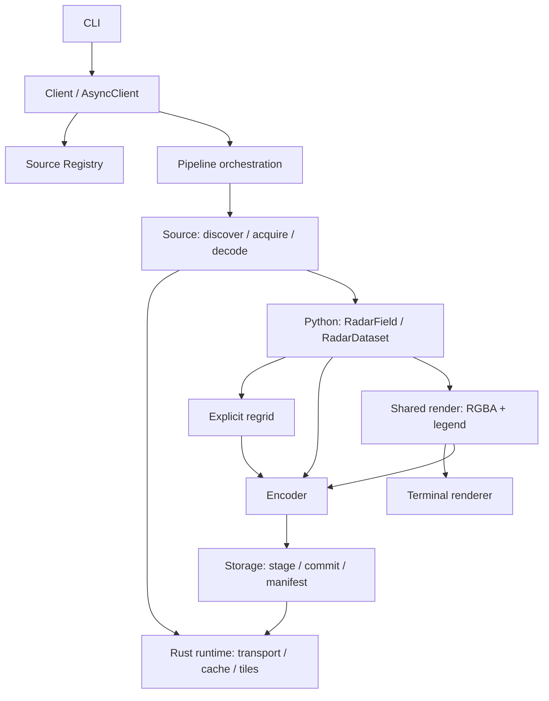

# radiust v1 设计与迁移计划

> 状态：v1 设计草案，描述目标契约，不代表现有功能已实现。
> 当前仓库只有 Python/Rust 包骨架，Python 构建仍使用 setuptools；切换 maturin 属于后续实施工作。
> 本文 API 已确定以 Python SDK 为主；HTTP 服务、常驻调度器、分布式队列不进入 v1。

## 目标

将 `旧项目` 重构为独立项目 **radiust**，完整迁移现有所有 radar source，旧仓库迁移完成后归档。

去除 OSS/Mongo/Kafka/Sentry/StatsD/Apollo 等生产业务耦合，但保留对象存储作为通用输出能力。

## 技术架构

### Rust 层

`radiust-core` 负责 I/O fast path：

- HTTP/FTP 网络请求
- retry / timeout / concurrency / rate limit
- proxy / headers / cookies
- streaming download
- temporary files
- cache 管理
- S3-compatible / Aliyun OSS I/O
- tile 并发下载
- tile mosaic / crop
- PyO3 暴露给 Python

Playwright source v1 暂时保留 Python 实现。

Rust 不依赖 xarray，也不理解 `RadarField` 科学语义。

### Python 层

`radiust` 负责：

- source-specific discover
- source-specific decode
- palette parsing
- numpy/scipy/opencv 等复杂处理
- xarray 数据模型
- CRS/grid/reprojection/regrid
- NetCDF / GeoTIFF / PNG / Zarr
- Python API
- CLI orchestration

构建采用 PyO3 + maturin。

## 核心 Pipeline

```text
discover
   ↓
FrameRef
   ↓
acquisition
   ↓
RawFrame
   ↓
decode
   ↓
RadarField / RadarDataset
   ↓
optional regrid
   ↓
encoder
   ↓
local / OSS / S3
```

### Source API

内部明确保留三阶段：

```python
discover(...) -> list[FrameRef]
download(ref) -> RawFrame
decode(raw) -> RadarField | RadarDataset
```

高级 Python 用户可以分别调用。

普通 API：

```python
radiust.fetch(...)
await radiust.afetch(...)

radiust.fetch_many(...)
await radiust.afetch_many(...)
```

async 为核心实现，sync 只是 wrapper。

## CLI

主要面向用户任务，而不是机械暴露内部函数：

```bash
radiust list sources
radiust list jma

radiust download jma --latest
radiust download jma --latest --raw
radiust cat jma --latest                 # 直接在终端显示雷达图
```

`download` 默认执行：

```text
discover → download → decode → output
```

默认输出格式：**NetCDF**。

其他格式：

```bash
--format png
--format geotiff
--format zarr
```

## FrameRef

保持小而稳定：

```python
FrameRef(
    source,
    product,
    station,
    valid_time,
    base_time,
    uri,
    metadata,
    locator,             # 稳定、版本化的 source-specific 定位信息
    locator_version,
    revision=None,       # discover 可获知的上游版本，可为空
)
```

`station`、`base_time` 可为空。

source-specific 定位参数进入版本化 locator；不影响身份的补充信息进入 metadata。

## RawFrame

只是运行期 envelope，不持久化对象本身：

```python
RawFrame(
    ref,
    artifacts,
    metadata,
)
```

artifact 可以使用 bytes 或 path。

decode 与所需 raw 持久化均完成后释放 `RawFrame`；失败与取消时也必须释放。返回的数据不可依赖已删除的临时文件。

## Tile source

默认在 Rust 完成：

```text
discover
→ concurrent fetch_tiles
→ retry
→ temporary tile files
→ mosaic
→ crop
→ RawFrame(mosaic)
→ Python decode
```

单 tile 默认只是临时数据，mosaic 完成且不再需要 raw 持久化后删除。

Rust mosaic 必须保持像素颜色与透明度语义，不做 resize/interpolation/量化。不同 indexed PNG 的 palette index 不可直接拼接；仅允许经过测试的无损 palette lookup 得到统一 RGBA，保留原始 tiles 供 raw 导出。

`--raw` 或 `--raw-only` 时原始 tiles 作为正式 output 保存；必须在临时文件删除前提交。

## 数据模型

### RadarField

```text
RadarField
└── xr.DataArray
```

表示一个主要物理变量，例如：

- reflectivity
- rain_rate
- level
- etc.

### RadarDataset

```text
RadarDataset
└── xr.Dataset
```

仅用于真正的多变量产品。

### Grid

Grid 是一等抽象：

```text
GeographicGrid
CartesianGrid
PolarGrid
```

默认保留 source 的 native grid：

```text
native grid first
```

只有用户显式要求才：

```python
field.regrid(...)
field.to_geographic(...)
```

CLI 对应：

```bash
--grid geographic
--resolution ...
```

## Decoder

显式区分：

```text
ExactPaletteDecoder
NearestPaletteDecoder
ImageRecoveryDecoder
```

原则：

- 能 exact 就不用 fuzzy
- fuzzy 必须有 threshold
- recovery 必须 source-specific
- unknown pixel 不允许静默变成降水值

不把旧 `parse_img()` 的模糊行为作为全局默认。

## Source registry

所有当前 source v1 都内置：

```text
radiust.sources.*
```

统一 registry：

```python
radiust.get_source("jma")
radiust.sources()
```

同时预留 Python entry-point，使第三方以后可以发布：

```text
radiust-source-xxx
```

v1 不拆分现有 source 为独立包。

## 配置

静态 source knowledge 默认随 package 发布：

```text
stations
palettes
products
source definitions
```

配置优先级：

```text
CLI / Python 显式参数
> --conf /path/config.yaml
> environment variables
> package defaults
```

允许用户指定 `--conf` 覆盖默认配置。

## Storage

正式支持：

```text
local
Aliyun OSS
S3-compatible
```

包括 AWS S3、MinIO、R2 等。

认证支持：

```text
CLI --access-key / --secret-key / --endpoint
environment variables
provider credential chain
```

CLI 参数优先。

文档默认推荐环境变量，避免 secret 出现在 shell history/process list。

## 输出目录

默认 Hive-style：

```text
<root>/
source=<source>/
product=<product>/
date=YYYY-MM-DD/
hour=HH/
<station-or-composite>_<valid_time>[_base-<base_time>]_<variant_id>.<ext>
```

例如：

```text
s3://radar-data/
source=jma/
product=hrpns/
date=2026-09-16/
hour=06/
composite_20260916T061000Z_a1b2c3d4e5f6.nc
```

允许：

```bash
--output-template
```

覆盖默认规则。

### `--raw`

`--raw` 明确表示正式数据，而不是缓存。

例如：

```text
.../hour=06/
├── composite_20260916T061000Z_a1b2c3d4e5f6.nc
└── raw/
    └── composite_20260916T061000Z_a1b2c3d4e5f6/
        └── ...
```

无论 local / OSS / S3 都写入目标数据目录。

cache GC 永远不能删除 `--raw` 输出。

## 幂等

默认：

```text
有效 manifest 不存在 → 写入或修复未完成产物
manifest 完整且 output identity 匹配 → skip
同一路径已有不同 identity → 报 OutputConflict
--overwrite → 重新校验上游、处理并提交替代版本
```

适合直接作为周期性 radar ingestion CLI 使用。

## Cache

cache identity 基于稳定的数据帧，而不是 URL：

```text
source
+ product
+ station
+ valid_time
+ base_time
+ source locator/version
```

### latest / realtime

动态 URL，例如：

```text
/latest/radar.png
```

不作为长期 cache key。

每次先 discover，解析成稳定 `FrameRef`。

discover 可以有极短 TTL，但不能导致 stale radar。

### historical

明确历史时次且 immutable 的 artifact 可以进入长期 cache。

### Tile

单 tiles 不进入长期 cache。

```text
tiles → tmp → mosaic → optional raw commit → delete tiles
```

mosaic 可以缓存。

### 目录

```text
~/.cache/radiust/
├── objects/
├── mosaics/
├── tmp/
└── index.sqlite
```

SQLite 记录：

```text
key
path
kind
size
created_at
last_accessed_at
source
```

默认：

```text
max_size = 20GB
max_age = 30d
gc_interval = 24h
```

GC 顺序：

1. stale tmp
2. expired entries
3. LRU until below max size

CLI：

```bash
radiust cache status
radiust cache gc
radiust cache clear
```

支持：

```bash
--no-cache
--cache-dir
```

## 依赖策略

采用轻核心 + extras：

```bash
pip install radiust
pip install "radiust[all]"
pip install "radiust[playwright]"
pip install "radiust[storage]"
pip install "radiust[geotiff]"
```

核心保留：

- numpy
- xarray
- pyproj
- Pillow
- CLI runtime
- 默认 NetCDF writer（选择并锁定经过 round-trip 测试的 backend）
- Rust extension

source-specific 重依赖按 extra 安装。

## Repo 结构

建议：

```text
radiust/
├── Cargo.toml
├── crates/
│   └── radiust-core/
│
├── python/
│   └── radiust/
│       ├── sources/
│       ├── decoders/
│       ├── grids/
│       ├── storage/
│       ├── outputs/
│       ├── resources/
│       ├── field.py
│       ├── registry.py
│       └── cli.py
│
├── tests/
│   ├── fixtures/
│   ├── sources/
│   ├── decoders/
│   └── integration/
│
└── pyproject.toml
```

## 迁移策略

迁移 `旧项目` 中**所有现有 source**，包括当前未启用/注释的实现。

旧仓库只作为 migration reference，不维持：

- API compatibility
- configuration compatibility
- reverse dependency
- production integration compatibility

迁移完成后归档旧仓库。

## Source 迁移顺序

先建立 framework，再按 source family 批量迁移：

1. HTTP 单图 sources
2. palette/image decoding sources
3. tile sources
4. FTP / special protocol sources
5. Playwright / anti-scraping sources
6. 复杂 recovery sources

先挑每类一个代表 source 验证 framework，再迁移同类其余 source。

## 测试与验收

每个 source 至少有真实 fixture。

### discover

验证：

- source
- station
- product
- valid_time/base_time

### acquisition

验证：

- artifact 数量/类型
- HTTP/raw behavior
- tile layout
- mosaic dimensions

### decode

验证：

- shape
- dtype
- variable
- units
- Grid/CRS
- nodata semantics
- range/histogram/reference pixels

Exact palette 额外测试：

- palette shuffle invariance
- unknown color raises
- nodata/no-rain distinction

live-network tests 与 fixture tests 分离，默认测试不依赖公网。

## 迁移兼容原则

不要求新旧文件逐 byte 相同。

遵循：

```text
网络行为：尽量保持
原始事实：fixture 回归
科学语义：以 radiust 新模型为准
历史错误：修正并记录 migration note
```

尤其不继续把旧项目中的：

```text
value * 3.2 → clip(224) → uint8
```

之类编码当成 canonical radar data。

## 最终边界

```text
Rust = fast I/O infrastructure
Python = flexible radar/scientific layer

FrameRef = 数据身份
RawFrame = 临时 acquisition envelope
RadarField = canonical single-variable radar data
RadarDataset = canonical multi-variable radar data

cache = 可删除的实现优化
--raw = 用户明确保存的数据
output = 正式数据
```

v1 最终完成条件（不是 framework 阶段）：所有旧 source 完成迁移盘点和 fixture contract；在线可用 source 可通过统一 `list/download/cat` CLI 和 Python API 获取或展示标准数据。停运与不可获取项需记录例外；按后文 M4 验收完成后才归档 `旧项目`。


## 详细架构与依赖方向

### 方案取舍

| 方案 | 优点 | 代价与结论 |
|---|---|---|
| Python Client 编排 + Rust 基础设施 | source 开发灵活，网络/缓存策略统一 | 需明确跨语言资源所有权；v1 采用 |
| 每个 source 自己实现完整流程 | 首个 source 开发快 | 重复重试/缓存/输出逻辑，难以统一行为；不采用 |
| 独立采集服务 + HTTP API/任务队列 | 多租户、远程作业集中管理 | 增加部署与状态管理；有实际需求再建设 |



- CLI 只做参数解析、进度和退出码映射；业务逻辑全部走 SDK。
- `Source` 持有静态描述，不持有进程级客户端或全局可变缓存。连接池、认证、限流、临时目录由 Client context 注入。
- source 定义获取哪些 artifact，Rust 执行获取策略；Playwright 使用 Python acquisition adapter，产物仍遵守相同 RawFrame 契约。
- decoder 只读 RawFrame 与版本化资源，不联网、不写最终输出、不自行重投任务。
- Grid 负责几何描述与校验，regrid 模块负责数值变换；encoder 负责文件编码，storage 负责传输与提交。
- Rust 不导入 Python 科学模块；Python 不直接依赖 Rust 内部类型，跨边界使用私有 `_core` facade。
- v1 提供 Python 公共契约；Rust crate/扩展内部接口暂不承诺稳定，版本随 wheel 一起发布。

### 并发、背压与生命周期

Client 生命周期覆盖连接池、Rust runtime、缓存索引和临时目录。便捷函数创建短生命周期 Client；循环抓取使用显式 Client 复用连接。

- async 为网络编排主入口；同步 decode/encoder 进入有界 worker，不阻塞事件循环。CPU worker、并行帧数和网络请求数分别限额。
- 初始配置：并行帧 2、全局请求 16、单 host 请求 4、decode worker 2；source 可声明更低限制，最终取更严格值。这些是起始值，不是性能承诺。
- tile 请求与普通请求共享全局 semaphore，避免“帧并发 × tile 并发”失控。
- 同时限制在途字节数、单 artifact 大小、最大像素数、临时盘用量；遇到超限抛 ResourceLimitError。
- 网络层拥有唯一重试预算：默认最多 3 次尝试，指数退避加 jitter，尊重 Retry-After；每次请求 timeout 与整帧 deadline 分开。
- 仅重试暂时性连接错误、限流及可恢复服务器错误；认证、解码、参数错误不自动重试。latest 的短暂 404 是否重试由 source 明确声明。
- 取消必须传播到排队请求和可取消 I/O；不可中断的 CPU 工作结束后丢弃结果并清理，不提交成功 manifest。
- Rust 大文件落盘，跨语言优先传路径和小型 metadata；不承诺所有处理零拷贝。

## 数据契约：身份、原始数据与科学数据

### 时间和查询

- 公共 API 接受带时区 datetime；CLI 接受带 `Z` 或 offset 的 ISO 8601。拒绝无时区时间，统一转换 UTC。
- `valid_time` 是产品有效时间，`base_time` 是起报时间；`retrieved_at` 是实际获取时间，不能替代有效时间。
- 时间区间统一 `[start, end)`；`at` 要求精确匹配，不静默取相邻时次。未来可增加显式 nearest 查询。
- `latest` 是 discover 时找到的最新可用帧，按 source/product/station 分组；发现后固定 ref，下载阶段不再重新解释 latest。
- latest 支持 `max_age`；超过阈值报 StaleFrameError。产品描述必须给出 cadence、发布延迟与建议 max_age，避免全局拍一个阈值。
- forecast 查询可用 `base_time` 消除多起报歧义；单帧 API 匹配多个结果时报 AmbiguousFrameError。
- source 不支持历史查询时抛 UnsupportedQueryError，不用当前图冒充历史数据。

### FrameRef 的稳定身份

FrameRef 为不可变值对象，明确区分三个概念：

| 标识 | 组成 | 用途 |
|---|---|---|
| logical_id | source/product/station/valid_time/base_time/稳定 locator | 同一逻辑观测或预报帧 |
| revision | 上游明确版本或 acquisition 后的内容 SHA-256 | 识别同一帧的更正 |
| output_id | logical_id + revision + processing spec | 判定输出可复用性 |

- `uri` 为可选获取线索；签名 URL、cookie、token 不属于 identity，也不能写入日志/manifest。
- `locator` 是 source 定义的 JSON-compatible 结构，具有 `locator_version`；tile 范围、扫描层等影响身份的字段必须进入 locator，不能藏在自由 metadata。
- metadata 仅用于补充信息，不允许 Python 任意对象；采用稳定 JSON 序列化与排序计算 SHA-256。
- revision 在 discover 时可以未知；下载后补入 acquisition receipt，不能篡改已有 FrameRef。ETag 仅作上游校验器，不默认等同内容 hash。
- 无稳定上游版本的动态 latest URL，需在获取时验证产品时间或执行 source 定义的前后版本检查；无法证明对应 ref 时拒绝提交。
- processing spec 包含输出类型（decoded/raw-only）、decoder/resource 版本、变量选择、目标 Grid、重采样方法与 encoder 参数。临时目录、并发数、凭据不影响输出身份。

### Artifact 与 RawFrame

```text
Artifact
  name: 唯一逻辑名称（例如 image / metadata / tile-z-x-y）
  role: data | metadata | tile
  media_type: MIME type
  payload: bytes 或受管理的 local path（二选一）
  size_bytes / sha256 / source_revision

RawFrame
  ref: FrameRef
  artifacts: 有序、名称唯一的 Artifact 集合
  receipt: retrieved_at / revision / acquisition_version
  metadata: source-specific JSON-compatible 补充信息
```

RawFrame 必须实现 context manager/close。缓存 artifact 通过 lease 借用，close 只释放 lease；临时 artifact 由 owner 删除；raw 正式输出不归 RawFrame 所有。

`decode` 完成后数据必须已加载到独立内存，或持有显式可关闭的持久 backing store；v1 默认采用前者。禁止返回引用已删除临时文件的 lazy xarray 对象。

`--raw-only` 产物包含 `raw-manifest.json`，记录 ref、artifact 名称/大小/hash、获取版本，支持以后离线重放；不序列化运行时 RawFrame 或认证信息。

### RadarField / RadarDataset 结构

保持 DataArray/Dataset 为科学数据核心，以轻量 wrapper 增加验证、grid、quality 和 provenance；不继承 xarray 类。

```text
RadarField
  data: xr.DataArray           # 一个主要变量
  quality: xr.DataArray        # 与 data 同形状的 uint16 bit mask
  grid: GridSpec
  provenance: ProcessingRecord
  validate() / to_dataset() / regrid() / to_geographic()

RadarDataset
  data: xr.Dataset             # 多个主要变量，及各自的 <variable>_quality
  grid: GridSpec
  provenance: ProcessingRecord
  validate() / select(variable) / regrid()
```

quality 不算第二个主要物理变量。`to_dataset()` 将 Field 的 data、quality、CRS 信息组成可序列化 Dataset。v1 一个 RadarDataset 的主要变量共享 grid 和时间；异构分辨率/扫描网格拆成多个帧，不偷偷 align 填充。

| 项目 | 约定 |
|---|---|
| 连续变量 | 默认 float32；缺测 NaN；保留真实物理量，不套旧 uint8 编码 |
| 类别变量 | 整数 code + flag_values/flag_meanings；显式独立 nodata code |
| rain_rate | units=`mm h-1`；0 仅代表已知无雨 |
| reflectivity | units=`dBZ`；不把“无回波”无依据映射成 0 dBZ |
| level | units=`1`；保存类别/区间映射，不能宣称精确降水强度 |
| 单帧时间 | scalar `time`；forecast 附 `forecast_reference_time` 和 lead time |
| provenance | logical_id、revision、软件/decoder/palette 版本、转换历史、retrieved_at |

quality 位定义：bit 0 missing、bit 1 outside_coverage、bit 2 unknown_color、bit 3 recovered、bit 4 interpolated、bit 5 below_detection。0 代表无已知异常，可同时设置多个标志。未知颜色在 strict 模式抛错；显式 permissive 模式写 NaN + unknown_color 并记录数量，不能转成无雨。

无回波且只有检测上限时，保存 NaN + below_detection 与阈值 metadata；存在有物理依据的数值时才赋值。RGBA 透明、缺 tile、站外区域分别由 source 规则映射 quality，不合并成降水 0。

序列化遵循经过验证的 CF 元数据映射：变量 units、可适用的 standard_name、坐标、grid_mapping、quality flags；不为没有对应标准名的变量自造 standard_name。实现阶段固定并记录验证过的 CF 版本。

### GridSpec 与重网格

| Grid | 维度与坐标 | 必填几何信息 |
|---|---|---|
| GeographicGrid | `(latitude, longitude)`，像元中心，单位度 | CRS、shape、extent；不规则一维轴需显式保存 |
| CartesianGrid | `(y, x)`，像元中心，单位由 CRS 决定 | CRS WKT、shape、轴坐标；规则网格附 affine |
| PolarGrid | `(azimuth, range)`，方位角正北顺时针，距离 m | 站点经纬高程、elevation、距离 gate、波束几何假设 |

- 保持源数组行方向，但坐标必须单调并与数据一致；中心坐标与边界不能混用。
- 经纬度二维曲线网格不能伪装成规则 GeographicGrid；迁移盘点若发现此类源，应在对应批次加入 CurvilinearGrid。
- `bbox=(west,south,east,north)` 明确是经纬度；v1 跨日期变更线的 bbox 拒绝并提示分成两个请求。
- regrid 目标必须确定 CRS、extent、resolution 或完整 GridSpec；单位随目标 CRS，不能把 `1000` 默认解释为米。
- categorical/palette level 仅 nearest；连续量 v1 默认 nearest，可显式 bilinear；不允许跨缺测区域不加约束地插值。
- dBZ 的 bilinear 必须先在线性反射率域插值再转回，禁止直接平均 dBZ。雨量守恒重映射留到有验证案例时引入。
- source 不具备可靠地理定位时抛 GeoreferencingError；Polar 到地面投影需记录波束模型，不能仅做坐标标签替换。

## Python API 详细设计

以下是目标接口草案，并非当前可运行示例。`Query` 要求 latest/at/start+end 恰选一种；`product` 仅在 source 声明唯一默认产品时可省略。

```python
query = radiust.Query(
    source="jma", product="hrpns", latest=True,
)

# 返回科学对象，不隐式写正式 output；允许使用本地缓存。
field = radiust.fetch(query)                    # RadarField | RadarDataset
field = await radiust.afetch(query)

with radiust.Client(config="config.yaml") as client:
    refs = client.discover(query)               # list[FrameRef]
    with client.acquire(refs[0]) as raw:         # RawFrame
        field = client.decode(raw)
    result = client.write(field, output="./data", format="netcdf")

async with radiust.AsyncClient() as client:
    refs = await client.discover(query)
    async with client.acquire(refs[0]) as raw:
        field = await client.decode(raw)
    result = await client.write(field, output="s3://bucket/radar", format="netcdf")
```

`AsyncClient.acquire()` 返回 async context manager；其他上述方法均 awaitable。Source 协议内部仍使用 async `discover(query, context)`、async `download(ref, context)`、同步 `decode(raw, context)` 三阶段。Client 的 acquire 封装 source.download 和资源清理，不混淆 SDK 获取原始数据与 CLI 完整 download 的含义。

- `fetch`/`afetch`：恰好一帧，零帧 NoDataError，多帧 AmbiguousFrameError。
- `fetch_many`/`afetch_many`：接收 Query 或有序 refs，返回 BatchResult；默认 `on_error="collect"`，逐帧保留成功/失败，绝不静默丢失败。
- BatchResult 的 items 按 discovery 稳定顺序或输入 refs 顺序，含 ref、status、data/error；同一 ref 输入重复时报参数错误。`on_error="raise"` 首次失败取消未完成工作并抛带部分结果的 BatchError。
- `iter_fetch`/`aiter_fetch`：按完成顺序逐个返回带 ref 的 FrameResult，限制预取；用于历史批量处理，避免全量数组留在内存。
- `download`/`adownload`：SDK 高层导出接口，与 CLI download 使用同一 pipeline，返回 DownloadReport（written/skipped/failed 与每帧 URI），不返回全部数组。
- `write` 是编码+存储 API；只有 field 时 raw 不可重建。请求 raw 保存在 download/acquire 生命周期内完成。
- 同步 API 在当前线程已有运行中事件循环时明确报错并提示 async API，不嵌套 event loop。
- `radiust.get_source(id)` 返回描述/协议对象；`radiust.sources()` 返回稳定排序的 SourceInfo，不触发网络。

### SourceInfo 与产品能力

每个 source 声明 `id / description / adapter_version / products / stations / required_extras / availability`。每个 ProductInfo 声明变量/单位、native grid、cadence、历史查询能力、预报能力、默认产品与最新时效策略。

availability 区分 available、missing_dependency、needs_configuration、upstream_unavailable、retired。静态 list 不联网，因此后两种来自随包状态记录；仅显式 `doctor --network` 做实时探测并附时间。

内置 source 懒加载；一个重依赖缺失不能阻止列出其他 source。第三方预留 entry-point group `radiust.sources`；重名时报 DuplicateSourceError，不静默覆盖内置实现。

### 错误契约

所有领域错误继承 RadiustError，带稳定 `code / stage / source / frame_id / retryable / message`，保留底层异常供 debug。不在 message 包含凭据、cookie 或完整签名 URL。

| 类别 | 示例 | 调用者处理 |
|---|---|---|
| 配置/能力 | ConfigError、MissingDependencyError、UnsupportedQueryError | 修正配置/安装 extra |
| 无数据/时效 | NoDataError、StaleFrameError、AmbiguousFrameError | 调整查询或等待下一发布 |
| 获取 | AuthenticationError、TransportError、IntegrityError | 按 retryable 判断 |
| 科学处理 | DecodeError、UnknownColorError、GridError | 检查 source/fixture，不能自动当无雨 |
| 输出 | OutputConflict、StorageError | 检查目标或显式覆盖 |

## CLI 命令与参数契约

```bash
radiust list sources --json
radiust list jma                         # source 详情、产品与能力；兼容原方案
radiust list products jma
radiust list stations jma
radiust discover jma --product hrpns --latest --json

radiust download jma --product hrpns --latest --output ./data
radiust download jma --product hrpns --at 2026-09-16T06:10:00Z
radiust download jma --product hrpns --start 2026-09-16T00:00:00Z --end 2026-09-17T00:00:00Z
radiust download jma --product hrpns --latest --raw
radiust download jma --product hrpns --latest --raw-only
radiust download jma --product hrpns --latest --grid geographic --bbox 130,30,140,40 --resolution 0.01 --resampling nearest
radiust download jma --product hrpns --latest --dry-run --json

radiust config show --redact
radiust doctor                              # 本地配置、依赖、缓存可写性
radiust doctor --source jma --network       # 显式网络检查
radiust cache status --json
radiust cache gc --dry-run
radiust cache clear --yes
```

| 参数 | 语义 |
|---|---|
| `--latest / --at / --start + --end` | 恰选一种；拒绝隐式 latest，避免误下载 |
| `--station` | 可重复；单帧 SDK 有歧义时报错，CLI 逐帧处理 |
| `--output` | 输出 root，默认当前目录下 `./data` |
| `--format` | netcdf（默认）/geotiff/png/zarr |
| `--raw` | 同时保存 decoded output 和完整 raw artifacts |
| `--raw-only` | 只获取并持久化 raw；不 decode，不做 mosaic/regrid |
| `--variable` | 多变量输出到 PNG/GeoTIFF 时必须指定；NetCDF/Zarr 可保留全部 |
| `--grid` | native（默认）/geographic；后者需 bbox、resolution |
| `--overwrite` | 重新获取或校验源数据并替换；不等同简单忽略文件存在 |
| `--no-cache` | 不读写长期缓存，仍允许有界临时文件 |
| `--dry-run` | 可执行 discover 和目标检查，显示计划；不下载 artifact、不写 output |
| `--on-error` | continue（默认）/stop；continue 最后仍以非零码报告失败 |
| `--json / --quiet / --verbose` | 机器报告/安静/诊断；quiet 与 verbose 互斥 |

`--raw` 与 `--raw-only` 互斥；raw-only 与显式 format/grid/variable/resampling 参数互斥。`--format png` 是可视化产物，必须记录 palette/range 与地理定位 sidecar，不能用它替代科学量存档。

除下文 `cat` 的图片/文本展示模式外，stdout 仅输出最终人类报告或一个带 `schema_version` 的 JSON 对象；进度、日志、警告走 stderr。JSON 报告包含 run_id、查询、计数、逐帧状态与错误；quiet 不抑制显式要求的 JSON。

退出码：0=全部成功或有效 skip，2=参数/配置/缺依赖，3=无数据或全部过期，4=部分成功部分失败，5=全部处理失败，130=用户中断。默认无数据也非零，便于调度系统发现异常。

CLI 不内置轮询守护；定时运行交给 cron/systemd/外部调度器。每次命令是有界任务。

### `radiust cat`：直接在终端看雷达图

v1 必须提供单帧终端预览，默认获取标准科学数据后绘制；不要求先 download，不启动浏览器，不写正式 output。允许复用 acquisition cache。

```bash
radiust cat jma --product hrpns --latest
radiust cat jma --product hrpns --at 2026-09-16T06:10:00Z
radiust cat jma --product hrpns --latest --width 100 --height 35
radiust cat jma --product hrpns --latest --renderer kitty
radiust cat jma --product hrpns --latest --renderer ansi
radiust cat jma --product hrpns --latest --variable rain_rate --palette rain-rate --vmin 0 --vmax 80
radiust cat --file ./radar.nc --variable rain_rate
radiust cat --file ./radar.png
radiust cat --file ./radar.nc --renderer text   # 纯文字摘要，适合重定向
```

**输入与选择：**

- source 位置参数与 `--file PATH` 二选一；source 模式复用 Query 的 latest/at、station、product、base-time/max-age 约定。
- v1 一次展示一帧；不接受 start/end，多帧匹配报歧义并提示选择 station/base-time。动画、watch 后续再扩展。
- `--file` v1 支持 radiust 生成的 NetCDF 和 PNG；NetCDF 需具有受支持的数据契约，多时间文件必须用 `--at` 选择。PNG 原样预览，缺少 sidecar 时不推断物理变量与地理坐标。
- 多变量数据必须 `--variable`；不默默选第一个变量。文件模式不支持 source/station/product/latest 等网络查询参数。
- cat 不接受 download 的 `--raw/--raw-only/--output/--format/--overwrite`，也不接受 `--json`；机器结构化查询使用 discover，正式文件导出使用 download。

**图像与科学语义：**

- 与 PNG encoder 共享 `render(field, RenderOptions) -> RenderedImage`，输出 RGBA、图例、标题与显示 metadata；TerminalRenderer 只负责终端传输，不理解科学值。
- 同一变量使用随包发布且版本化的固定 palette/range；类别数据保留离散色阶。允许显式 `--palette/--vmin/--vmax`，连续变量须满足 vmin < vmax；类别变量拒绝连续范围覆盖。
- 默认显示 source、product、station、UTC valid/base time、变量、单位、色标；区分无雨、缺测和站外区域。文件缺失的信息显示“未知”，不能编造。
- 规则 Geographic/Cartesian grid 依据坐标方向显示；Polar 与不能直接渲染的网格需要显式 `--grid geographic --bbox ... --resolution ...`，不能把极坐标矩阵当地图。
- 缩放只作用于展示副本，保持纵横比，默认 nearest；不修改 field 或科学输出。此处保持栅格显示比例，不承诺经纬度图上的物理距离等比例。
- `--width/--height` 单位是终端列/行，为最大展示范围；自动布局给标题/图例留空间，并根据字符格尺寸适配，限制总像素和传输大小。
- 预览已有 PNG 不重新着色；palette/range/grid 等科学处理参数不适用于 PNG，传入时报参数错误。

**终端协议与降级：**

| `--renderer` | 行为 |
|---|---|
| auto（默认） | 在 TTY 上探测：确认 Kitty 支持则使用 Kitty，否则确认 iTerm2 支持则使用 iTerm2，最后降级 ANSI/文本 |
| kitty | Kitty graphics protocol，使用内联数据传输，避免 SSH 两端文件路径不一致 |
| iterm2 | iTerm2 inline image protocol，内联传输 PNG |
| ansi | 使用 Unicode 半块字符与 ANSI 色彩近似显示；按色彩能力降级到 256 色；图例仍显示单位与范围 |
| text | 仅显示时间、变量、shape、单位、有效值范围和缺测比例，无图像 escape sequence；纯 PNG 仅报告已知图像信息 |

- 能力探测有界超时（默认总预算 200ms），不只依赖 TERM 名称；不支持/不确定时降级，禁止无限等待终端响应。修改的 termios 状态必须在成功、失败和取消时恢复。
- tmux/screen 下仅在确认 passthrough 可用时发送图片协议，否则采用 ANSI；不自动修改用户终端配置。Sixel 暂不进入 v1 必需支持范围。
- 无颜色能力、`TERM=dumb` 或 `NO_COLOR` 时 auto 退为 text；显式请求不兼容 renderer 时清楚报错，不悄悄发无法显示的控制序列。
- stdout 非 TTY 时默认在获取数据前报错，提示使用 `--renderer text` 或 download；不往管道/日志发送图片控制序列，不静默改写到 `/dev/tty`。
- cat 的 stdout 是图像与图例/标题，诊断日志走 stderr；不再追加 download 风格报告。renderer/终端参数错误退出 2，数据处理失败沿用 3/5，Ctrl-C 为 130。

**SDK 与实现边界：**

新增 Python `radiust.render(field, ...) -> RenderedImage` 和 `radiust.show(field, renderer="auto", ...) -> None`；render 不依赖 TTY，show 为显式终端副作用。终端协议实现放 `terminal/`，科学配色与图例放 `rendering/`，PNG writer 复用 rendering。

首版依托已有 Pillow/NumPy 完成 RGBA 与图例，不为 cat 引入浏览器或强制 GUI/Matplotlib 依赖。先做 ANSI/text 与无终端渲染测试，再完成 Kitty/iTerm2 传输和真实终端验收。

验收包括：固定 fixture 图像/色阶/方向、无雨与缺测区别、尺寸与比例、多变量选择、TTY/非 TTY、探测超时、取消恢复终端、未知终端降级；ANSI 与至少一个图片协议做真实终端目视检查，其余声明支持的协议发布前分别检查。M1 必须具备 ANSI/text，M2 完成 Kitty/iTerm2；均属于 v1 必需功能。

协议实现参考 [Kitty graphics protocol](https://sw.kovidgoyal.net/kitty/graphics-protocol/) 与 [iTerm2 inline images](https://iterm2.com/documentation-images.html)。以上自动探测及降级顺序是 radiust 的设计选择，不代表所有终端都支持这些协议。

## 输出、缓存和提交的一致性

### Output identity 与命名

`variant_id` 为完整 output_id 的前 12 个十六进制字符；完整 hash 写 manifest，短 hash 冲突时不得覆盖。base_time 存在时加入文件名，避免同 valid_time 的不同起报互相覆盖。

自定义 output-template 只能使用白名单字段，不执行代码；校验绝对路径、`..`、分隔符与对象 key，目标必须位于指定 root。若模板消除了版本差异，仍通过完整 identity 检查防止覆盖。

### Manifest 与提交协议

每个输出组以 manifest 为完成标志，包含 schema_version、logical_id、revision、processing spec/hash、所有 artifact URI/大小/SHA-256、格式与创建时间。不得包含凭据。

1. 解析查询与 processing spec，校验能力及 extra，寻找已有 manifest。
2. 仅对有可信稳定 revision 的 immutable source 允许提前 skip；mutable/未知 revision 必须重新校验或获取，不能永久复用旧 latest。
3. 下载、校验、decode、可选 regrid；编码至 staging，同时处理 raw 保存。
4. 提交全部文件并验证 receipt，最后发布 manifest；中途失败没有成功 manifest。
5. 释放资源；遗留 staging 由显式维护或生命周期策略回收，不能由 cache GC 删除正式输出。

本地输出使用同一文件系统 staging + 原子重命名；多文件组在 manifest 发布前不视为可用。v1 同一目标 root 只允许一个 writer，使用 root 锁并明确报锁冲突，不依赖“先 exists 后 write”实现并发安全。

对象存储使用不可变 generation prefix 上传数据，manifest/pointer 最后更新；覆盖时旧 generation 保留到显式清理。v1 同一输出 root 要求外部保证单 writer，暂不提供跨机器 exactly-once。不同 provider 的条件写能力通过 adapter 测试后再开放并发写。

`--raw` 是输出完整性要求：已有 decoded-only manifest 不能直接 skip，必须补 raw 并提交新 manifest。`--raw-only` 有独立输出类型，不能被当成 decoded 成功。

### Encoder 能力矩阵

| 格式 | 单变量/多变量 | Grid 支持 | 完整性要求 |
|---|---|---|---|
| NetCDF | 均支持 | native 各类 grid | 数值、quality、坐标、CRS、provenance round-trip |
| GeoTIFF | v1 单变量 | 可表达 affine 的规则栅格 | nodata、CRS、transform；quality/provenance sidecar |
| PNG | v1 单变量渲染 | 规则二维栅格 | RGBA + palette/range/georeferencing sidecar |
| Zarr | 均支持 | native 各类 grid | v1 每帧独立 store，manifest 最后提交 |

Polar 或不规则网格导出 GeoTIFF/PNG 必须先显式 regrid；不自动改变 native grid。Zarr v1 不做共享时间轴 append，避免多写者和 schema 演进问题。

### Cache 的补充约束

- acquisition cache key 使用 frame identity + revision/validator + acquisition/mosaic 版本；decode 参数不污染原始数据缓存。
- revision 未知时保存 validator 与最近校验时间，按 source 可变性策略 revalidate；`--overwrite` 必须触发校验，不能取未经确认的旧缓存。
- SQLite 索引增加 checksum、validator、schema_version、expiry；lease 使用独立运行期锁/记录，GC 跳过被借用条目。
- 写入先临时文件、校验、原子 rename，再提交索引；启动时可修复孤立文件与失效索引。损坏条目淘汰并重新获取。
- 请求相同 key 时在同进程合并下载；跨进程通过每 key 锁避免重复提交。SQLite 事务不跨网络请求持有。
- 默认 mosaics 缓存不能满足 raw tiles 导出；用户要求 raw 时必须重新获取缺少的原始 tiles。
- `cache clear` 只清理 radiust 管理且未被使用的缓存；交互时确认，非交互必须 `--yes`。不接受把 output root 当缓存清理对象。

## 配置与包组织细化

建议配置分为 runtime、cache、sources、storage、output 五部分，加载后得到不可变 EffectiveConfig。未知 key 报错；深度合并 map，列表整体替换，不做含糊的拼接。

普通配置遵循前文优先级；provider credential chain 是最后认证兜底。静态资源覆盖必须显式指定文件并计算版本/hash，写入 provenance。`config show` 默认脱敏且显示字段来源；认证信息不写 effective config 快照。

`radiust[storage]` 只安装 Python 可选适配依赖；Python extra 不能在安装预编译 wheel 后开启 Rust feature。Rust OSS/S3 能力若属于正式标准 wheel，需在构建矩阵中启用并验证；若决定全部随 wheel 发布，应在安装文档解释 storage extra 的实际作用。

新增模块建议：

```text
python/radiust/
  api.py / client.py / pipeline.py     # 公共入口、资源生命周期、编排
  models.py / query.py / errors.py     # 值对象、查询验证、错误契约
  config.py / registry.py              # 配置与 source 注册
  _core.*                             # 私有 PyO3 extension
  sources/ / decoders/ / grids/
  storage/ / outputs/ / resources/
  rendering/ / terminal/               # 共享渲染与终端协议
  cli/                                # 命令组，不堆入单个 cli.py
```

NetCDF backend 属于最小安装契约；GeoTIFF、Zarr、Playwright 与重型 source 依赖按 extra 安装。缺少 extra 时在发起下载前给出准确安装指令。构建采用 maturin mixed Python/Rust layout，验证从 wheel 安装而非只在源码树运行。

## 分阶段交付与验收门槛

| 阶段 | 交付 | 必须通过的验收 |
|---|---|---|
| M0 迁移盘点 | source inventory、产品/依赖/状态/fixture 来源 | 包含旧仓库未启用/注释 source；每项有去向 |
| M1 最小闭环 | mixed wheel、数据契约、Client、HTTP 单图代表源、NetCDF/local CLI、cat ANSI/text | 最小安装可离线 fixture fetch/download，round-trip 与 JSON/退出码正确 |
| M2 复杂获取 | palette、tile、FTP、Playwright、recovery 各一个代表源、cat Kitty/iTerm2 | palette 差异、缺 tile、时间竞态、临时资源清理测试 |
| M3 完整输出与可靠性 | OSS/S3、GeoTIFF/Zarr、cache/manifest、批处理 | 断网/取消/写入中断/输出冲突/损坏缓存故障测试 |
| M4 全量迁移 | 所有 source 的统一 contract、迁移说明、发布包 | inventory 无未解释遗漏，代表 live smoke 与所有 fixture 回归通过 |

M0 必须先核对真实 source，本文不推断未读取旧仓库的 source 数量或可用性。上游停运的 source 仍需保留 fixture 行为、明确 retired 状态与证据，不能宣称能在线获取。存在此类例外时，归档旧仓库前需记录并接受例外清单。

验收补充：

- 数据：有雨/无雨/缺测/无回波分别测试；几何用控制点、坐标方向与 extent 验证；预报起报时间碰撞测试。
- tiles：相同 index 不同 palette、透明像素、缺失 tile、边界 crop 必须有 fixture；默认缺 tile 失败，只有 source 显式允许时才生成带 missing quality 的部分产品。
- API：sync/async 结果一致；事件循环误用报错；BatchResult 不丢错误；流式读取后内存不会随总帧数线性增长。
- storage：manifest 发布前故障不会产生可跳过的“成功”；raw-only/decoded/raw 联合模式互不误判；覆盖保留可诊断记录。
- cache：并发访问、lease 与 GC 竞争、索引损坏恢复、mutable revision 重新校验。
- packaging：在声明支持的平台/Python 版本测试 wheel 安装、最小 NetCDF 写出；额外依赖不可导致基本 list 失败。
- 性能：代表源记录吞吐、峰值 RSS、请求数、临时盘峰值，与旧系统基线对比；没有数据前不设虚构加速目标。
- 可观测性：结构化日志带 run_id/frame_id/stage/duration/cache_hit/bytes/retries；库不配置全局 logging handler，不依赖外部监控服务。

## 参考与待验证决策

设计使用 xarray 的 DataArray/Dataset 作为容器；属性不会自动替应用保证科学语义，因此 radiust 自己承担 validate 与序列化测试。参见 [xarray 数据结构](https://docs.xarray.dev/en/stable/user-guide/data-structures.html)。

坐标、grid mapping 与 quality flags 的序列化参照 [CF Conventions](https://cfconventions.org/cf-conventions/cf-conventions.html)，实现阶段固定版本并逐格式测试，不能仅凭添加 attrs 宣称全面兼容。

Python 包与 Rust 扩展布局参照 [maturin mixed project layout](https://www.maturin.rs/project_layout.html)。

以下事项需在对应阶段通过小型验证确定，不能作为已实现能力：

- M0：真实产品清单、停运 source、非规则网格、上游认证与时间绑定机制。
- M1：默认 NetCDF backend、Python/PyO3/maturin 支持矩阵、async 取消桥接、CF 版本。
- M2：FTP adapter、tile 无损像素处理、重型 decoder 的 worker 策略。
- M3：OSS/S3 上传与 commit 行为、Zarr 格式版本与 chunk 策略、远端 staging 回收策略。
