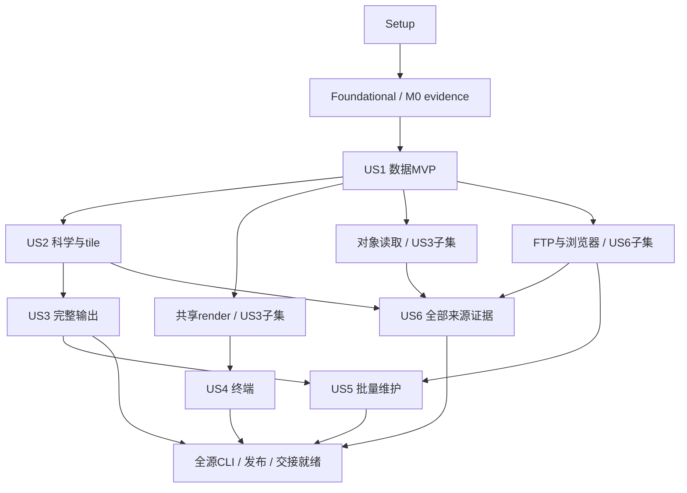

# Tasks: radiust v1 独立雷达数据获取与全量迁移

**Input**: `specs/001-radiust-v1-migration/` 的 [plan.md](plan.md)、[spec.md](spec.md)、[research.md](research.md)、[data-model.md](data-model.md)、[contracts](contracts/python-sdk.md)、[quickstart.md](quickstart.md)、[source-inventory.md](source-inventory.md)。

**Prerequisites**: 上述设计已完成；现有代码只是骨架。本文件仅生成实施任务，所有任务初始未完成，未执行安装、迁移或应用测试。

**Tests**: spec FR-036、六个用户场景及 SC-003～010 明确要求 fixture/合同/故障/安装验收，因此纳入测试任务。先建立会因缺失行为而失败的断言，再实现并验证；本次不额外生成与行为无关的测试。

**Organization**: Setup → Foundational → US1/US2/US3/US6（P1）→ US4/US5（P2）→ 跨故事发布门槛。用户故事编号保持 spec 原编号；阶段显示顺序不是强制等待所有先前故事完成，实际调度以任务依赖为准。

## Format: `[ID] [P?] [Story] Description`

- 每项具有唯一连续 TaskID、准确目标路径、可观察结果、依赖和交付门槛 M0–M4。
- `[P]` 只表示其列出的前置完成后，能与**文件不重叠且互不依赖**的就绪任务并行，不表示所有带P的任务可同时启动；共享catalog/inventory/Client/pipeline/CLI入口由单独汇总任务串行修改。
- 未注明P的任务默认串行；任务ID是一个合法拓扑次序，跨阶段可提前执行已就绪任务。所有故事实现还隐含依赖 Foundational checkpoint。
- 先写测试的任务完成标准是断言和受控预期失败成立；故事checkpoint要求相应测试真正通过，不能把测试创建误算成产品实现。
- source迁移任务自身也遵循“固定真实raw→写失败断言→适配实现→合同通过”。缺样本/凭据/终端/provider的情况保留阻塞证据，不能用合成图、mock或skip替代所要求的真实验收。
- 宪章仍为空模板，按已给定spec/plan约束执行，不虚构宪章审批或原则。仅有明确接受记录的例外可改变对应验收范围，不能自行豁免来源。

## Path Conventions

所有任务中的路径均相对仓库根目录；Python为 `python/radiust/`，Rust为 `crates/radiust-core/`，测试为 `tests/`，盘点/证据为 `migration/` 与 `validation-results/`。`fixture.json` 同目录 raw/ 存放真实原始资料。旧文件路径相对旧仓库，基准commit见inventory；旧库只读，不复制凭据或生产集成。

## Phase 1: Setup — 构建与开发基础

**Goal**: 建立可安装的 mixed Python/Rust 项目、锁定依赖及默认离线测试环境。

**Independent Test**: 构建出的 wheel 可在源码树外导入 radiust._core；测试基础设施默认阻断公网；候选版本解析结果有记录。

### Implementation

- [X] T001 整理 mixed package 目录与模块边界，在 `python/radiust/__init__.py`、`python/radiust/py.typed`、`crates/radiust-core/src/lib.rs` 保留公共 facade/私有扩展边界；不增加尚未实现的来源占位成功路径。（依赖：无；门槛：M1）
- [X] T002 将 `pyproject.toml` 切换 maturin、module-name=radiust._core 与 python-source=python；更新 `Cargo.toml`、`crates/radiust-core/Cargo.toml` 的 resolver、cdylib、匹配 PyO3/async bridge feature 和 `rust-toolchain.toml`，先验证最小扩展可构建。（依赖：T001；门槛：M1）
- [X] T003 按 research R01/R03 解析核心与 geotiff/zarr/playwright/recovery/scraping/all extras，在 `pyproject.toml`、`uv.lock`、`Cargo.lock`、`constraints/python-3.10.txt`、`constraints/python-3.11.txt`、`constraints/python-3.12.txt`、`constraints/python-3.13.txt` 固定已验证组合；storage extra 明确为空，失败不得假定兼容。 dev组包含pytest、pytest-asyncio、maturin、ruff、独立netCDF4 reader和CF检查工具。（依赖：T002；门槛：M1）
- [X] T004 [P] 在 `ruff.toml`、`rustfmt.toml` 配置 Python 3.10 类型/格式规则与 Rust 格式检查，明确科学层不得导入旧生产业务模块。（依赖：T003；门槛：M1）
- [X] T005 [P] 在 `pytest.ini`、`tests/conftest.py` 建立 pytest-asyncio、live/provider 标记、受控 loopback 放行、公网默认阻断和 RADIUST_TEST_ opt-in；缺 opt-in 显式 skip，测试数据隔离到临时目录。 公网隔离必须覆盖Rust I/O，不能仅patch Python socket。（依赖：T003；门槛：M1）
- [X] T006 [P] 在 `.github/workflows/wheels.yml`、`tests/packaging/test_wheel_import.py` 建立 CPython 3.10–3.13、Linux x86_64/aarch64、macOS arm64/x86_64 的独立 wheel 构建/源码外导入作业，记录真实标签与系统下限，不提前标记未测组合 supported。（依赖：T003；门槛：M1）
- [X] T007 在 `.github/workflows/offline.yml` 串联锁文件安装、ruff、cargo test 和默认离线 pytest；测试阶段禁公网，依赖下载阶段单列。（依赖：T004、T005；门槛：M1）
- [X] T008 构建最小 wheel 并执行导入/测试隔离冒烟，将版本、命令与失败修复结果写入 `validation-results/setup.md`；本机无法执行的平台保留 CI 待执行记录。（依赖：T006、T007；门槛：M1）

**Checkpoint**: Setup 完成后才能进入基础模型与运行时实现；不把导入成功视作数据功能完成。

---

## Phase 2: Foundational — M0 证据与共享契约

**Goal**: 完成所有故事共用的盘点、身份、科学容器、错误、配置、I/O预算与资源所有权。

**Independent Test**: 首个 my 真实 raw 可验证 hash/来源/时间；身份 golden vectors、共享科学模型和 Rust 取消/临时资源测试通过。

### Implementation

- [X] T009 将 `source-inventory.md` 的 24 条 HEAD 实现路径与 2 条历史线索转入 `migration/inventory.json`、`migration/inventory.schema.json`，锁定旧 commit 8d251601ca551fbd5c05451f1fb337fc4b75362c；为全部条目记录产品/站点/协议/网格/认证/时次绑定、状态和待补证据，不把逻辑来源数等同文件数。 同时确定台/印/泰多路径划分及两条历史巴西实现的初始迁移/排除依据；后续历史任务负责落实，而非拖到M4才首次盘点。（依赖：T008；门槛：M0）
- [X] T010 在 `tests/fixtures/fixture.schema.json`、`tests/support/fixtures.py` 定义真实原始资料的 origin/使用依据/采集时间/hash/ref/receipt/reference/tolerance 校验及脱敏；旧 map.png 只能标历史产物，不作 canonical 真值。（依赖：T009；门槛：M0）
- [ ] T011 从旧库或可合法取得的原始资料固定 my 的 raw 与发现响应到 `tests/fixtures/sources/my/fixture.json`、`tests/fixtures/sources/my/raw/`，核实实际有效时间与原生几何；缺 raw 时记录 `migration/blockers/my.md` 并保留任务未完成。（依赖：T010；门槛：M0）

### Tests

- [X] T012 [P] 先写 `tests/contract/test_identity.py`、`tests/fixtures/scientific/identity-v1.json`，覆盖 UTC 等价/键序/null/locator版本/签名URL排除、原始清单 revision、processing/raw-only 身份及短hash碰撞；确认实现前测试失败。（依赖：T011；门槛：M1）
- [X] T013 [P] 先写 `tests/contract/test_scientific_model.py` 和 `tests/fixtures/scientific/model-cases.json`，覆盖单/多变量、quality 位、NaN/0、类别nodata、同网格时间约束和未知schema拒绝。（依赖：T011；门槛：M1）
- [X] T014 [P] 先写 `crates/radiust-core/tests/runtime_lifecycle.rs`，用 loopback/受控时钟验证共享请求预算、Python桥接可取消任务的Rust侧收尾、文件owner与跨进程lease释放，不靠固定长sleep。（依赖：T011；门槛：M1）

### Implementation

- [X] T015 实现 `python/radiust/models.py` 的 SourceInfo/ProductInfo/StationInfo、不可变 FrameRef、Artifact/Receipt、ProcessingSpec/Record、OutputRequest/Manifest、FrameResult/BatchResult/DownloadReport 与严格安全JSON投影。（依赖：T012、T013；门槛：M1）
- [X] T016 实现 `python/radiust/identity.py` 的唯一 canonical JSON/SHA-256 路径、递归冻结、内容清单 revision、output_id/variant_id 与缓存身份，令 Rust 仅消费身份字符串。（依赖：T015；门槛：M1）
- [X] T017 实现 `python/radiust/errors.py`、`crates/radiust-core/src/errors.rs` 的稳定领域错误映射、stage/source/frame/retryable、安全message和不序列化cause规则；取消保留取消语义。（依赖：T015；门槛：M1）
- [X] T018 实现 `python/radiust/config.py`、`python/radiust/resources/defaults.yaml` 的安全YAML/重复key拒绝、参数>文件>环境>默认、map合并/list替换、来源追踪与成组凭据；配置 R10 限额及测试命名空间隔离。（依赖：T017；门槛：M1）
- [X] T019 实现 `python/radiust/grids/models.py` 的 Geographic/Cartesian/Polar 形状、单调中心坐标、extent/CRS、站点/elevation/beam校验；二维曲线坐标明确标独立类型，不伪装成规则轴。（依赖：T013、T017；门槛：M1）
- [X] T020 实现 `python/radiust/field.py` 的 RadarField/RadarDataset validate、quality uint16、to_dataset/select 与独立加载；不隐式align异构变量，不继承xarray，不返回悬挂lazy数组。（依赖：T019、T016；门槛：M1）
- [X] T021 实现 `crates/radiust-core/src/runtime.rs`、`crates/radiust-core/src/limits.rs` 的 Tokio RuntimeManager、跨活跃Client预算、host/帧/worker限制、取消token与join收尾；接入 R10 字节/像素/临时盘/超时保护值。（依赖：T014、T018；门槛：M1）
- [X] T022 实现 `crates/radiust-core/src/temp.rs`、`crates/radiust-core/src/digest.rs` 的临时文件owner、流式大小/hash、跨进程lease和幂等关闭；在CPU工作真正结束前保持输入存活。（依赖：T021；门槛：M1）
- [X] T023 实现 `crates/radiust-core/src/python.rs` 与 `python/radiust/_bridge.py` 的 future_into_py、错误和受管理路径转换、Python cancel传播；私有facade不泄露Rust内部类型。（依赖：T022、T017；门槛：M1）
- [X] T024 定义 `python/radiust/sources/base.py`、`python/radiust/context.py` 的静态Source协议与 discover/download/decode 上下文，包含 raw-only/acquisition请求、凭据引用、lease和取消；decoder禁止联网和写正式输出。（依赖：T023、T020；门槛：M1）
- [X] T025 实现 `python/radiust/raw.py` 的 sync/async RawFrame context manager、receipt补充、close后访问拒绝、cache lease与temporary区分，worker结束后清理且raw正式输出不归其所有。（依赖：T024；门槛：M1）
- [X] T026 实现 `tests/support/replay.py` 的发现/HTTP本地重放和测试专属transport注入，实际执行Source三阶段且不将测试source注册到公开目录；验证fixture摘要后才能重放。（依赖：T025、T010；门槛：M1）
- [X] T027 [P] 实现 `python/radiust/logging.py` 的字段白名单与凭据/cookie/签名URL脱敏，提供run_id/frame_id/stage/duration/cache_hit/bytes/retries字段；库不安装全局handler。（依赖：T017；门槛：M1）
- [X] T028 执行共享契约、模型、Runtime/bridge取消测试并写入 `validation-results/foundation.md`，核验M0首源证据与宪章空模板状态；失败项修复后才解除故事共同前置。（依赖：T026、T027、T016、T014、T013；门槛：M1）

**Checkpoint**: 此阶段完成是故事实现的共同前置；没有真实首批样本不能用合成图关闭基础证据门槛。

---

## Phase 3: User Story 1 — 查找并获取可信雷达数据 (Priority: P1) — MVP

**Goal**: 提供最小安装下的离线目录、精确查询、同步/异步获取与默认本地NetCDF完整提交。

**Independent Test**: 真实 my fixture 经 discover→acquire→decode→download 读回；sync/async结果一致，零/多/过期/无时区输入正确失败，重复有效产物可skip。

### Tests

- [X] T029 [P] [US1] 先写 `tests/contract/test_query.py`，覆盖时间选择互斥、UTC/[start,end)、latest分组、max_age、forecast base_time、零/多帧及不支持历史拒绝。（依赖：T028；门槛：M1）
- [X] T030 [P] [US1] 先写 `tests/contract/test_python_sdk.py`、`tests/contract/test_registry.py`，覆盖目录离线/缺extra隔离/重名拒绝、sync/async等价、acquire上下文语义、事件循环误用和fetch不写正式数据。（依赖：T028；门槛：M1）
- [X] T031 [P] [US1] 先写 `tests/contract/test_encoding.py` 的NetCDF案例和 `tests/integration/test_local_commit.py`，验证value/quality/time/CRS/provenance读回、manifest-last、root锁、未完成不能skip；其他格式案例在US3扩展。（依赖：T028；门槛：M1）
- [X] T032 [P] [US1] 先写 `tests/contract/test_offline_e2e.py` 与 `tests/contract/test_cli_acquisition.py` 的list/discover/download闭环、JSON/stderr/退出码和dry-run不下载断言；终端断言由US4追加。（依赖：T028；门槛：M1）

### Implementation

- [X] T033 [US1] 实现 `python/radiust/query.py` 的查询解析/规范化、稳定帧排序与单帧选择错误，严禁历史查询回退当前帧。（依赖：T029；门槛：M1）
- [X] T034 [US1] 实现 `python/radiust/registry.py`、`python/radiust/resources/catalog.json` 的静态目录、按需加载、availability、entry-point radiust.sources及重复id拒绝；目录覆盖全部盘点项但未迁移项不能声称可获取。（依赖：T030、T009；门槛：M1）
- [X] T035 [US1] 实现 `crates/radiust-core/src/transport/http.rs`、`crates/radiust-core/src/transport/mod.rs` 的reqwest流式下载、TLS验证、proxy/headers/cookies、Retry-After与单一3次预算，区分请求timeout/整帧deadline与不可重试错误。（依赖：T021、T022、T017；门槛：M1）
- [X] T036 [US1] 实现 `crates/radiust-core/src/cache/index.rs`、`crates/radiust-core/src/cache/lease.rs`、`crates/radiust-core/src/cache/mod.rs` 的基础object/mosaic索引、临时写+hash+rename、稳定key、validator/expiry和借用；不长期缓存tile，GC维护留US5。（依赖：T035、T016；门槛：M1）
- [X] T037 [US1] 实现 `python/radiust/decoders/exact.py` 的精确palette解析、unknown严格失败/显式permissive、透明/无雨/缺测分离，为my提供可复用科学解码。（依赖：T020、T013；门槛：M1）
- [ ] T038 [US1] 迁移 `python/radiust/sources/my.py`、`python/radiust/resources/sources/my.json`、`tests/sources/test_my.py`、`migration/sources/my.json`，使用已固定真实GIF与发现响应验证两区域产品、时次绑定/几何；先补来源断言再实现，不把响应获取时间当有效时间。（依赖：T033、T034、T035、T036、T037、T011；门槛：M1）
- [X] T039 [US1] 实现 `python/radiust/outputs/base.py`、`python/radiust/outputs/netcdf.py` 的显式h5netcdf/NETCDF4、CF-1.8映射、uint16 quality无FillValue、时间/CRS/provenance与单writer关闭语义。（依赖：T031、T020；门槛：M1）
- [X] T040 [US1] 实现 `crates/radiust-core/src/storage/local.rs` 的root进程锁、同文件系统staging/fsync/rename和清理，失败不让旧清单指向半替换文件。（依赖：T031、T022；门槛：M1）
- [X] T041 [US1] 实现 `python/radiust/storage/manifest.py`、`python/radiust/storage/naming.py` 的完整hash校验、默认Hive路径/起报时间/微秒命名、基础完成判定、冲突和缺失产物修复。（依赖：T016、T040；门槛：M1）
- [X] T042 [US1] 实现 `python/radiust/client.py` 的Client/AsyncClient上下文、私有loop复用、单帧discover/acquire/decode/write/fetch、错误循环/线程使用拒绝与有界worker；输入lease保持到实际工作结束。（依赖：T030、T038、T025、T039、T041；门槛：M1）
- [X] T043 [US1] 实现 `python/radiust/pipeline.py` 的单帧完整导出、revision校验、staging→verify→本地manifest-last、取消门禁与清理；下载默认NetCDF到./data，fetch不写output。（依赖：T042、T040；门槛：M1）
- [X] T044 [US1] 在 `python/radiust/api.py`、`python/radiust/__init__.py` 暴露Query、sources/get_source、fetch/afetch、download/adownload和Client；便捷函数关闭临时Client，批量入口保留明确未实现直到US5完成。（依赖：T043、T034；门槛：M1）
- [X] T045 [US1] 实现 `python/radiust/cli/reporting.py`、`python/radiust/cli/main.py` 的Click入口、单JSON对象schema、stdout/stderr分离、日志handler和退出码归约；不得直接打印带秘密的ref。（依赖：T032、T027、T044；门槛：M1）
- [X] T046 [US1] 实现 `python/radiust/cli/listing.py`、`python/radiust/cli/discover.py`、`python/radiust/cli/download.py` 的目录/查询/单帧导出、conf与quiet/verbose校验、dry-run发现但不取artifact、未知revision不伪造output_id。（依赖：T045、T033；门槛：M1）
- [X] T047 [US1] 实现 `python/radiust/cli/doctor.py` 的M1本地诊断子集并注册到 `python/radiust/cli/main.py`，只检查已安装依赖/当前配置/cache可写性，不联网；为quickstart最小wheel验证提供可运行doctor，网络与完整配置展示留US5。（依赖：T046、T018；门槛：M1）
- [X] T048 [US1] 实现并运行 `tests/packaging/test_installed_wheel.py` 的干净核心wheel源码外list→fixture fetch→NetCDF导出/独立读回，确认静态资源随包发布且未安装重型extra不阻断；记录 `validation-results/mvp.md`。（依赖：T047、T039、T044；门槛：M1）
- [X] T049 [US1] 运行US1所有contract/本地故障测试，使用独立netCDF4 reader与CF checker复核代表文件，在 `validation-results/us1.md` 记录sync/async与时次错误覆盖；只读/获取闭环全部通过才标US1完成。（依赖：T048、T029、T030、T031、T032；门槛：M1）

**Checkpoint**: US1可独立演示；它是MVP数据闭环，不代表M1终端部分或v1全量完成。

---

## Phase 4: User Story 2 — 正确解释颜色、质量与空间位置 (Priority: P1)

**Goal**: 完成复杂颜色/瓦片/恢复及显式网格转换，保留科学值与质量。

**Independent Test**: 固定raw与几何控制点验证palette乱序不变、未知色/无回波不当零、缺tile策略、原生网格和dBZ线性域插值。

### Tests

- [X] T050 [P] [US2] 先写 `tests/contract/test_decoders.py` 覆盖exact/threshold-nearest/source-specific recovery、palette shuffle、strict/permissive、RGBA透明及六种quality；合成边界数据与真实raw分开标记。（依赖：T028；门槛：M2）
- [X] T051 [P] [US2] 先写 `crates/radiust-core/tests/tiles.rs`、`tests/integration/test_tile_acquisition.py` 覆盖不同palette同index、WebP/RGBA、无损crop、缺tile失败/显式部分覆盖及取消raw保活。（依赖：T028；门槛：M2）
- [X] T052 [P] [US2] 先写 `tests/contract/test_grids.py`、`tests/contract/test_regrid.py`，覆盖CRS/中心/extent/Y方向、polar波束、跨日期线拒绝、类别nearest、strict缺测和dBZ线性域bilinear质量传播。（依赖：T028；门槛：M2）

### Implementation

- [ ] T053 [US2] 固定 `tests/fixtures/sources/id_sidarma/fixture.json`、`tests/fixtures/sources/rainviewer/fixture.json`、`tests/fixtures/sources/fr/fixture.json` 及各自raw；补参考像素/范围/质量/几何/时间证据，缺真实raw保持相关任务未完成。（依赖：T010；门槛：M2）
- [X] T054 [P] [US2] 实现 `python/radiust/decoders/nearest.py` 的显式距离阈值、unknown计数和permissive质量，不把旧parse_img的fuzzy设全局默认。（依赖：T050、T037；门槛：M2）
- [X] T055 [P] [US2] 实现 `python/radiust/decoders/recovery.py` 的source-specific恢复策略协议、recovered质量标记与版本记录，SciPy/OpenCV按extra懒加载，下载前缺依赖报错。（依赖：T050、T037；门槛：M2）
- [X] T056 [US2] 实现 `crates/radiust-core/src/tiles/palette.rs`、`crates/radiust-core/src/tiles/mosaic.rs`、`crates/radiust-core/src/tiles/crop.rs` 的无损统一RGBA拼接和裁剪；禁止resize/量化，原始tile独立保留至raw提交或释放。（依赖：T051、T022；门槛：M2）
- [X] T057 [US2] 实现 `crates/radiust-core/src/tiles/mod.rs`、`python/radiust/sources/tiles.py` 的tile计划/共享请求预算/原始receipt/可选mosaic缓存，raw-only明确绕过拼接与解码。（依赖：T056、T036、T024；门槛：M2）
- [X] T058 [US2] 扩展 `python/radiust/grids/geographic.py`、`python/radiust/grids/cartesian.py`、`python/radiust/grids/polar.py` 的几何/控制点和可靠定位校验；缺定位抛GeoreferencingError，必要曲线网格不能伪装规则栅格。（依赖：T052、T019；门槛：M2）
- [X] T059 [US2] 实现 `python/radiust/grids/regrid.py` 的显式target CRS/extent/resolution、nearest/bilinear、dBZ线性域与strict四点缺测规则，返回新field/转换历史，不跨洞填有效值。（依赖：T058、T020、T052；门槛：M2）
- [X] T060 [US2] 在 `python/radiust/field.py`、`python/radiust/pipeline.py`、`python/radiust/cli/download.py` 接入regrid/to_geographic和CLI grid/bbox/resolution/resampling校验，默认native不改变；仅所需共享文件串行修改。（依赖：T059、T049；门槛：M2）
- [X] T061 [P] [US2] 迁移 `python/radiust/sources/id_sidarma.py`、`python/radiust/resources/sources/id_sidarma.json`、`tests/sources/test_id_sidarma.py`、`migration/sources/id_sidarma.json`，验证CMAX/LastOneHour/Latest、radarlist、时间绑定和palette，不继承业务header秘密；本地 adapter、显式 `api_key` fail-closed、回放和脱敏合同已完成，真实授权 raw/palette 继续留在 T053/T065。（依赖：T053、T054、T060；门槛：M2）
- [X] T062 [P] [US2] 迁移 `python/radiust/sources/rainviewer.py`、`python/radiust/resources/sources/rainviewer.json`、`tests/sources/test_rainviewer.py`、`migration/sources/rainviewer.json`，验证10分钟时次、WebP通道物理含义、tile布局与原始保全。（依赖：T053、T057、T060；门槛：M2）
- [X] T063 [P] [US2] 迁移 `python/radiust/sources/fr.py`、`python/radiust/resources/sources/fr.json`、`tests/sources/test_fr.py`、`migration/sources/fr.json`，验证FRCOMP页面/WMS和luminance恢复的科学含义，记录历史编码修正而非照搬。留存的真实WMS帧逐字节/参考像素及时间合同通过；由于WMS不提供可查询值或图例，adapter只保留显示原图并拒绝把RGB/luminance伪解码为dBZ。T065继续跟踪真实调色板和雷达原生网格的缺口。（依赖：T053中的FR fixture部分、T055、T060；门槛：M2）
- [X] T064 [US2] 将US2三个来源的静态描述合入 `python/radiust/resources/catalog.json`，统一懒加载与required_extras，补 `tests/contract/test_registry.py` 的目录隔离断言。（依赖：T061、T062、T063；门槛：M2）
- [ ] T065 [US2] 运行科学/解码/tile/空间转换测试并校准代表源像素与内存阈值，在 `validation-results/us2.md` 记录实际输入摘要、geometry控制点、quality精确比较和不支持场景；所有代表真实契约通过才关闭。（依赖：T064、T051、T052、T050；门槛：M2）

**Checkpoint**: 科学契约与代表源通过后允许同类来源批量迁移；不由旧uint8产物反推未经证明的科学真值。

---

## Phase 5: User Story 3 — 完整、幂等地保存科学数据与原始资料 (Priority: P1)

**Goal**: 完成四种编码、本地/OSS/S3输出、raw与raw-only、补存/覆盖/冲突和可核对的提交结果。

**Independent Test**: 本地及各目标用相同fixture执行首次/skip/补raw/修订/覆盖与逐状态故障注入；无假成功，raw可离线重放，所有格式按各自语义读回。

### Tests

- [X] T066 [P] [US3] 在 `tests/integration/test_output_commit.py` 与 `tests/integration/test_remote_commit.py` 覆盖local/remote完整性、root锁、generation唯一性、短hash/自定义路径冲突、stage/verify/fence/manifest响应丢失与覆盖保旧；注入失败不得发布可误认为完成的指针。（依赖：T028；门槛：M3）
- [X] T067 [P] [US3] 在 `tests/integration/test_raw_modes.py` 验证decoded→补raw保持revision/output identity、仅有mosaic缓存时重取原始tiles、revision变化不混配、raw-only不进入decode/processing、清空cache不删除正式raw。（依赖：T028；门槛：M3）
- [X] T068 [US3] 扩展 `tests/contract/test_encoding.py` 的GeoTIFF/PNG/Zarr能力、缺依赖前置、quality/CRS/时间/provenance/sidecar完整性；加入 `tests/contract/test_rendering.py` 的共享RGBA/legend/方向/数组不变测试。（依赖：T039；门槛：M3）
- [X] T069 [P] [US3] 在 `tests/integration/test_storage_providers.py`、`tests/support/providers.py` 建立local/AWS/S3-compatible/OSS可复用矩阵和显式opt-in；凭据只从进程环境读取，要求隔离test前缀，无配置显示unverified并skip；真实provider执行仍由T084验收。（依赖：T028；门槛：M3）

### Implementation

- [X] T070 [US3] 完善 `python/radiust/storage/naming.py` 的白名单模板、canonical root校验、symlink/编码路径逃逸拒绝与完整identity冲突检测，raw-only使用独立输出类型。（依赖：T066、T041；门槛：M3）
- [X] T071 [US3] 在 `crates/radiust-core/src/storage/object.rs`、`crates/radiust-core/src/storage/mod.rs` 实现OpenDAL OSS/S3读取/分块写/close/abort、credential chain/capability及内容SHA-256 receipt；标准wheel直接编入OSS/S3 services。memory-backend故障与receipt测试通过；真实provider留T084。（依赖：T069、T023；门槛：M2/M3）
- [X] T072 [US3] 在 `python/radiust/storage/object.py` 实现URI/provider解析、匿名HTTP/object读取、错误分类和真实内容hash；ETag不作为SHA-256。URI、安全路径、大小限制和loopback读取测试通过。（依赖：T071、T070；门槛：M2/M3）
- [X] T073 [US3] 在 `python/radiust/storage/commit.py`、`python/radiust/storage/local.py` 与pipeline实现stage→verify→commit fence→manifest-last、unique generation/覆盖历史、响应丢失核对与`commit_outcome_unknown`；本地root锁、旧marker隔离、发布前read-back及取消fence均由故障注入验证。（依赖：T066、T072、T040；门槛：M3）
- [X] T074 [US3] 实现 `python/radiust/storage/raw.py` 的原始集合正式保存/raw-manifest、artifact摘要与安全ref、raw_complete判定；补raw必须同revision，关闭RawFrame不得删正式raw。（依赖：T067、T073、T057；门槛：M3）
- [X] T075 [US3] 实现 `python/radiust/raw_replay.py` 与 `tests/contract/test_raw_replay.py` 的本地raw-manifest校验和离线重放，只读已校验相对资料，不执行URL或任意对象；验证可重新decode。（依赖：T074；门槛：M3）
- [X] T076 [US3] 实现 `python/radiust/rendering/core.py`、`python/radiust/rendering/palettes.py`、`python/radiust/rendering/legend.py` 的固定版本化配色/RGBA/标题/图例/方向与只缩放副本，为PNG和终端共用；类别和unknown信息按契约处理。（依赖：T068、T020；门槛：M1/M3）
- [X] T077 [P] [US3] 实现 `python/radiust/outputs/geotiff.py` 的单变量affine data.tif+quality.tif+provenance.json、CRS/transform控制点、显式网格能力拒绝与extra安装指引。（依赖：T068、T058、T039；门槛：M3）
- [X] T078 [P] [US3] 实现 `python/radiust/outputs/zarr.py` 的显式v2、逐帧store、data/quality同chunk、完整元数据与逐文件清单；禁止共享时间append，适配已锁xarray参数名。（依赖：T068、T058、T039；门槛：M3）
- [X] T079 [P] [US3] 实现 `python/radiust/outputs/png.py` 的共享render结果与render.json地理/配色侧车，单变量规则二维网格预检；文件组不完整不能提交。（依赖：T076、T068；门槛：M3）
- [X] T080 [US3] 在 `python/radiust/outputs/registry.py` 统一encoder能力矩阵、版本/默认参数规范化、下载前extra/variable/grid预检与单writer科学编码调度。（依赖：T077、T078、T079、T039；门槛：M3）
- [X] T081 [US3] 扩展 `python/radiust/pipeline.py`、`python/radiust/client.py` 将write/download接到统一commit、raw/raw-only/overwrite/四格式、mutable revalidate和损坏输出修复；raw-only显式绕过科学阶段且write(field)拒绝重建raw。（依赖：T073、T075、T080、T065；门槛：M3）
- [X] T082 [US3] 扩展 `python/radiust/cli/download.py` 的format/raw/raw-only/output-template/overwrite/凭据/网格选项和显式参数互斥，CLI与SDK使用同一pipeline；更新 `tests/contract/test_cli_output.py`。（依赖：T081；门槛：M3）
- [X] T083 [P] [US3] 在 `docs/output-maintenance.md` 给出generation/遗留staging/未完成multipart的显式识别与回收步骤、bucket生命周期建议和单写者前提；不让cache gc管理正式root。（依赖：T073；门槛：M3）
- [ ] T084 [US3] 在隔离测试目标运行AWS S3、至少一个S3-compatible与Aliyun OSS真实矩阵，保存 `validation-results/storage-providers.json`；逐项记录成功/失败/未运行及provider版本，不接触生产prefix。（依赖：T082、T069；门槛：M3）
- [ ] T085 [US3] 运行四格式round-trip、raw重放、local/remote故障与清理验收，在 `validation-results/us3.md` 核对FR-016～022和SC-005；缺provider证据不能标全存储验收完成。（依赖：T084、T083、T066、T067、T068；门槛：M3）

**Checkpoint**: offline矩阵和实际provider矩阵分别记录；没有凭据时相关provider验收任务保持未完成，不以mock替代。

---

## Phase 6: User Story 6 — 所有旧来源迁移与交接证据 (Priority: P1)

**Goal**: 将全部未启用/未注册/多路径来源纳入统一Source契约，补FTP/浏览器代表，完成每条迁移去向与真实样本证据。

**Independent Test**: 机器inventory与逐来源contract一一核对；每个非例外至少一个真实raw通过发现/获取/解码，历史错误有说明、历史路径有明确去向。

### Tests

- [X] T086 [P] [US6] 在 `tests/contract/test_migration_inventory.py`、`tests/sources/conftest.py`、`tests/sources/test_source_contract.py` 建立全盘点行manifest/hash/时间/产品/站点/artifact合同；科学shape/dtype/unit/grid/quality/参考像素必须齐全，或显式记录blocked，不删除失败行、不以skip代替迁移状态。RainViewer已补齐已验证参考元数据并与实际adapter输出逐项核对。（依赖：T028；门槛：M0/M4）
- [X] T087 [P] [US6] 先写 `crates/radiust-core/tests/ftp.rs`、`tests/support/ftp_server.py` 的本地passive plain FTP/explicit FTPS listing/stat/read、证书/认证失败、断流/超时/ABOR与临时清理契约。（依赖：T028；门槛：M2）
- [X] T088 [P] [US6] 先写 `tests/integration/test_browser_acquisition.py`、`tests/fixtures/protocols/browser/index.html` 的离线CSRF/导航/下载/fallback/取消/大小限制，确认浏览器extra不影响普通目录查询。（依赖：T028；门槛：M2）

### Implementation

- [X] T089 [US6] 实现 `crates/radiust-core/src/transport/ftp.rs` 的suppaftp Tokio/rustls只读passive adapter，共用预算、deadline、receipt与owner；只声明实际通过模式，不支持active/implicit/SFTP/上传。（依赖：T087、T035；门槛：M2）
- [X] T090 [US6] 实现 `python/radiust/sources/browser.py` 的Playwright acquisition adapter、context/页面生命周期/凭据隔离/有界下载与取消收尾，生成统一RawFrame，不绕过共享限额。（依赖：T088、T042；门槛：M2）
- [X] T091 [P] [US6] 迁移 kr（旧实现 `core/scrapers/kr_scraper.py`）：先固定 `tests/fixtures/sources/kr/fixture.json` 及raw并写 `tests/sources/test_kr.py` 的失败断言，再实现 `python/radiust/sources/kr.py` 与 `python/radiust/resources/sources/kr.json`；验证CGI站点GIF、时区/有效时间、palette与原生网格，在 `migration/sources/kr.json` 记录差异/证据；本地 acquisition/replay adapter 已完成，source-matched palette/native-grid 继续留在 T065。（依赖：T086、T049；门槛：M2/M4）
- [X] T092 [P] [US6] 迁移 tw（旧实现 `core/scrapers/tw_s3_scraper.py`）：先固定 `tests/fixtures/sources/tw/fixture.json` 及raw并写 `tests/sources/test_tw.py` 的失败断言，再实现 `python/radiust/sources/tw.py` 与 `python/radiust/resources/sources/tw.json`；验证匿名S3 Observation/CV1_3600 PNG+JSON及时间绑定；不引入s3fs另行网络策略，在 `migration/sources/tw.json` 记录差异/证据；缺真实raw或可靠语义不得标完成。（依赖：T086、T072、T049；门槛：M2/M4）
- [X] T093 [P] [US6] 迁移 tw-http（旧实现 `core/scrapers/tw_scraper.py`）：先固定 `tests/fixtures/sources/tw-http/fixture.json` 及raw并写 `tests/sources/test_tw_http.py` 的失败断言，再实现 `python/radiust/sources/tw_http.py` 与 `python/radiust/resources/sources/tw-http.json`；验证Observe_radar.js/Brotli和CV产品，将HTTP路径与tw-S3独立命名，在 `migration/sources/tw-http.json` 记录差异/证据；缺真实raw或可靠语义不得标完成。（依赖：T086、T049；门槛：M2/M4）
- [X] T094 [P] [US6] 迁移 ph（旧实现 `core/scrapers/ph_scraper.py`）：先固定 `tests/fixtures/sources/ph/fixture.json` 及raw并写 `tests/sources/test_ph.py` 的失败断言，再实现 `python/radiust/sources/ph.py` 与 `python/radiust/resources/sources/ph.json`；验证PAGASA timeline/CSRF、HTTP与Playwright fallback均重放，浏览器取消清理，在 `migration/sources/ph.json` 记录差异/证据；本地 HTTP/browser replay、取消清理和显式 token fail-closed 已完成，PAGASA 授权 token/raw/science evidence 按用户指示延期。（依赖：T086、T090、T049；门槛：M2/M4）
- [X] T095 [P] [US6] 迁移 vn（旧实现 `core/scrapers/vn_scraper.py`）：先固定 `tests/fixtures/sources/vn/fixture.json` 及raw并写 `tests/sources/test_vn.py` 的失败断言，再实现 `python/radiust/sources/vn.py` 与 `python/radiust/resources/sources/vn.json`；验证Hymetnet CMAX00、HTML/inline-JS、站点和有效时间，在 `migration/sources/vn.json` 记录差异/证据；缺真实raw或可靠语义不得标完成。（依赖：T086、T049；门槛：M2/M4）
- [X] T096 [P] [US6] 迁移 es（旧实现 `core/scrapers/es_aemet_scraper.py`）：先固定 `tests/fixtures/sources/es/fixture.json` 及raw并写 `tests/sources/test_es.py` 的失败断言，再实现 `python/radiust/sources/es.py` 与 `python/radiust/resources/sources/es.json`；验证AEMET timeline/national PNG与经控制点验证的EPSG:3857，不只信旧注释，在 `migration/sources/es.json` 记录差异/证据；本地 timeline/raw adapter 已完成，legacy PNG 的 EPSG:3857 控制点与 palette 仍留在 T065，官方 GeoTIFF 已作为独立产品证据记录但未冒充 PNG 等价物。（依赖：T086、T065；门槛：M2/M4）
- [X] T097 [P] [US6] 迁移 ca（旧实现 `core/scrapers/ca_scraper.py`）：先固定 `tests/fixtures/sources/ca/fixture.json` 及raw并写 `tests/sources/test_ca.py` 的失败断言，再实现 `python/radiust/sources/ca.py` 与 `python/radiust/resources/sources/ca.json`；验证ECCC多级目录CAPPI RAIN.gif、站点/时间和单位，在 `migration/sources/ca.json` 记录差异/证据；缺真实raw或可靠语义不得标完成。（依赖：T086、T049；门槛：M2/M4）
- [X] T098 [P] [US6] 迁移 th_royalrain（旧实现 `core/scrapers/th_royalrain_scraper.py`）：先固定 `tests/fixtures/sources/th_royalrain/fixture.json` 及raw并写 `tests/sources/test_th_royalrain.py` 的失败断言，再实现 `python/radiust/sources/th_royalrain.py` 与 `python/radiust/resources/sources/th_royalrain.json`；验证Royal Rain CAPPI/mobile stations，明确与th共享旧输出归属但不合并产品，在 `migration/sources/th_royalrain.json` 记录差异/证据；缺真实raw或可靠语义不得标完成。（依赖：T086、T049；门槛：M2/M4）
- [X] T099 [P] [US6] 迁移 sg（旧实现 `core/scrapers/sg_scraper.py`）：固定 `tests/fixtures/sources/sg/fixture.json` 及 raw 并以失败断言驱动实现 `python/radiust/sources/sg.py`、`python/radiust/resources/sources/sg.json` 和独立 33 色 palette；验证 slideshowimages/DPSRI、SGT 时次、类别值、无可见雨色/低于显示阈值、范围外与缺帧语义。历史帧与官方 API 可见像素完全一致；透明像素不伪装成定量 0 mm/h，AEQD 地球半径的推导与误差限制均记录于 migration/geometry audit。（依赖：T086、T049；门槛：M2/M4）
- [X] T100 [P] [US6] 迁移 nz（旧实现 `core/scrapers/nz_scraper.py`）：先固定 `tests/fixtures/sources/nz/fixture.json` 及raw并写 `tests/sources/test_nz.py` 的失败断言，再实现 `python/radiust/sources/nz.py` 与 `python/radiust/resources/sources/nz.json`；验证MetService JSON/mobileRainRadar、定制header且保持TLS验证，不迁移verify=False，在 `migration/sources/nz.json` 记录差异/证据；缺真实raw或可靠语义不得标完成。（依赖：T086、T049；门槛：M2/M4）
- [X] T101 [P] [US6] 迁移 id（旧实现 `core/scrapers/id_scraper.py`）：先固定 `tests/fixtures/sources/id/fixture.json` 及raw并写 `tests/sources/test_id.py` 的失败断言，再实现 `python/radiust/sources/id.py` 与 `python/radiust/resources/sources/id.json`；验证被注释BMKG sidarmaimage/最近一小时路径，独立于id_sidarma/bmkg并修正TLS默认，在 `migration/sources/id.json` 记录差异/证据；本地独立 adapter、TLS-safe transport contract 和 token fail-closed 已完成，授权 discovery/raw/time/palette 继续延期。（依赖：T086、T065；门槛：M2/M4）
- [X] T102 [P] [US6] 迁移 cam（旧实现 `core/scrapers/cam_scraper.py`）：先固定 `tests/fixtures/sources/cam/fixture.json` 及raw并写 `tests/sources/test_cam.py` 的失败断言，再实现 `python/radiust/sources/cam.py` 与 `python/radiust/resources/sources/cam.json`；验证被注释Cambodia slideshow/JS，补静态配置与palette证据，在 `migration/sources/cam.json` 记录差异/证据；本地 slideshow/JS parser、raw-only path 和 fail-closed scientific contract 已完成，canonical raw/license/palette/geometry 仍延期。（依赖：T086、T049；门槛：M2/M4）
- [X] T103 [P] [US6] 迁移 au（旧实现 `core/scrapers/au_scraper.py`）：先固定 `tests/fixtures/sources/au/fixture.json` 及raw并写 `tests/sources/test_au.py` 的失败断言，再实现 `python/radiust/sources/au.py` 与 `python/radiust/resources/sources/au.json`；验证被注释BoM FTP IDR*.T.*.png、listing/站点/时间与同预算重试，在 `migration/sources/au.json` 记录差异/证据；缺真实raw或可靠语义不得标完成。（依赖：T086、T089、T049；门槛：M2/M4）
- [X] T104 [P] [US6] 迁移 th（旧实现 `core/scrapers/th_scraper.py`）：先固定 `tests/fixtures/sources/th/fixture.json` 及raw并写 `tests/sources/test_th.py` 的失败断言，再实现 `python/radiust/sources/th.py` 与 `python/radiust/resources/sources/th.json`；验证被注释TMD cmp1/kkn240Loop实时GIF，明确拒绝不支持的历史查询，在 `migration/sources/th.json` 记录差异/证据；缺真实raw或可靠语义不得标完成。（依赖：T086、T049；门槛：M2/M4）
- [X] T105 [P] [US6] 迁移 pt（旧实现 `core/scrapers/pt_ipma_scraper.py`）：固定并复取IPMA PTST2原始PNG，验证UTC timeline；依据官方 Madeira ImageOverlay 脚本建立EPSG:4326像素中心网格，依据官方雨强图例输出序数区间类别，不把legacy luminance恢复成dBZ或连续mm/h；测试参考色、透明/缺色质量、未知色拒绝和CLI cat，并在 `migration/sources/pt.json` 记录差异与限制。（依赖：T086、T055；全局代表源门槛继续由T065汇总；门槛：M2/M4）
- [X] T106 [P] [US6] 处置 UK DataPoint 退役来源（旧实现 `core/scrapers/uk_scraper.py`）：Met Office 官方 FAQ 确认 DataPoint 于 2025-12-01 退役且 Radar Composite 无同类替代；按已接受的 `uk-datapoint-retired` 例外，不伪造raw、不迁移旧key、不尝试在线请求，保留目录项与 fail-closed adapter，并由 `tests/sources/test_uk.py::test_uk_retired_datapoint_fails_before_using_external_key` 验证零网络调用；在 `migration/sources/uk.json` 与 `migration/exceptions.json` 留证。该任务完成的是退役处置，不代表 UK Radar Composite 仍可用。（依赖：T086；例外：`uk-datapoint-retired` 已接受；门槛：M4）
- [X] T107 [P] [US6] 迁移 windy（旧实现 `core/tiles/radar.py`）：先固定 `tests/fixtures/sources/windy/fixture.json` 及raw并写 `tests/sources/test_windy.py` 的失败断言，再实现 `python/radiust/sources/windy.py` 与 `python/radiust/resources/sources/windy.json`；验证green-channel物理含义与HTTP/Playwright两获取路径、tile透明和时间对应，在 `migration/sources/windy.json` 记录差异/证据；本地 HTTP/Playwright 双路径、透明 tile、限额和 RawFrame 生命周期已完成，green-channel 物理映射与 provider time binding 留在 T065。（依赖：T086、T057、T090、T065；门槛：M2/M4）
- [X] T108 [P] [US6] 迁移 wunderground（旧实现 `core/tiles/radar.py`）：先固定 `tests/fixtures/sources/wunderground/fixture.json` 及raw并写 `tests/sources/test_wunderground.py` 的失败断言，再实现 `python/radiust/sources/wunderground.py` 与 `python/radiust/resources/sources/wunderground.json`；验证wuRadarMosaic、API key脱敏与tile帧身份，在 `migration/sources/wunderground.json` 记录差异/证据；本地 API-key 注入/脱敏、wuRadarMosaic locator、四 tile replay 和 fail-closed contract 已完成，用户未提供的 WU key 及 provider science/time evidence 延期。（依赖：T086、T057、T065；门槛：M2/M4）
- [X] T109 [P] [US6] 迁移 opensnow（旧实现 `core/tiles/radar.py`）：先固定 `tests/fixtures/sources/opensnow/fixture.json` 及raw并写 `tests/sources/test_opensnow.py` 的失败断言，再实现 `python/radiust/sources/opensnow.py` 与 `python/radiust/resources/sources/opensnow.json`；验证RV-like PNG tile，补旧实现缺失的物理解码证据，不把仅merge当合格科学场，在 `migration/sources/opensnow.json` 记录差异/证据；本地 RV-like tile locator/replay 与 scientific fail-closed 已完成，当前官方 API 的 source-provisioned key、canonical tile 和物理语义继续延期。（依赖：T086、T057、T065；门槛：M2/M4）
- [X] T110 [P] [US6] 迁移 bmkg（旧实现 `core/tiles/radar.py`）：先固定 `tests/fixtures/sources/bmkg/fixture.json` 及raw并写 `tests/sources/test_bmkg.py` 的失败断言，再实现 `python/radiust/sources/bmkg.py` 与 `python/radiust/resources/sources/bmkg.json`；验证TMS Y翻转、IDCOMP palette、parse_img历史差异与缺tile质量，在 `migration/sources/bmkg.json` 记录差异/证据；本地 TMS Y-flip/locator/replay 与 scientific fail-closed 已完成，当前 403 upstream raw、IDCOMP palette 和 native geometry 继续延期。（依赖：T086、T057、T065；门槛：M2/M4）
- [X] T111 [P] [US6] 只读恢复历史commit 887cbdc3160adc087ff366bddeaf409fc432b907 的br_cptec线索，写 `migration/history/br_cptec.json`；若仍属应迁产品则落地 `python/radiust/sources/br_cptec.py`、`tests/fixtures/sources/br_cptec/fixture.json` 与 `tests/sources/test_br_cptec.py`，否则记录可核验排除依据，不能无证据标retired。（依赖：T086、T065；门槛：M0/M4）
- [X] T112 [P] [US6] 只读恢复历史commit 39f07beff4528f2334803c1ee2aedc9b87c9c38e 的br_sipam线索，写 `migration/history/br_sipam.json`；若仍属应迁产品则落地 `python/radiust/sources/br_sipam.py`、`tests/fixtures/sources/br_sipam/fixture.json` 与 `tests/sources/test_br_sipam.py`，否则记录可核验排除依据，不能无证据标retired。（依赖：T086、T065；门槛：M0/M4）
- [X] T113 [US6] 依据全部来源几何盘点补 `migration/geometry-audit.json`；发现真实二维曲线网格时实现 `python/radiust/grids/curvilinear.py` 与 `tests/contract/test_curvilinear.py`，保留二维坐标并验证native输出/显式转换；未发现时只记录证据，不引入无需求抽象。（依赖：T009、T058、T086；门槛：M2/M4）
- [X] T114 [US6] 汇总各来源独立manifest到 `migration/inventory.json`、`python/radiust/resources/catalog.json`，审计所有产品/站点/palette资源版本、required_extras与lazy入口，保留24条HEAD路径及历史去向；按geometry审计补适配，禁止并行直接改汇总文件。（依赖：T038、T061、T062、T063、T091、T092、T093、T094、T095、T096、T097、T098、T099、T100、T101、T102、T103、T104、T105、T106、T107、T108、T109、T110、T111、T112、T113；门槛：M4）
- [X] T115 [US6] 在 `migration/exceptions.json`、`docs/migration.md` 汇总停运/不可获取/缺真实raw/历史错误证据和明确影响；修正旧3.2缩放uint8编码兼容预期，例外仅在确有接受记录时标accepted，未接受项继续阻塞迁移关闭。（依赖：T114；门槛：M4）
- [X] T116 [US6] 运行全来源独立contract并在 `validation-results/us6-inventory.md` 对每条记录标implemented/contract_passed/exception，核验全部非例外真实raw和历史去向；本步骤不要求终端协议已完成，归档就绪判断留最终跨故事发布门槛。（依赖：T115、T086；门槛：M4）

**Checkpoint**: 本阶段关闭来源实现与证据；旧仓库归档还需所有故事及最终发布门槛，不在任务中自动归档旧库。

---

## Phase 7: User Story 4 — 终端直接查看雷达 (Priority: P2)

**Goal**: 提供源码来源或本地文件的单帧预览，完成ANSI/text最小展示和Kitty/iTerm2图片协议。

**Independent Test**: 固定fixture图像/方向/色标、TTY/non-TTY、200ms探测与取消恢复通过；每个声明图片协议和ANSI有真实终端目视证据。

### Tests

- [X] T117 [P] [US4] 先写 `tests/contract/test_cli_cat.py`，覆盖source/file二选一、时间/多变量歧义、参数互斥、非TTY获取前拒绝、PNG信息未知不推断与text可重定向。（依赖：T028；门槛：M1）
- [X] T118 [P] [US4] 先写 `tests/terminal/test_capabilities.py`、`tests/terminal/test_renderers.py`，以伪TTY覆盖探测预算、NO_COLOR/dumb/tmux降级、协议分块、错误和取消后termios恢复及不吞输入。（依赖：T028；门槛：M1/M2）

### Implementation

- [X] T119 [P] [US4] 实现 `python/radiust/terminal/text.py` 的时间/变量/shape/unit/有效范围/缺测比例摘要，纯PNG只输出已知属性，不包含颜色或图片escape序列。（依赖：T117、T076；门槛：M1）
- [X] T120 [P] [US4] 实现 `python/radiust/terminal/ansi.py` 的半块字符、色彩能力降级、列行尺寸上限、比例及legend，使用共享RenderedImage且不修改Field。（依赖：T118、T076；门槛：M1）
- [X] T121 [US4] 实现 `python/radiust/terminal/capabilities.py`、`python/radiust/terminal/session.py` 的TTY预检/200ms总探测/保守降级/可验证passthrough与异常取消恢复；不静默转写/dev/tty。（依赖：T118；门槛：M1/M2）
- [X] T122 [US4] 实现 `python/radiust/rendering/api.py`、`python/radiust/terminal/api.py` 并在 `python/radiust/api.py`、`python/radiust/__init__.py` 暴露render/show，明确render无TTY副作用、show显式终端输出和多变量选择。（依赖：T119、T120、T121、T044；门槛：M1）
- [X] T123 [US4] 实现 `python/radiust/cli/cat.py` 的source单帧与NetCDF/PNG文件读取、variable/at选择、palette范围/尺寸/网格参数验证和错误码，注册到 `python/radiust/cli/main.py`；不写正式output、不追加download报告。（依赖：T122、T046、T117；门槛：M1）
- [X] T124 [US4] 将cat text/ANSI/non-TTY场景加入 `tests/contract/test_offline_e2e.py`、`tests/packaging/test_installed_wheel.py` 并执行，将M1最小安装→获取→导出→读回→预览证据保存 `validation-results/m1.md`。（依赖：T123、T049；门槛：M1）
- [X] T125 [P] [US4] 实现 `python/radiust/terminal/kitty.py` 的query确认、内联PNG分块/确认与错误处理，遵守session限额和取消，不依赖SSH远端文件路径。（依赖：T121、T076、T118；门槛：M2）
- [X] T126 [P] [US4] 实现 `python/radiust/terminal/iterm2.py` 的已确认能力内联PNG、宽高/比例与传输上限，tmux能力不明即拒绝或auto降级，不假定所有终端支持。（依赖：T121、T076、T118；门槛：M2）
- [X] T127 [US4] 在 `python/radiust/terminal/api.py` 接入auto Kitty→iTerm2→ANSI/text和显式不兼容错误，在 `tests/terminal/test_protocol_transcripts.py` 固定协议往返/超时/取消记录。（依赖：T125、T126、T124；门槛：M2）
- [X] T128 [US4] 按用户明确接受的替代路径，配置可由push/pull_request触发的GitHub Actions `terminal-contract` job，并在 `validation-results/terminal-matrix.md` 记录其命令与本地PTY/协议证据；Kitty/iTerm2、SSH/tmux目视验收保留为未验证项。（依赖：T127；门槛：M2）
- [X] T129 [US4] 执行全部cat/render/terminal合同测试并在 `validation-results/us4.md` 记录无图片序列泄漏、探测预算、科学数组不变和CI job路径；目视检查按用户选择由可运行GitHub Actions替代。（依赖：T128、T117、T118；门槛：M2）

**Checkpoint**: ANSI/text子集是M1必需；Kitty/iTerm2为M2必需，不能因P2而省略。

---

## Phase 8: User Story 5 — 批量运行、诊断与缓存维护 (Priority: P2)

**Goal**: 交付逐帧可追溯批量/流式获取、取消/限流/资源上限、缓存维护和脱敏诊断。

**Independent Test**: 混合成功/失败/重复/超限输入检验顺序与退出码；提前关闭stream能清理；GC与lease竞争不删在用或正式资料，配置优先级可解释。

### Tests

- [X] T130 [P] [US5] 先写 `tests/integration/test_batch_cancel.py`、`tests/contract/test_batch_sdk.py`，覆盖collect保序/raise部分结果/重复ref拒绝、完成顺序stream、有界预取/提前close、CPU迟到结果丢弃与已提交结果保留。（依赖：T028；门槛：M3）
- [X] T131 [P] [US5] 先写 `tests/integration/test_cache_lifecycle.py`，覆盖多进程key锁/lease、GC竞争、索引/内容损坏、mutable重新验证、no-cache等价、stale tmp/expiry/LRU顺序和output-root拒绝。（依赖：T028；门槛：M3）
- [X] T132 [P] [US5] 先写 `tests/contract/test_config.py`、`tests/contract/test_cli_reports.py`，覆盖各层优先级/重复未知key/map-list规则/半对凭据错误、预检与全部退出码、单JSON/stderr/quiet和日志清单脱敏。（依赖：T028；门槛：M3）
- [X] T133 [P] [US5] 先写 `tests/integration/test_resource_limits.py`，验证多Client共同上限、host/source限速、tile共享预算、buffer/artifact/frame/pixel/tmp上限、请求与帧超时、只重试暂时性故障且总尝试不叠加。（依赖：T028；门槛：M3）

### Implementation

- [X] T134 [US5] 实现 `python/radiust/batch.py` 的有序输入/重复身份检测、FrameResult与BatchResult、collect/raise/BatchError部分结果，错误不静默丢失。（依赖：T130、T042；门槛：M3）
- [X] T135 [US5] 实现 `python/radiust/streaming.py` 的按完成顺序同步/异步迭代、有界预取和提前close/aclose，关闭时取消未完成工作并保留输入owner到实际结束。（依赖：T134、T025；门槛：M3）
- [X] T136 [US5] 在 `python/radiust/client.py`、`python/radiust/api.py`、`python/radiust/__init__.py` 接入fetch_many/afetch_many/iter_fetch/aiter_fetch和批量download/adownload，复用现有loop/取消与commit fence，不返回全部导出数组。（依赖：T135、T081；门槛：M3）
- [X] T137 [US5] 在 `python/radiust/cli/download.py`、`python/radiust/cli/reporting.py` 接入多站点/区间批处理、continue/stop、计数恒等式、部分失败4/全失败5/无数据3/中断130，已提交帧保留written。（依赖：T136、T082、T132；门槛：M3）
- [X] T138 [US5] 完善 `crates/radiust-core/src/cache/index.rs`、`crates/radiust-core/src/cache/mod.rs` 的启动孤儿/失效索引修复、损坏驱逐重取、validator重校验、同进程合并获取及跨进程发布锁；SQLite事务不得跨网络。（依赖：T131、T036；门槛：M3）
- [X] T139 [US5] 实现 `crates/radiust-core/src/cache/gc.rs` 的20GB/30d/24h有界GC、stale tmp→expired→LRU、lease跳过和占满报告；清空只删除ownership marker管理且非正式output的条目。（依赖：T138、T022；门槛：M3）
- [X] T140 [US5] 实现 `python/radiust/cli/cache.py`、`python/radiust/cache.py` 的status/gc dry-run/clear、TTY确认与非TTY --yes、cache-dir/no-cache、root隔离和维护报告，注册CLI入口。（依赖：T139、T045；门槛：M3）
- [X] T141 [US5] 完善 `python/radiust/config.py`、`config/example.yaml` 的五部分schema/字段来源/provider凭据链/静态资源覆盖hash与R10保护值，将CLI/Python显式参数一致合并，示例不得包含真实凭据。（依赖：T132、T018、T072；门槛：M3）
- [X] T142 [US5] 实现 `python/radiust/cli/config.py`、`python/radiust/cli/doctor.py` 的默认脱敏配置来源、本地依赖/缓存可写性、显式 --network/source 有界探测及带时间报告；静态availability不被误当实时结果。（依赖：T141、T034、T140；门槛：M3）
- [X] T143 [US5] 依据resource测试完善 `crates/radiust-core/src/limits.rs`、`crates/radiust-core/src/runtime.rs`、`python/radiust/context.py` 的source限速/全局多Client预算、实际分配前像素检查和worker输入保活；校准副本/质量数组占用而非只看压缩大小。（依赖：T133、T136、T057、T090；门槛：M3）
- [X] T144 [US5] 修复 `python/radiust/pipeline.py`、`python/radiust/client.py` 与 `crates/radiust-core/src/python.rs` 的排队取消、Rust join、CPU完成后丢弃、清理错误附加和commit-outcome核对，按故障测试证明无已接受取消后的迟到发布。（依赖：T143、T137、T073；门槛：M3）
- [X] T145 [US5] 在 `python/radiust/logging.py`、`python/radiust/cli/reporting.py` 补全run/frame/stage/duration/cache_hit/bytes/retries全链字段，验证库无全局handler、CLI stderr与机器报告隔离、credentials/signature不泄漏。（依赖：T144、T142、T027；门槛：M3）
- [X] T146 [US5] 执行batch/config/cache/resource/取消故障矩阵并记录 `validation-results/us5.md`，比较缓存开关结果，测量stream随总帧数增加仍只持有有界未消费结果；核对每帧结果与全部退出码。（依赖：T145、T130、T131、T132、T133；门槛：M3）

**Checkpoint**: 全部可靠性故障测试通过才关闭US5；资源性能阈值基于实际代表源校准。

---

## Phase 9: Polish & Cross-Cutting — 发布与交接门槛

**Goal**: 汇总六个故事的真实验证、安装矩阵、文档与迁移关闭证据。

**Independent Test**: 37条功能要求与11项成功标准逐项有证据；全部非例外来源可经统一SDK/CLI使用，未运行或失败项不算通过。

### Implementation

- [X] T147 在 `tests/integration/test_source_cli_matrix.py` 通过所有非例外、可重放本地fixture参数化验证统一list/download/cat text与SDK，并在 `validation-results/source-cli-matrix.json` 明确记录无canonical fixture的来源例外；本矩阵只验证本地输出，AWS/S3-compatible/OSS 仍按用户指示延期且由T084/T085单独验收，不能据此宣称全量入口或v1发布就绪。（依赖：T116、T129、T146；门槛：M4）
- [X] T148 [P] 实现 `scripts/validation/benchmark_sources.py` 的 --offline/--output，测量my/id_sidarma/rainviewer/au/ph/fr六类冷暖缓存吞吐/RSS/请求数/tmp峰值，保存 `validation-results/benchmarks.json` 与旧链可比或不可比原因；不虚构加速指标。（依赖：T147；门槛：M4；当前报告明确标记3个canonical、3个synthetic-only，旧链基线不可比）
- [X] T149 [P] 实现 `tests/live/test_representative_sources.py`、`.github/workflows/live.yml` 的显式opt-in有界代表smoke和provider作业，默认不运行；实际执行后写 `validation-results/live.json`，没有上游/凭据时保持未验收，不从单次失败推断retired。（依赖：T147；门槛：M4）
- [X] T150 [P] 扩展 `tests/packaging/test_installed_wheel.py`、`.github/workflows/wheels.yml` 运行核心+各extra/all在声明矩阵的干净安装/默认NetCDF/静态资源/缺依赖隔离与科学读回，写 `validation-results/packaging-matrix.json`；未验证组合不发布支持声明。16/16 wheel build/core cells and 28/28 extra selections passed locally; native Intel and GitHub-hosted execution remain explicitly distinguished in the report。（依赖：T147、T003；门槛：M4）
- [X] T151 [P] 更新 `README.md`、`docs/python-sdk.md`、`docs/cli.md`、`docs/source-development.md`、`docs/installation.md`，提供真实目录产品示例、extra安装、storage空extra说明、raw/cache区别与支持矩阵；不把未确认JMA示例当现有来源。（依赖：T147、T083；门槛：M4）
- [X] T152 逐项执行 `specs/001-radiust-v1-migration/quickstart.md`（含隔离wheel、离线闭环、provider/terminal/live证据），将实际命令与结果写 `validation-results/quickstart.md`，仅在实现与契约一致时修正文档示例；本地执行记录已完成，用户明确延期的AWS/S3-compatible/OSS及无可用凭据的provider项保留为未验收，不据此宣称发布就绪。（依赖：T148、T149、T150、T151；门槛：M4）
- [X] T153 运行ruff、cargo fmt检查、cargo test、默认离线pytest与格式/契约/来源/安装集成检查，在 `validation-results/release-checks.md` 汇总成功、失败、未执行；有新修改才重跑受影响检查，不将skip等同通过。（依赖：T152；门槛：M4）
- [X] T154 创建 `migration/release-readiness.md` 逐条映射FR-001～037/SC-001～011到证据，确认inventory零未解释遗漏、全部例外确已接受与宪章状态；形成发布/旧库归档就绪结论，任何缺口保持阻塞，实际发布/归档另行执行。（依赖：T153；门槛：M4；结论：证据报告完成，发布与旧库归档仍被缺项阻塞。）

**Checkpoint**: 这里只形成可审查发布/归档就绪结果，不自动发布包、修改远端仓库状态或归档旧库。

---

## Dependencies & Execution Order

### 阶段与关键路径

- Setup：T001～T008，建立能运行开发检查的构建底座。
- Foundational：T009～T028，所有故事共同前置；M0盘点/首个真实样本必须在首个来源实现前完成。
- US1：T029～T049，数据MVP；不等全量迁移、远端输出或终端图片协议。
- US2：T050～T065，可先独立做科学/瓦片测试，集成和代表源依赖US1稳定入口。
- US3：T066～T085，测试和render/encoder可提前做；完整raw/tile提交依赖US2；对象读取T072供tw使用，不要求tw等待全部M3 provider验收。
- US6：T086～T116，合同/FTP/浏览器可提前就绪，来源各按其HTTP/tile/recovery/object依赖执行；汇总前不得并行改总目录。US6的source证据关闭不等于整个v1归档就绪。
- US4：T117～T129，只依赖已就绪的US1与共享render，不必等US6全部来源或US3完整provider；ANSI/text可先组成M1。
- US5：T130～T146，测试先独立；批量导出复用US3 commit，完整资源测试还需tile/browser适配，不需等待所有剩余来源迁移。
- Polish：T147～T154，依赖六个故事真正验收；只有这里判定全量v1发布/交接就绪。

此图是组件/故事摘要；任务行列出的具体TaskID依赖是调度依据。不要把US6的最终归档门槛提前到US4/US5之前，也不要因文档阶段排序延后可独立交付的M1终端。

### M0–M4 与故事组织的对齐

| 门槛 | 必需就绪任务/证据 | 不可误判 |
| --- | --- | --- |
| M0 | T009、T010、T011，源合同模式 T086 可在Foundational后立即执行 | 初始inventory不等于每源fixture通过；历史路径去向已前置记录 |
| 数据MVP | Setup+Foundational+US1到 T049 | 不是完整M1或v1 |
| M1 | 数据MVP + T076 与其测试前置 + T119～T124 的依赖闭包 | 必须包含ANSI/text、wheel外部安装和NetCDF本地manifest |
| M2 | US2 + T089、T090、T103、T094、T092 + US4至 T129；先完成其各自依赖 | 代表家族全，不代表所有来源全量迁移 |
| M3 | US3至 T085 + US5至 T146 | mock或无凭据skip不是provider验收 |
| M4 | US6至 T116 + 所有故事 + T147～T154 | 例外未接受/真实终端或live未验收时不得宣称完整发布就绪 |

## Parallel Execution Examples

仅在列出的依赖全部完成后，选择如下无共享写文件的批次；仍未完成的前置不得绕过。

| 故事 | 可并行任务例子 | 汇合点与共享文件规则 |
| --- | --- | --- |
| US1 | T029、T030、T031、T032 | 测试文件独立；Client/pipeline/CLI入口实现串行 |
| US2 | T054、T055；代表源 T061、T062、T063 | 各自前置已完成；T064统一更新catalog |
| US3 | T077、T078、T079 | PNG先等render；T080统一注册，T081统一接pipeline |
| US6 | T091、T095、T099；tile来源 T107、T108、T109、T110 | 每个source自有adapter/resource/fixture/test/migration文件；T114单写汇总 |
| US4 | T119、T120；T125、T126 | 先固定共享render/session；T122/T127单写public facade |
| US5 | T130、T131、T132、T133 | batch、cache、config实现可按依赖推进，但修改Client/runtime/reporting时串行 |

Setup 可并行 T004、T005、T006；最终证据/文档可并行 T148、T149、T150、T151。跨组并行也要检查路径，例如quickstart追加与旧US1测试文件修改不能同时执行。

## Source Coverage

每行均保留独立来源契约与真实raw；目录总表不得通过删除失败行降低覆盖率。

| 目标id/线索 | 实现或落实任务 | 汇总/验收 |
| --- | --- | --- |
| my | T038 | T114、T116、T147 |
| id_sidarma | T061 | T114、T116、T147 |
| rainviewer | T062 | T114、T116、T147 |
| fr | T063 | T114、T116、T147 |
| kr | T091 | T114、T116、T147 |
| tw | T092 | T114、T116、T147 |
| tw-http | T093 | T114、T116、T147 |
| ph | T094 | T114、T116、T147 |
| vn | T095 | T114、T116、T147 |
| es | T096 | T114、T116、T147 |
| ca | T097 | T114、T116、T147 |
| th_royalrain | T098 | T114、T116、T147 |
| sg | T099 | T114、T116、T147 |
| nz | T100 | T114、T116、T147 |
| id | T101 | T114、T116、T147 |
| cam | T102 | T114、T116、T147 |
| au | T103 | T114、T116、T147 |
| th | T104 | T114、T116、T147 |
| pt | T105 | T114、T116、T147 |
| uk | T106 | T114、T116、T147 |
| windy | T107 | T114、T116、T147 |
| wunderground | T108 | T114、T116、T147 |
| opensnow | T109 | T114、T116、T147 |
| bmkg | T110 | T114、T116、T147 |
| br_cptec（历史） | T111 | T114、T116、T147 |
| br_sipam（历史） | T112 | T114、T116、T147 |

## Requirement and Success-Criteria Coverage

| 要求 | 实现/验证任务 |
| --- | --- |
| FR-001 | T034、T044、T114 |
| FR-002 | T009、T034、T046、T142 |
| FR-003 | T029、T033 |
| FR-004 | T029、T038、T032 |
| FR-005 | T012、T016、T070 |
| FR-006 | T038、T035、T081 |
| FR-007 | T022、T025、T144 |
| FR-008 | T015、T020、T013 |
| FR-009 | T013、T020、T050 |
| FR-010 | T037、T054、T055、T050 |
| FR-011 | T056、T057、T051 |
| FR-012 | T019、T058、T113 |
| FR-013 | T052、T059、T060 |
| FR-014 | T030、T042、T044 |
| FR-015 | T130、T134、T135、T136 |
| FR-016 | T039、T077、T079、T078、T080 |
| FR-017 | T031、T068、T039、T077、T078 |
| FR-018 | T041、T071、T072、T084 |
| FR-019 | T070、T066 |
| FR-020 | T073、T081、T066 |
| FR-021 | T040、T073、T066 |
| FR-022 | T067、T074、T075、T082 |
| FR-023 | T131、T139、T140 |
| FR-024 | T131、T138、T074 |
| FR-025 | T018、T132、T141、T142 |
| FR-026 | T021、T035、T133、T143 |
| FR-027 | T025、T130、T144 |
| FR-028 | T046、T123、T140、T142 |
| FR-029 | T045、T137、T132 |
| FR-030 | T017、T027、T145 |
| FR-031 | T117、T123 |
| FR-032 | T076、T068、T117 |
| FR-033 | T121、T125、T126、T128、T129 |
| FR-034 | T003、T006、T048、T150 |
| FR-035 | T009、T034、T114 |
| FR-036 | T010、T086、T116、T147 |
| FR-037 | T111、T112、T115、T154 |

| 成功标准 | 证据任务 |
| --- | --- |
| SC-001 | T009、T116、T154 |
| SC-002 | T086、T065、T116、T149 |
| SC-003 | T029、T012、T038、T066 |
| SC-004 | T013、T050、T052、T068 |
| SC-005 | T066、T067、T084、T085 |
| SC-006 | T130、T133、T146 |
| SC-007 | T131、T138、T146 |
| SC-008 | T117、T118、T128、T129 |
| SC-009 | T048、T124、T150 |
| SC-010 | T132、T145、T146 |
| SC-011 | T148、T154 |

## Implementation Strategy

### MVP First

1. 完成Setup与Foundational，固定my真实样本和共享身份/模型。
2. 完成US1到 T049，演示离线目录、精确时次、sync/async获取、本地默认NetCDF与有效manifest。
3. 使用已就绪的共享render与US4 ANSI/text子集到 T124 形成完整M1；不必等待远端存储和全来源。
4. 按M2代表家族、M3可靠性、M4全源闭合推进，逐门槛留证据，不把框架完成等同迁移完成。

### Incremental Delivery

每次以任务依赖选择就绪工作；先完成合同断言，再实施，再运行本故事独立测试。来源并行只修改独立文件，共享目录/配置/Client由汇总任务合并。某来源或provider因外部条件无法验收时记录阻塞，继续可独立工作，但不能标对应验收任务完成。仅当例外有明确接受记录且范围变更可追溯时，更新相关任务验收条件。

### Completion Evidence

任务勾选以其描述的产物和验证为准；提交文档不代表功能实现。最后 T154 统一检查所有SC、真实fixture、live/provider/terminal和wheel证据。本任务清单不授权自动发布、归档旧库或发送外部消息；此前用户明确授权的动作仍按其授权执行。

## Task Summary

共 **154** 个任务，其中 **65** 个标记 `[P]`；编号 T001–T154。所有任务初始为未完成。

| 分组 | 数量 | 独立验收摘要 |
| --- | --- | --- |
| Setup | 8 | wheel导入、依赖与离线测试底座 |
| Foundational | 20 | 真实my样本、身份/模型/所有权 |
| US1 | 21 | list→fetch→默认NetCDF，sync/async等价 |
| US2 | 16 | 颜色/质量/tile/控制点与显式重网格 |
| US3 | 20 | 三类存储、四格式、raw/覆盖/故障完整性 |
| US6 | 31 | 全部路径的真实样本contract与迁移去向 |
| US4 | 13 | 四种终端模式、TTY边界及目视记录 |
| US5 | 17 | batch/stream/取消/缓存/配置与退出码 |
| Polish | 8 | 全源入口、安装矩阵、基准与发布门槛 |

## Notes

- 用户故事阶段全部带对应 `[USn]`；Setup/Foundational/Polish不带故事标签。
- 模型、协议、配置与identity的细节以链接设计为准；任务中的具体验收点负责防止实施漏项。
- `.specify/extensions.yml` 本次不存在，before_tasks/after_tasks无钩子可执行。
- 下一步可运行 `$speckit-analyze` 检查spec/plan/tasks一致性，或按本清单进入 `$speckit-implement`。
