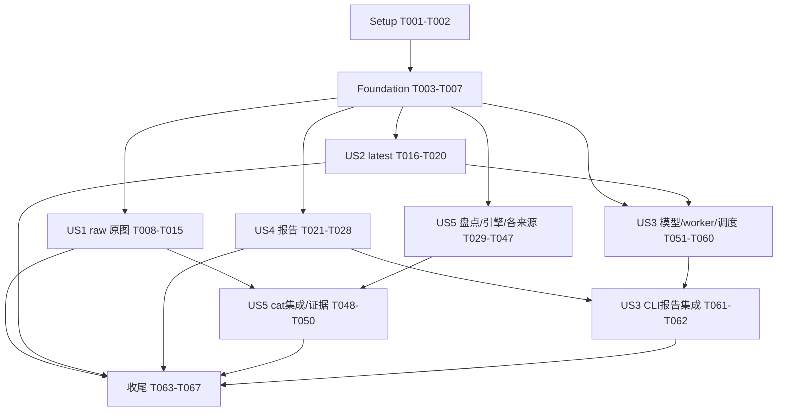

# Tasks: CLI 行为修复与终端体验优化

**Input**: `specs/002-cli-experience/` 下的 [spec.md](spec.md)、[plan.md](plan.md)、[research.md](research.md)、[data-model.md](data-model.md)、[contracts/cli.md](contracts/cli.md)、[contracts/discovery-report.md](contracts/discovery-report.md)、[contracts/legacy-display.md](contracts/legacy-display.md)、[quickstart.md](quickstart.md)。

**Branch**: 实际 Git 分支 `main`，特性目录 `002-cli-experience`。

**Tests**: 规格明确要求 Independent Test、离线比对和 SC-001–010 验收，故包含对应契约、集成、进程和PTY测试。先编写相关新行为测试并确认因缺失行为失败，再实施；既有通过基线不算新增功能通过。

**Organization**: Setup → Foundational → P1故事（US1、US2、US4、US5）→ P2故事（US3）→收尾。优先级不裁剪交付范围。所有路径相对仓库根目录，标注“新增”的文件由相应任务创建。不修改尚未批准的宪章占位模板，不升级工具链，不读取旧仓库凭据。

**Format**: `- [ ] Tnnn [P?] [USn?] 动作与文件路径`。[P]仅表示在本节明确的前置任务完成后，可与同组不同文件的任务并行；不是允许越过依赖。共同入口文件必须串行集成。

## Phase 1: Setup

**Purpose**: 固定现有契约和可重放测试输入，不重新初始化现有项目。

- [X] T001 按 `pyproject.toml` 执行 `uv sync --group dev` 与 `quickstart.md` 的现有基线测试，将命令、退出码、环境及结果记录至新增 `validation-results/002-cli-experience.md`；保持默认离线且不改变依赖范围。
- [X] T002 建立新增 `tests/support/cli_experience.py`，提供固定UTC时钟、多产品/多站FrameRef、无科学decoder的PNG/GIF获取器、目录注入与网络调用计数；复用 `tests/support/fixtures.py`，合成行为测试素材不得标为真实迁移证据。

## Phase 2: Foundational

**Purpose**: 为所有故事建立安全输出及CLI选择边界；本阶段完成后才开始故事实现。以下两组测试可并行，两个实现也可并行，但各自须先有失败测试。

- [X] T003 [P] 在新增 `tests/contract/test_cli_safe_output.py` 固定递归脱敏、认证URL、已知secret、C0/C1/ESC/OSC注入及JSON字段类型保留契约，覆盖错误和诊断文本（FR-017）。
- [X] T004 [P] 在新增 `tests/contract/test_cli_query_normalization.py` 固定无选择器注入latest、显式at/range不注入、半范围/冲突/非法时间报错及base-time/max-age保留语义，断言SDK Query默认未改变（FR-006–007）。
- [X] T005 [P] 在新增 `python/radiust/cli/safety.py` 实现供报告、异常、标题和诊断共用的安全文本/递归脱敏函数，保留安全身份信息和字段类型，不直接发布未知响应正文；依赖T003。
- [X] T006 [P] 在新增 `python/radiust/cli/query.py` 实现共享CLI时间规范化及Query构造，复用 `python/radiust/query.py` 的既有选择验证，不修改SDK默认；依赖T004。
- [X] T007 将安全输出接入 `python/radiust/cli/reporting.py` 的文本/JSON/异常序列化，并在 `tests/contract/test_cli_reports.py` 固定既有schema_version=1外层、单报告与单来源退出码；依赖T005，验证quiet仍保留JSON和错误。

**Checkpoint**: T001–T007通过；安全输出和时间规范化接口稳定。模型按所属故事实现，不提前引入无用公共抽象。

## Phase 3: US1 — 一条命令预览原始雷达图片 (P1，首个可演示增量)

**Goal**: 来源raw和本地PNG/GIF独立预览，不依赖科学解码。

**Independent Test**: 离线无decoder来源与本地图片一条命令显示身份/尺寸/raw；获取前拒绝不兼容renderer，decode/regrid/commit调用为零，成功/失败/取消均仅清理本次资源。此阶段原图显示完整，US5后补齐验证通过的legacy规则自动显示。

### Tests

- [X] T008 [P] [US1] 在新增 `tests/contract/test_cli_raw_preview.py` 覆盖source raw默认latest、歧义候选、--file/--raw互斥、科学选项显式传入即拒绝、非TTY必须显式text且获取次数为零、GIF首帧与未知元数据（FR-001–005）。
- [X] T009 [P] [US1] 在新增 `tests/integration/test_raw_preview_lifecycle.py` 注入损坏/超限图片、非图片、多artifact、发现后最新地址换帧及获取/显示取消，断言130、无科学路径调用、raw/hash/其他缓存/output不变、取消5秒内清理（SC-001/004/007）。

### Implementation

- [X] T010 [US1] 在新增 `python/radiust/display/__init__.py`、`python/radiust/display/models.py` 定义RawPreview身份、RGBA、格式/尺寸、GIF帧号、hash、original/legacy模式与规则/原因字段，未知时间和单位明确为空，不构造RadarField。
- [X] T011 [US1] 在新增 `python/radiust/display/raw.py` 实现PNG/GIF真实格式检测及受字节/像素/临时盘限制的首帧读取，复用 `python/radiust/raw.py`、`python/radiust/raw_replay.py` 完整性及所有权约束，保留独立RGBA副本；依赖T010。
- [X] T012 [US1] 在 `python/radiust/terminal/api.py`、`python/radiust/terminal/text.py` 接入RawPreview与GIF摘要，复用ansi/kitty/iterm2编码器和有界auto能力判断，标题经过safety处理；避免非TTY图形序列和未知图片物理数值推断；依赖T011。
- [X] T013 [US1] 在 `python/radiust/cli/cat.py` 增加--raw及PNG/GIF文件预览，复用T006默认时间规范化，先执行renderer/科学选项预检，再discover→唯一帧选择→acquire→display，歧义列安全候选和选择建议，多artifact暂按无验证规则拒绝；依赖T012。
- [X] T014 [US1] 在 `python/radiust/cli/cat.py`、`python/radiust/context.py`、`python/radiust/terminal/session.py` 完成所有退出路径的资源/终端恢复与取消130；若底层阻塞阻止5秒要求，以有界可终止获取边界解决而非只取消async任务，保持用户raw/cache/output所有权不变；依赖T013。
- [X] T015 [US1] 运行T008/T009及 `tests/contract/test_cli_cat.py`、`tests/contract/test_raw_replay.py`、`tests/terminal/test_renderers.py`、`tests/integration/test_raw_modes.py`，将raw增量结果记录至 `validation-results/002-cli-experience.md`，不得将US5标为完成。

**Checkpoint**: 原图MVP可演示；完整US1中legacy联动在T049回归，未提前宣称全部灰度能力可用。

## Phase 4: US2 — 省略时间参数即可取得最新资料 (P1)

**Goal**: discover/download/source cat统一默认latest，保留显式查询及文件模式。

**Independent Test**: 固定单站、多站、空结果、过期目录中默认与显式latest结果100%一致；半范围/冲突仍参数错误，文件多时刻仍须选择。

### Tests

- [X] T016 [P] [US2] 在新增 `tests/contract/test_cli_latest_defaults.py` 参数化discover/download/cat的默认/显式时间、base-time/max-age、--latest拼写、产品默认、站点多帧和文件NetCDF多时刻规则（FR-006–007/SC-002）。
- [X] T017 [P] [US2] 在新增 `tests/integration/test_latest_identity.py` 用同站同时间不同身份候选、跨站同名和过期样本验证不丢候选、cat不任取及download逐帧报告，不改变单来源显式查询契约。

### Implementation

- [X] T018 [US2] 在 `python/radiust/cli/main.py` 将discover/download接到 `python/radiust/cli/query.py`，与 `python/radiust/cli/cat.py` 使用相同默认规则；去除旧显式选择器强制检查，保持每命令已有支持选项范围。
- [X] T019 [US2] 在 `python/radiust/sources/base.py`、`python/radiust/sources/legacy.py` 与 `python/radiust/query.py` 修正按产品/站点latest选择和同时间候选保留/歧义检测，确保discover/download保留所有所选站最新帧，cat严格唯一，不修改SDK默认选择器要求。
- [X] T020 [US2] 运行T016/T017与 `tests/contract/test_query.py`、`tests/contract/test_cli_acquisition.py`、T008回归，记录 `validation-results/002-cli-experience.md` 的默认/显式等价矩阵。

## Phase 5: US4 — 快速看懂终端输出 (P1)

**Goal**: 标签化报告、窄终端完整信息、stderr进度、安全quiet/verbose/JSON。

**Independent Test**: 40/80/120列、中文长字段、NO_COLOR与管道保留身份/状态/时间/错误；JSON仅一个对象，取消恢复终端；三类报告各30秒可读验收。

### Tests

- [X] T021 [P] [US4] 扩展 `tests/contract/test_cli_output.py`，覆盖list/discover/download标题、状态/UTC/输出位置、汇总、空结果、错误建议，以及doctor/config/cache分组和敏感字段脱敏（FR-014/017）。
- [X] T022 [P] [US4] 扩展 `tests/terminal/test_cli_pty.py`，以40/80/120列验证中文/组合字符/长字段换行、NO_COLOR、stderr进度、未知总数、SIGINT恢复和图片前清除进度；加入quiet/verbose冲突及管道无控制序列断言（FR-015–016）。

### Implementation

- [X] T023 [P] [US4] 在新增 `python/radiust/cli/layout.py` 实现显示宽度、标签化表格/逐条记录、分组键值和不丢信息的换行；40列退化记录布局，状态不依赖颜色，已安全化文本才进入布局。
- [X] T024 [P] [US4] 在新增 `python/radiust/cli/progress.py` 定义ProgressEvent及阶段/完成数输出，TTY stderr动态刷新、未知总数无百分比、NO_COLOR无控制序列、quiet静默，finally清理光标和进度。
- [X] T025 [US4] 在 `python/radiust/cli/reporting.py` 使用T023实现按命令的展示投影和有依据的错误码建议，保留既有JSON字段/类型和显式JSON优先于quiet；统一空结果文案。
- [X] T026 [US4] 在 `python/radiust/cli/main.py`、`python/radiust/cli/cache.py`、`python/radiust/cli/doctor.py` 接入doctor/config/cache分组输出与安全verbose诊断，根/子命令quiet/verbose互斥规则一致；依赖T025。
- [X] T027 [US4] 在 `python/radiust/pipeline.py`、`python/radiust/batch.py`、`python/radiust/cli/main.py`、`python/radiust/cli/cat.py` 接入不依赖终端的可选进度回调，由CLI驱动T024；单来源查询/下载有实际阶段和完成数，最终报告或图片前结束进度，不改变SDK默认输出。
- [X] T028 [US4] 运行T021/T022及 `tests/contract/test_cli_reports.py`、`tests/terminal/test_capabilities.py`，在 `validation-results/002-cli-experience.md` 保存终端矩阵，并记录成功/无数据/部分失败三份报告各30秒的人类验收结果；没有真实验收者时明确待验收而非自称通过（SC-005–007）。

## Phase 6: US5 — 复现全部旧来源的灰度显示 (P1)

**Goal**: 全部旧产品路径有版本化规则和逐路径证据；缺合法材料明确blocked，不影响其他路径继续实施。

**Independent Test**: 每条材料齐全路径至少一组合法raw与固定旧基准比对，尺寸、像素、alpha、背景/缺测100%一致或有逐项已接受差异；所有路径有passed/difference_pending/blocked状态，科学状态不升级。

### Tests

- [X] T029 [P] [US5] 在新增 `tests/contract/test_legacy_display.py` 覆盖规则身份/版本匹配、步骤顺序、灰度0..224、透明缺测/不透明黑零、拒绝未知RGB/WMS反算、无规则回退与匹配执行失败不回退（FR-020–022）。
- [X] T030 [P] [US5] 在新增 `tests/contract/test_legacy_display_evidence.py` 覆盖manifest路径/hash/许可依据、缺材料blocked、差异待复核、证据字段完整、规则变更失效和科学状态不变；程序机制测试可用合成图但不得替代来源golden（FR-019/024）。
- [X] T031 [P] [US5] 扩展 `tests/sources/test_tile_adapter_replay.py`，添加来源/帧绑定、缺瓦片、重复瓦片、错误尺寸/顺序、未知组合规则必须拒绝，以及已验证完整组合保持alpha/范围语义（FR-023）。

### Models, inventory and engine

- [X] T032 [US5] 在新增 `migration/legacy-display-inventory.json` 盘点14地区与3类纳入的瓦片（RainViewer/Windy/BMKG）的全部source/product/path_id；从 `migration/inventory.json`、`specs/001-radiust-v1-migration/source-inventory.md` 和可取得的旧commit `8d251601ca551fbd5c05451f1fb337fc4b75362c` 无凭据代码/配置快照建立映射；OpenSnow/WU按用户决定排除于本次legacy-display范围，缺快照时明确范围证据未闭合与blocked。
- [X] T033 [US5] 在新增 `python/radiust/display/rules.py` 定义LegacyDisplayRule/DisplayEvidence、ordered_steps、输入限制与状态校验；在新增 `migration/legacy-display.schema.json` 定义台账/证据schema，保留既有科学和获取字段；依赖T032。
- [X] T034 [US5] 在新增 `python/radiust/display/engine.py` 实现有依据的颜色预处理、palette/zero palette、阈值、背景/范围/圆盘掩码、裁剪、缺口修补及缩放有序执行，基础/产品覆盖显式合并，不支持或证据缺失步骤报blocked；灰度编码独立于科学decoder，原raw只读；依赖T033。
- [X] T035 [US5] 在新增 `python/radiust/display/tiles.py` 实现完整输入校验及按验证规则的唯一帧组合，限制像素/临时资源，不填零/任意拼接/科学regrid；依赖T034，满足T031。
- [X] T036 [US5] 在新增 `scripts/validation/compare_legacy_display.py`、`tests/fixtures/legacy-display/manifest.json` 实现契约规定的离线回放及逐像素/尺寸/alpha/背景/缺测比较，输入与基准SHA-256校验、路径边界、逐项差异报告；包含blocked路径且有blocked/difference_pending时返回非零；依赖T035。

### Source/product migration batches

以下每项均依赖T032–T036。共同完成定义：逐产品移植可取得的真实规则，登记旧依据/配置hash；将合法样本和基准放入该来源独立fixture目录，产生单来源证据；缺raw/配置/许可/基准时写明确blocked且不得把移植任务勾为已通过。各任务不改共享manifest/index/audit文件，交由T046/T050集成。

- [X] T037 [P] [US5] 移植AU/CA/ES全部旧产品规则到新增 `python/radiust/resources/legacy_display/au.json`、`ca.json`、`es.json`，在 `tests/fixtures/legacy-display/au/`、`ca/`、`es/` 保存合法基准及对比证据，分别更新 `migration/sources/au.json`、`ca.json`、`es.json` 的display_migration。
- [X] T038 [P] [US5] 移植ID/KR/MY全部旧产品规则到新增 `python/radiust/resources/legacy_display/id.json`、`kr.json`、`my.json`，在 `tests/fixtures/legacy-display/id/`、`kr/`、`my/` 保存合法基准/证据并更新 `migration/sources/id.json`、`kr.json`、`my.json`；MY 东部当前站点选用 pinned `MY/base.yaml`：三组归档 raw/map 均与该配置精确匹配，当前引擎登记样本为 568×640、零像素差异。station-specific 配置保留为补充重放记录，不追查旧项目当时为何用了另一配置。旧项目标识不作为当前 station 名称；本地样本授权仅用于本次迁移验证。
- [ ] T039 [P] [US5] 移植NZ/PH/SG全部旧产品规则到新增 `python/radiust/resources/legacy_display/nz.json`、`ph.json`、`sg.json`，在 `tests/fixtures/legacy-display/nz/`、`ph/`、`sg/` 保存合法基准/证据并更新 `migration/sources/nz.json`、`ph.json`、`sg.json`；调查旧快照 PH 配对材料：output/ph 为空，pinned commit/当前来源fixture无 PH raw/gray，当前采集无 verified raw；记录缺失项并保持blocked。SG ordinal palette不替代legacy规则。
- [X] T040 [P] [US5] 按用户确认完成TH/TW/VN本批次：保留 `th/kkn240Loop`、`tw/observation`、VN等已核验路径；TH `cmp1` 暂不纳入本批次完成门槛，TW当前station沿用provider标识，不以旧项目别名改名。其余未证实子路径仍在覆盖台账中明确blocked且不自动启用。
- [X] T041 [P] [US5] 独立移植FR/PT专属_png_to_map与产品覆盖到新增 `python/radiust/resources/legacy_display/fr.json`、`pt.json`，在 `tests/fixtures/legacy-display/fr/`、`pt/` 保存合法基准/证据并更新 `migration/sources/fr.json`、`pt.json`；不得用WMS亮度或provider分类色表推断旧编码。
- [X] T042 [P] [US5] 完成RainViewer当前瓦片兼容性评估并记录 `python/radiust/resources/legacy_display/rainviewer.json`、`tests/fixtures/legacy-display/rainviewer/` 和 `migration/sources/rainviewer.json` 的旧规则与证据；当前新瓦片与旧规则的产品编码/尺寸不兼容，按用户决定本批次不再要求旧算法可运行或旧 gray 对比，后续开发新匹配算法时再适配。当前路径继续在覆盖台账中标记blocked，不自动启用。
- [X] T043 [P] [US5] 完成Windy当前任务范围内的通道调查并记录 `python/radiust/resources/legacy_display/windy.json`、`tests/fixtures/legacy-display/windy/` 和 `migration/sources/windy.json` 的规则及试跑；按用户提供的当前判读，红通道为雷达、绿通道看起来是相态，本批次据此收口。该判读不表示完成旧 gray 像素验证；后续新匹配算法再处理新瓦片，未验证的时间/范围路径仍保留blocked证据。
- [X] T044 [P] [US5] 按用户收敛范围，将OpenSnow/WU从本次legacy-display迁移及逐路径覆盖中移除；保留其独立的来源采集记录，不注册旧灰度规则或把它们计入本功能验收。
- [X] T045 [P] [US5] 记录BMKG旧规则于 `python/radiust/resources/legacy_display/bmkg.json`、来源探测和缺失证据于 `tests/fixtures/legacy-display/bmkg/`、`migration/sources/bmkg.json`；当前来源返回HTTP 403，无法取得瓦片。按用户决定结束本批次，保留路径blocked；后续新增可达数据源时再适配新来源与匹配算法。

### Integration and evidence

- [X] T046 [US5] 汇总T037–T045已产生证据及未完成项的具体缺失物至 `tests/fixtures/legacy-display/manifest.json`、`migration/legacy-display-inventory.json`，执行T036生成 `validation-results/legacy-display.json`，复核有意差异并保持未接受项difference_pending；未完成来源任务不阻止其他路径验证。
- [X] T047 [US5] 在新增 `python/radiust/display/registry.py` 按source/product/path_id/version/输入约束及证据注册规则，仅passed允许自动启用，配置hash变化使验证失效，原图回退说明缺失原因；依赖T033/T046。
- [X] T048 [US5] 在 `python/radiust/display/raw.py`、`python/radiust/cli/cat.py`、`python/radiust/terminal/text.py` 接入规则查找与显示转换，标题/摘要显示规则版本和仅显示结论；本地无来源证据保持原图，匹配规则执行失败报错，只有验证完整组合允许多artifact；依赖T047。
- [X] T049 [US5] 扩展 `tests/contract/test_cli_raw_preview.py` 并运行 `tests/contract/test_legacy_display.py`、`tests/contract/test_legacy_gray_source.py`，验证规则启用/失败/回退、未知文件、已验证瓦片与US1生命周期，不修改raw且无科学输出/能力升级；依赖T048。
- [X] T050 [US5] 在 `scripts/validation/audit_migration.py`、`tests/contract/test_migration_audit.py`、`tests/contract/test_migration_inventory.py` 接入display schema与逐路径覆盖检查；更新 `validation-results/us2.md`、`validation-results/us6-inventory.md` 的版本/输入输出hash/裁剪/基准/差异及blocked清单，不能将只登记blocked算作迁移通过；依赖T046/T049。

**Checkpoint**: 功能引擎及证据流程可独立验收；来源任务只有实际移植与比对满足条件才勾选。缺材料时保持相关任务未完成并记录blocked，继续其他故事；US5整体状态明确区分“台账登记完整”和“全部迁移通过”。

## Phase 7: US3 — 一次查看全部来源最新状态 (P2)

**Goal**: 全目录目标唯一终态、完整报告、有界并发与整批硬预算。

**Independent Test**: 注入含全部状态的离线目录，每目标恰一行且counts一致；阻塞worker在统一deadline后5秒内进程退出，SIGINT保留已完成项、清理并退出130。

### Tests

- [X] T051 [P] [US3] 在新增 `tests/contract/test_cli_discover_all.py` 覆盖有效产品/站点组合、无站点和展开失败占位、全部11种状态、能力限制独立、空值排序、counts、空目录、退出0/2/3/4/5/130、禁止过滤在调用前拒绝及max-age（FR-008–012）。
- [X] T052 [P] [US3] 在新增 `tests/integration/test_discovery_deadline.py` 从父测试进程计时注入阻塞HTTP/浏览器/插件展开、崩溃、迟到IPC/背压、预算耗尽及SIGINT，断言5秒退出/终端与临时资源恢复、已完成结果不丢、后代进程无遗留（FR-013/SC-004）。
- [X] T053 [P] [US3] 在新增 `tests/integration/test_discovery_limits.py` 测量多worker总请求/host/来源并发峰值，覆盖网络禁用、缺凭据、重定向许可、字节/资源上限及worker退出后的令牌回收，断言无越限/未授权联网（SC-007）。

### Models and implementation

- [X] T054 [US3] 在 `python/radiust/models.py` 增加DiscoveryTarget/Item/Report独立模型、11种状态、null优先排序、完整零计数及一次终态约束，FrameRef仅安全投影，不复用DownloadReport状态或改变旧字段。
- [X] T055 [US3] 在 `python/radiust/config.py` 加入正有限 `runtime.discovery_deadline=300.0`、字段白名单/环境变量解析，在新增 `tests/contract/test_discovery_config.py` 验证conf与环境覆盖优先级及非法值，不改变frame_deadline。
- [X] T056 [US3] 在新增 `python/radiust/discovery_worker.py` 实现spawn子进程协议、按ID加载适配器/插件及目录展开、来源最小配置私有IPC、限长结果/进度回传和父级指定临时根；覆盖浏览器后代资源归属，不将凭据放argv/日志；依赖T054/T055。
- [X] T057 [US3] 在新增 `python/radiust/discovery_limits.py` 与 `python/radiust/transport.py` 接入父级全局/host/来源令牌仲裁及租约回收，阻塞/FTP/浏览器不支持仲裁路径必须保守串行且本地额度受限，worker不能各自使用完整全局额度；依赖T056。
- [X] T058 [US3] 在新增 `python/radiust/discovery.py` 利用 `python/radiust/registry.py` 建立目录目标账本，按有效所属关系展开而非盲目笛卡尔积，无站点单独目标、来源展开失败保留占位，防止占位与已展开目标重复计数；目录/插件展开也通过T056预算边界。
- [X] T059 [US3] 在 `python/radiust/discovery.py` 实现有界目标调度、独立错误归因、同时间歧义和能力限制，单一monotonic deadline从目录处理前开始，frame/request/host/来源限额不重置；依赖T057/T058，复用US2选择语义。
- [X] T060 [US3] 在 `python/radiust/discovery.py`、`python/radiust/discovery_worker.py`、`python/radiust/context.py` 实现停止派发→≤1秒协作取消→terminate/kill→有界join→自有临时根清理，总收尾≤5秒；保留终态、丢弃迟到结果、未开始不伪称timeout，取消优先130；依赖T059。
- [X] T061 [US3] 在 `python/radiust/cli/main.py` 接入discover all默认/显式latest，查询前拒绝at/start/end/base-time/product/station，允许max-age；在 `python/radiust/cli/reporting.py` 输出单一JSON及完整人类汇总，使用US4进度接口并按契约确定退出码；依赖T060/T025/T027。
- [X] T062 [US3] 执行T051–T053及 `tests/contract/test_discovery_config.py`，回归单来源discover/download JSON和默认latest，将状态/并发峰值/阻塞进程计时/取消清理证据写入 `validation-results/002-cli-experience.md`；不能只以async task取消断言硬退出。

## Phase 8: Polish & Cross-Cutting Concerns

**Purpose**: 完整范围回归与交接；缺外部材料的来源仍公开未完成，不阻塞可完成的文档/回归。

- [X] T063 [P] 更新 `docs/cli.md`，说明默认latest/多站选择、raw和科学边界、legacy启用/回退/失败/版本、all状态/退出码/预算配置、终端降级、quiet/verbose及离线管道示例（FR-018）。
- [X] T064 [P] 更新 `README.md` 的最短离线PNG/GIF与CLI使用示例、来源能力说明；不得把灰度显示迁移写为科学解码通过，也不依赖历史fixture在当前时间仍为latest（FR-018）。
- [X] T065 在 `pyproject.toml` 核验版本化规则随wheel打包，运行构建后的最小安装raw/显示规则加载冒烟并回归可选recovery extra缺失提示，将结果记录至 `validation-results/002-cli-experience.md`；不把缺合法样本的路径伪装为已启用。
- [X] T066 执行 `specs/002-cli-experience/quickstart.md` 的完整离线验收、`uv run pytest tests/contract tests/integration tests/terminal tests/sources/test_tile_adapter_replay.py` 和 `uv run ruff check python tests scripts/validation`；Rust改动时补对应cargo测试，在 `validation-results/002-cli-experience.md` 逐项记录SC-001–010证据与仍阻塞项，失败先修复再复核。
- [X] T067 对照 `specs/002-cli-experience/spec.md`、本任务表与 `validation-results/legacy-display.json` 更新 `TODO.md` 和 `validation-results/002-cli-experience.md` 交接状态；仅实际通过范围可勾选，保留未移植来源任务和人类验收待办，审计FR覆盖、无旧凭据读取、科学状态未升级及本次改动文件清单。

## Dependencies & Execution Order

### Phase and story graph

默认按任务ID顺序执行，P1在P2之前。同优先级按照规格出现顺序排列。若US5外部材料阻塞，记录后继续US3和可执行收尾，不等待不存在的授权/样本；这不代表US5完成。

US1依赖基础T006即可具备source cat默认latest，不等待US2命令全量接入。US2独立验证discover/download及科学cat，US1 raw回归在串行合并后执行。US4可用固定结果/进度源独立测试，不等待US3；all真实进度接入归T061。US5引擎/材料验证可独立开始，最终cat联动依赖US1。US3调度可独立测试，CLI汇总集成依赖US4，latest选择复用US2。基础之外无强制全故事顺序依赖。

### Task dependencies and file ownership

- T003→T005→T007；T004→T006。T008/T009完成测试后进入T010–T015，T016/T017之后T018–T020，T021/T022之后T023/T024并行、T025–T028串行。
- US5：T029/T030/T031测试→T032→T033→T034→T035→T036→T037–T045并行来源批次→T046→T047→T048→T049→T050。T046允许收集未完成批次的blocked证据，但不能替批次勾选完成。
- US3：T051/T052/T053测试→T054→T055→T056→T057→T058→T059→T060→T061→T062。所有故事完成或显式列出外部阻塞后可执行T063/T064；T065→T066→T067串行。
- `cli/main.py`、`cli/cat.py`、`cli/reporting.py`、`context.py`、`terminal/api.py` 和共用验收记录由整合执行者串行修改；不得因故事不同就同时编辑这些文件。
- US5并行批次仅写各自资源/fixture/来源JSON，共享manifest/index/schema及us2/us6报告由T046/T050统一合入。若T032发现TH/TW等子来源使用独立来源JSON，先在清单明确唯一归属到对应批次，避免重复认领。
- 新行为测试先确认失败再实现；测试依赖仅为接口契约/fixture，可先独立编写。验收命令成功且证据完整才勾选执行任务；禁止用skip/xfailed掩盖要求缺失。

## Parallel Examples per Story

| 故事 | 可并行示例 | 前置与边界 |
| --- | --- | --- |
| US1 | T008 CLI契约与T009生命周期集成测试 | Foundation完成；不同测试文件；实现入口串行 |
| US2 | T016默认选择契约与T017身份集成测试 | Foundation完成；不同文件；main/cat变更由T018整合 |
| US4 | T021输出契约与T022 PTY；之后T023布局与T024进度 | 各组前置测试/基础完成；reporting和入口由T025–T027整合 |
| US5 | T029/T030/T031测试；之后T037–T045九个来源批次 | 来源批次须T032–T036完成，写集互斥；共享manifest由T046写 |
| US3 | T051报告契约、T052进程deadline、T053限额测试 | Foundation及固定fixture完成；共享实现按依赖串行 |

跨故事可并行进行US5材料盘点与US1原图实现，以及US3 worker测试与US4布局实现；只授权互不冲突的文件写集。需要委派时可沿用Luna worker做边界明确的信息收集或单批次工作，主执行者负责共享入口集成。

## Implementation Strategy

**MVP first**: T001–T015为原图预览首个可演示增量，具备source raw和文件PNG/GIF、获取前预检及资源清理。它不代表完整特性完成；US1中的验证规则自动显示还需US5。若要求MVP即展示旧灰度，必须加入至少一条合法已通过路径的T029–T049依赖链，不能合成证据。

**Incremental delivery**: 原图 → 默认latest全命令 → 终端报告 → legacy规则及逐路径证据 → 全目录发现 → 完整离线/打包/人工验收。每增量保留旧JSON和明确查询回归，缺材料只阻塞对应来源迁移，不停止其他授权工作。

**Blocked handling**: 每个缺材料路径记录所缺raw/许可/旧配置/基准/瓦片及补齐后运行命令，保持对应移植任务未勾选。清单登记完成可以验收，迁移passed另行验收；无旧快照导致范围不明时，不声称SC-008的100%盘点已达成。无终端验收者时T028人工部分保持待验收。不要因通过了其他测试而覆盖这些状态。

## Requirement Coverage

| 需求 | 主要任务 | 验收 |
| --- | --- | --- |
| FR-001–005 | T008–T015、T048–T049 | SC-001/004/007 |
| FR-006–007 | T004/T006、T016–T020 | SC-002 |
| FR-008–009 | T051、T058、T061 | SC-003 |
| FR-010–012 | T051、T054、T059–T062 | SC-003/004 |
| FR-013 | T052–T053、T055–T060 | SC-004/007 |
| FR-014–016 | T021–T028、T061 | SC-005/006 |
| FR-017 | T003/T005/T007、T021–T028、T049/T062/T066 | SC-005/007 |
| FR-018 | T063–T064 | 离线示例与边界说明 |
| FR-019 | T032、T037–T046、T050 | SC-008 |
| FR-020–021 | T029、T033–T045 | SC-009/010 |
| FR-022–023 | T031、T035、T041–T049 | SC-001/009/010 |
| FR-024 | T030/T036、T046/T050/T067 | SC-008–010 |

## Generation Checks

本文件仅生成任务，不代表任务已执行。before_tasks/after_tasks按skill检查，无扩展文件时跳过。最终交付前检查ID连续唯一、所有任务有文件路径、故事标签/优先级正确、并行文件互斥、需求覆盖及依赖无环。
