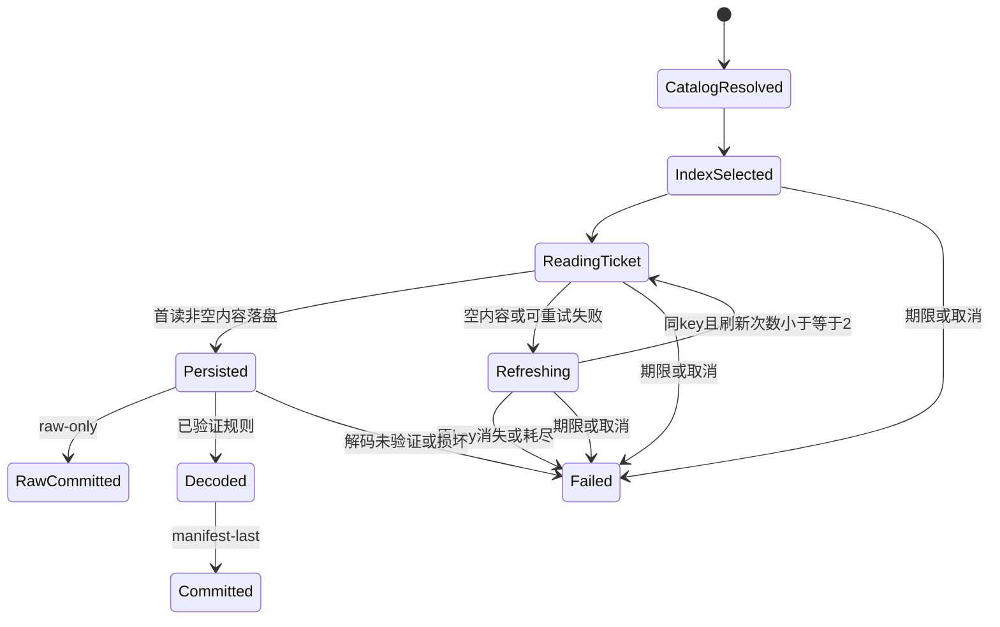

# RDCAP 数据模型

本文件是实施合同，扩展尚未实现。复用Query、FrameRef、RawFrame、RadarField及DiscoveryReport。

## 实体与关系

| 实体 | 字段/关系 | 约束 |
|---|---|---|
| Source | id=rdcap、provider=RDCAP/CWA、countries=[TWN,JPN,PHL]、版本、能力证据 | 独立于tw/tw-http/ph |
| Product | id/variable=reflectivity、units=dBZ、grid=geographic、historical/forecast=false、metadata.recent_time_queries=true | scan_type/height/upstream_qc未知；不保证cadence/窗口长度 |
| Station | id=两字母国家前缀+站码、name、可选lon/lat/altitude、product_ids、metadata | 保留原始记录ID/status列表、conflict、快照日期/出处；非实时状态 |
| StationCatalogUpdate | stations、observed_at、origin、冲突说明 | 可选adapter目录hook，一次发现共享，合并快照 |
| Timeline | country/station_code、list(key,url[])、header | ticket仅内存，header非必需；非完整历史 |
| FrameRef | source/product/station、valid_time、base_time=None、logical_id/revision、locator_version、private locator | 一站一个实际key绑定帧；ticket不参与身份 |
| RawFrame | frame、file-response.json、binding.json及receipt | 原始HTTP payload字节；size/sha256校验 |
| SparseGridHeader | W/H、T、first/last lon/lat、int16、default/invalid、CRS、scale/offset、legend | 仅已验证格式，维度非固定900/901 |
| SparseGrid | nnz、colIdx、rowPtr、vals | CSR合法，先检查预算再dense分配 |
| RadarField | reflectivity、f32 values/u16 quality、shape=[H,W]、dBZ、valid_time、Grid、provenance | C行优先，北→南，与frame时间一致 |
| Grid | EPSG:4326、shape、中心x/y、affine | 当前帧独立几何，左上角注册 |
| AnnotationEvidence | rdcap-annotation-v1、raw9999、source_annotation、empirical_inference、count/证据版本 | raw保留原值，bit6逐像元标记，非官方nodata |
| CapabilityEvidence | country/station/frame、verified_at、offline_decode/live_acquire/independent_readback | 三国分别验收，不以fixture填live |

## 标识与目录

RDCAP station语法为`(TW|JP|PH)[A-Z0-9]+`，不将当前四字符站码作为永久长度约束。不接受空码、重复分隔符、`.`/`..`、控制字符、反斜杠或百分号别名。短码在该次完整目录唯一时归一化；规范化后再查重，RCHL和TWRCHL不能变成两个目标。所有来源的公开站点 ID 均不放行斜杠。

目录增加可选metadata，schema仍v1。SDK StationInfo lon/lat为float或None，未知不补0。BALE保留全部原始记录ID和状态冲突但仅一个身份。Inactive仍可请求，Active空索引仍no_data。

内置快照48站=13 TWN+20 JPN+15 PHL；在线增站不受48限制。成功刷新中不再出现的快照站继续可选并标明快照来源，不自动判定retired。刷新失败保留快照并继续已知站请求；未知显式目标返回catalog_unavailable。

## 时间、身份、原始绑定

- epoch-ms经检查转换UTC RFC3339，identity沿用六位小数，例如1790834708000→2026-10-01T06:05:08.000000Z。
- safe locator仅country、station_code、key，locator_version=rdcap-csr-v1；ticket置于过滤的url/headers或独立私有结构，不保存upstream header ticket。
- identity_schema=1，包含完整station；票据、请求时间、并发、临时目录不影响hash。revision由原始内容摘要解析，不用JWT/key代替内容revision。
- binding.json含binding_version=1、country、station_code、key、valid_time、file_sha256、provider_origin、protocol_version；字段确定性，不放获取时刻/随机值。实际获取日期进入验证日志。
- CSV没有观测时间；时间证据来自索引选中key与file内容绑定，不声称文件内有独立时间证明。
- latest逐站最大时刻；at严格相等；range为[start,end)；max_age仅latest。同key换ticket去重；稳定描述/内容revision冲突显式ambiguous，不随机选一条。

## 数组与几何

W,H>=2，有限经纬度，lon递增，本版first_lat<last_lat；W×H与缓冲字节checked arithmetic。colIdx/vals长NNZ，rowPtr长H+1、起0/终NNZ/非递减；每行columns严格递增且0≤col<W；vals为int16。NNZ可为0，是合法全缺测場。

dense先填-999、写稀疏值、翻转行。科学值=raw×0.1。dx=(last_lon-first_lon)/(W-1)、dy=(last_lat-first_lat)/(H-1)、west=first_lon、north=last_lat；affine=[west,dx,0,north,0,-dy]。x[c]=west+(c+0.5)dx，y[r]=north-(r+0.5)dy，bounds=[west,north-H×dy,west+W×dx,north]。

| 基准 | shape[H,W] | bounds[W,S,E,N] | 格距 |
|---|---|---|---|
| TWRCHL | [901,901] | [117.12,19.48,126.13,28.49] | 0.01° |
| JPISHI | [900,900] | [119.69,19.92,128.69,28.92] | 0.01° |
| PHSUBI | [900,900] | [115.87,10.32,124.87,19.32] | 0.01° |

## 数值与质量

| raw角色 | value | quality | PNG/decoded preview |
|---|---|---|---|
| 默认/缺测-999 | NaN | 1：bit0 missing | 透明 |
| 验证规则中的9999标记 | NaN | 65：bit0+bit6 source_annotation | 透明，raw可追溯 |
| 有效负值或<5dBZ | raw×0.1 | 0 | 透明，数值有效 |
| 有效≥5dBZ | raw×0.1 | 0 | 15档下界色标，≥75白色 |

既有bits1–5不重新解释；缺测/弱回波不推定无雨。provenance记marker推断、rule/decoder/palette版本、raw摘要。9999规则限于已验证头/scale/legend组合；空间标记行为需三国样本与网页对照留证，行为不符时保持science未验证，不静默解释。

## 生命周期与报告

已提交raw-only保留，未完成科学成果不发布。raw cache只复用摘要验证完整内容；命中同logical frame不消耗ticket。解析/解码/提交共享资源及worker生命周期。

latest/at每target一个终态；range可含同target多个distinct frame items，counts.total按实际items，不一概等于站数。无匹配/失败target仍一项。48站快照latest矩阵sum(counts)=48；动态增站/range按预期目标/帧集合核对。
