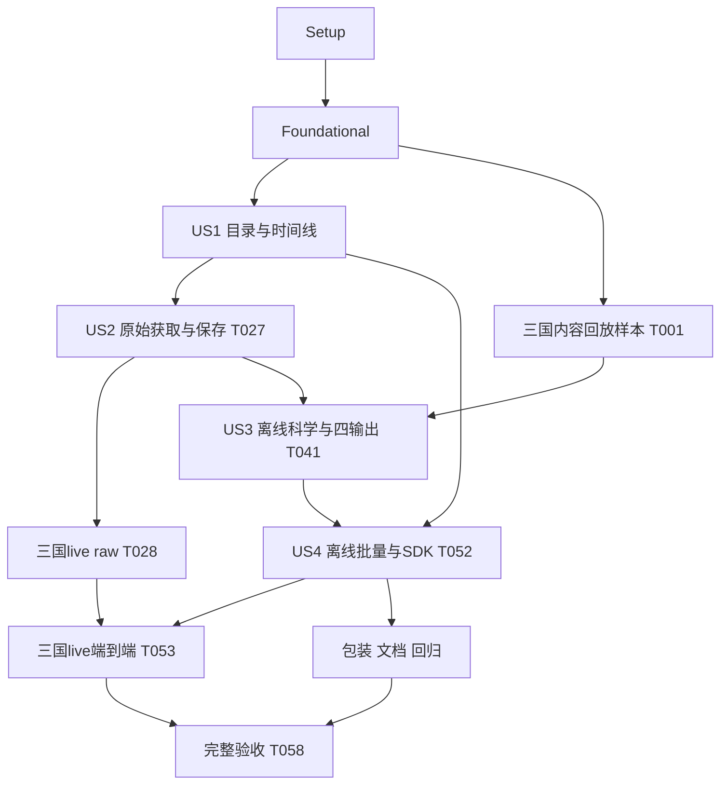

# Tasks: RDCAP 台湾、日本、菲律宾单站雷达支持

**Input**: `specs/004-rdcap-single-station/` 的 [spec](spec.md)、[plan](plan.md)、[research](research.md)、[data-model](data-model.md)、[contracts](contracts/cli-sdk.md)、[quickstart](quickstart.md)。

**Prerequisites**: Phase 0/1设计已完成；实际Git分支为main。任务状态以逐项复选框及验证台账为准。宪章仍为占位模板，不将示例审批或TDD要求视为已批准原则。

**实施状态（2026-10-01）**：55/58项已按证据关闭。T028/T053仍受三国 provider catalog 不可用阻塞；离线预算/取消矩阵和 CLI/同步/异步同 ref 等价核对已通过。T058 因 live 门槛未满足而保持未勾选。详见 [验证台账](../../validation-results/004-rdcap-single-station.md)。

**Tests**: 规格FR-024及SC-001–008明确要求可重放证据、异常场景和独立读回，因此包含必要的合同/集成验证。故事内先建立有意义的失败场景，再实现对应行为；本任务文件不要求额外用户审批。缺fixture、skip、未运行或上游不可达均不能计作通过。

**Organization**: US1/US2/US3为P1，US4为P2；每故事可单独验收其增量。US1不下载file，US2独立验收raw保存/离线完整性，US3可用已有内容样本独立验收science，US4验证入口等价与部分失败。

## Format: `[ID] [P?] [Story] Description`

- `[P]`仅表示在列明依赖完成后，可与同一执行波次中不同文件的任务并行；不表示可以越过前置条件。
- Setup/Foundational/Polish无故事标签；故事阶段必须有`[US1]`至`[US4]`。
- 路径均相对仓库根；拟新增文件由所属任务创建。`crates/radiust-core/tests/rdcap/`是单一`rdcap_contract`测试目标的子模块，不新增独立Cargo测试目标。
- 任务完成需留下可核对结果。T028/T053/T058是验收门槛，上游受限时写明blocked并保留未勾选；其他不依赖live的工作仍可继续。

## Phase 1: Setup — 样本、证据与测试入口

**Purpose**: 整理已授权研究材料，复用现有Rust1.92、CLI、PyO3构建，不初始化新项目或第二套Python pipeline。

- [X] T001 [P] 从`validation-results/rdcap-analysis/catalog.json`、三国`frame.csv`、`grid.json`、`comparison.json`建立`tests/fixtures/sources/rdcap/manifest.json`及`TWN/RCHL/`、`JPN/ISHI/`、`PHL/SUBI/`回放资料，保留出处/实际key/摘要；构造的JSON envelope明确标注reconstructed，不称为原始HTTP响应，目录/索引样本清除ticket。
- [X] T002 [P] 创建`validation-results/004-rdcap-single-station.md`，记录当前仅浏览器取样/内容解码通过、原生三国获取未验收，建立SC-001–008和逐国offline/live/readback证据栏，列出日期、build、frame identity、限制与结果，禁止预填passed。
- [X] T003 创建`crates/radiust-core/tests/rdcap_contract.rs`和`crates/radiust-core/tests/rdcap/support.rs`，预接线并初始化catalog/discovery/acquisition/persistence/science/output/batch子模块文件，提供可复用的fixture读取、可控UTC时钟、loopback服务器/请求计数/延迟取消工具；测试显式注入local origin或adapter，不增加生产endpoint配置/公网旁路（依赖T001）。

## Phase 2: Foundational — 共用接口与受限传输

**Purpose**: 所有故事共用的最小扩展；本阶段完成后才能开展故事实现。

- [X] T004 [P] 在`crates/radiust-core/src/errors.rs`与`crates/radiust-core/src/error_contract.rs`新增typed RDCAP/provider错误及安全ErrorCode映射，覆盖unknown_station/catalog_unavailable/no_matching_time/ambiguous_index/ticket_exhausted/selected_frame_disappeared/unexpected_body/decode_unverified/invalid_grid/访问拒绝/超时；保留既有enum含义与stage/retryable，不靠字符串识别，验证脱敏且不回显URL/body。
- [X] T005 [P] 在`crates/radiust-core/src/source/catalog.rs`给CatalogSource/Product/Station增加缺省为空的可选metadata和StationCatalogUpdate DTO，定义国家、近期查询、目录冲突/出处及逐国能力字段；保持schema v1、其他来源字段/坐标不变，旧目录仍可解析。
- [X] T006 [P] 在`crates/radiust-core/src/transport/http.rs`增加可选single-attempt文件GET策略及所需请求结果分类，保持默认重试路径不变；用`crates/radiust-core/tests/http_metadata.rs`的loopback合同验证只发一次GET、同源跳转、TLS/headers策略、字节限制、实际request/host permit及取消，禁止HEAD/预读。
- [X] T007 在`crates/radiust-core/src/source/mod.rs`增加返回StationCatalogUpdate的可选异步目录hook，默认None；共用SourceContext/RequestBudget/操作取消，不自行创建无预算client；确定Engine可在目标过滤前一次调用的接口（依赖T004–T006）。

**Checkpoint**: 旧来源默认路径与共用预算不变；目录/错误/单次GET合同可供后续故事使用。

## Phase 3: User Story 1 — 找到三国站点及近期时次（P1，MVP）

**Goal**: list查到48唯一身份，在线目录可增补，latest/at/range返回每站真实时刻和独立结果，不消费file ticket。

**Independent Test**: 冻结目录13/20/16条记录→48身份；BALE冲突可见；APAR Active但no_data；短码唯一/歧义、新站、缺坐标、乱序/毫秒/重复/缺口/stale/半开区间均有预期结果，file请求计数为0。

### Tests for User Story 1

- [X] T008 [P] [US1] 在`crates/radiust-core/tests/rdcap/catalog.rs`建立目录/规范身份/未知坐标/BALE冲突/跨国短码歧义/新增站/目录刷新失败回放，断言一次目录刷新、其他来源标识不放行斜杠，snapshot与实时状态分离。
- [X] T009 [P] [US1] 在`crates/radiust-core/tests/rdcap/discovery.rs`建立真实epoch-ms时间线和latest/精确at/[start,end)/stale/空索引/拒绝HTML/重复ticket/稳定候选冲突/取消场景，断言逐目标终态、无合成时间且file GET为0。

### Implementation for User Story 1

- [X] T010 [US1] 在`crates/radiust-core/src/source/rdcap.rs`实现严格`(TWN|JPN|PHL)/[A-Z0-9]+`解析/目录短码规范化辅助函数，在`crates/radiust-core/src/model.rs`仅对source=rdcap使用站点专用校验，其他source/product/locator_version继续原规则；规范化后再次拒绝重复选择（依赖T008/T009）。
- [X] T011 [US1] 在`python/radiust/models.py`与`python/radiust/registry.py`贯通SourceInfo/ProductInfo/StationInfo可选metadata和RDCAP未知坐标None；覆盖StationInfo/FrameRef/DiscoveryTarget/Query国家站码校验，StationInfo用metadata.source_id及所属SourceInfo限定，保持其他来源映射行为（依赖T010）。
- [X] T012 [US1] 在`python/radiust/resources/catalog.json`登记rdcap/默认reflectivity及48唯一快照站点，附国家/原始目录status冲突/快照出处/unknown scan-height/QC、historical=false/近期at-range能力与逐国live未验收元信息，不以当前活跃站作为永久白名单（依赖T005/T010）。
- [X] T013 [US1] 在`crates/radiust-core/src/source/rdcap.rs`实现country/radar目录POST与已验证XHR/Referer headers，按国家站码合并原始记录并保留冲突/无坐标，目录hook一次返回三国去重信息，未知/拒绝内容使用typed错误（依赖T007/T012）。
- [X] T014 [US1] 在`crates/radiust-core/src/engine.rs`于目标过滤/统计前调用一次RDCAP目录hook，合并快照、新站和保留项，短码归一化后展开目标；刷新失败继续已知目标、未知显式站返回catalog_unavailable；将刷新纳入原发现总deadline和取消预算（依赖T013）。
- [X] T015 [US1] 在`crates/radiust-core/src/source/rdcap.rs`实现`datetime=""`近期索引请求及checked epoch-ms→UTC FrameRef，稳定locator只含country/station_code/key，票据仅私有url/headers；检测未知url[]结构、同key票据重复和稳定描述冲突，不下载header、不猜历史参数（依赖T014）。
- [X] T016 [US1] 在`crates/radiust-core/src/source/mod.rs`注册RdcapSourceAdapter，在`crates/radiust-core/src/engine.rs`接入逐站latest/精确at/半开range和RDCAP专属no_matching_time/ambiguous映射；更新当前注册/快照总数为25/74，旧24/26来源集合仍完整，其他来源selector不改（依赖T015）。
- [X] T017 [US1] 在`crates/radiust-cli/src/commands/list.rs`与`crates/radiust-cli/src/human.rs`展示RDCAP国家/目录状态/冲突/快照/能力信息，沿用`crates/radiust-cli/src/commands/discover.rs`报告布局、时区与真实时间；默认list离线，无新增country flag，未知站不空成功（依赖T011/T016）。
- [X] T018 [US1] 运行`crates/radiust-core/tests/rdcap/catalog.rs`、`crates/radiust-core/tests/rdcap/discovery.rs`及标准CLI目录/发现回放，将SC-001/002与全来源74快照目标、range按frame items统计、file请求0的结果写入`validation-results/004-rdcap-single-station.md`（依赖T010–T017）。

**Checkpoint**: 可交付目录/时间线MVP；此时没有声明原始文件自动获取或科学成果已验收。

## Phase 4: User Story 2 — 保存可离线重放的原始单站资料（P1）

**Goal**: 标准入口自动保存所选帧原始字节和时间绑定；票据失效后有界重取同key，缓存/manifest可离线核验。

**Independent Test**: loopback首读成功/二读空模拟、同key换票据、旧帧消失、HTML/空body/超时/超限/取消验证不虚假提交；三国raw保存和摘要/绑定/manifest断网读取不依赖science。三国真实HTTPS获取另由T028验收，数值重放在US3。

### Tests for User Story 2

- [X] T019 [P] [US2] 在`crates/radiust-core/tests/rdcap/acquisition.rs`建立单读ticket状态机合同：无HEAD/header GET、每ticket一次GET、最多三次文件请求/两次索引刷新、同key绑定、刷新仍返回旧ticket/原帧消失、空JSON/HTML/访问拒绝/预算取消，无原生fixture回退。
- [X] T020 [P] [US2] 在`crates/radiust-core/tests/rdcap/persistence.rs`建立原始payload字节/确定性binding、ticket换新identity不变、内容revision改变、v1 manifest完整性/篡改/symlink、raw cache/并发消费者/幂等/skipped/安全模板合同，raw-only不得调用science/preview。

### Implementation for User Story 2

- [X] T021 [US2] 在`crates/radiust-core/src/source/rdcap.rs`实现私有票据与country/code/key绑定校验和fetch_raw hook，只接受已选帧提供者HTTPS同origin`/file?ft=`，拒绝userinfo/fragment/未知路径及未审查redirect，公开safe locator不含header ticket（依赖T019/T020及T018）。
- [X] T022 [US2] 在`crates/radiust-core/src/source/rdcap.rs`经single-attempt HttpTransport流式写临时`file-response.json`并计算receipt，保持JSON解析前payload字节，校验非空UTF-8 JSON string/获取合法性；raw-only不dense解码，意外HTML/空内容不提交成功（依赖T021/T006）。
- [X] T023 [US2] 在`crates/radiust-core/src/source/rdcap.rs`实现同key有限刷新与已用ticket去重，最多两次刷新/三张可用票据且不重置frame deadline；空内容/可重试错误才重取，已消失时刻/拒绝直接明确失败，取消终止等待/请求（依赖T022）。
- [X] T024 [US2] 在`crates/radiust-core/src/source/rdcap.rs`生成不含获取时间/随机值的`binding.json`，在`crates/radiust-core/src/engine.rs`与`crates/radiust-core/src/raw_manifest.rs`接通v1 raw保存/安全locator/摘要与所选key绑定核验；合法未知science格式仍可保留raw，离线load不复原ticket（依赖T023）。
- [X] T025 [US2] 在`crates/radiust-core/src/engine.rs`和`crates/radiust-core/src/source/rdcap.rs`复用完整raw cache并为同logical frame并发获取合并首读结果，消费者复用已保存内容而非二读ticket；按内容摘要解析revision，验证临时文件真实生命周期、byte/permit预算及取消清理（依赖T024）。
- [X] T026 [US2] 在`crates/radiust-core/src/download.rs`对已校验RDCAP模板`{station}`编码为单个`TWN%2FRCHL`分量，验证`crates/radiust-core/src/identity.rs`不将ticket/临时路径纳入hash，保持默认hash目录、其他来源模板、root containment、overwrite/manifest-last和raw追加revision规则（依赖T025）。
- [X] T027 [US2] 在`crates/radiust-cli/src/commands/download.rs`接通RDCAP raw-only标准下载和安全逐项错误，运行acquisition/persistence合同验证字节、离线manifest、有限重试/失败无成功清单；将结果写入`validation-results/004-rdcap-single-station.md`（依赖T021–T026）。
- [ ] T028 [US2] 经标准Engine/原生CLI且正常TLS完成TWN/JPN/PHL各一站的当前raw-only获取，保存真实`file-response.json`/binding/manifest并将日期、build、country/station/key、摘要及尝试数写入`validation-results/004-rdcap-single-station.md`；代表站无数据可换同国站，上游受限记录blocked并保持此任务未勾选，不用Orca/curl -k/样本替代（依赖T027）。

**Checkpoint**: T027证明原始保存增量离线完整；只有T028三国成功才有原生在线raw通过。T028受限不阻止使用已有内容样本开展US3离线工作，也不代表US2全部完成。

## Phase 5: User Story 3 — 正确单位、位置的回波数值和图像（P1）

**Goal**: CSR恢复原生EPSG:4326 dBZ，区分缺测/弱值/annotation，统一科学预览和四输出；每种科学成果可独立读回。

**Independent Test**: 三国语义样本、RCHL八点≤0.01dBZ/缺测一致，bounds/中心注册/行方向误差≤格距×1e-6；负值/弱值不丢，9999→NaN+quality65，15级颜色符合基准，四格式/readback和raw科学重放一致。

### Tests for User Story 3

- [X] T029 [P] [US3] 在`crates/radiust-core/tests/rdcap/science.rs`建立三国CSR/header、NNZ/rowPtr/列顺序/int16/溢出/资源限制、未知CRS/注册/transform/legend、全缺测/仅标记回放；独立断言三站geometry、八参考点、负/弱值和annotation65，错误不变成科学成功。
- [X] T030 [P] [US3] 在`crates/radiust-core/tests/rdcap/output.rs`与`tests/test_rdcap_formats.py`建立PNG/decoded preview一致、15档边界/透明/sidecar及NetCDF/GeoTIFF/Zarr独立Python读回合同，保留旧六质量位文件可读和其他来源palette默认；缺互操作依赖明确not_verified。

### Implementation for User Story 3

- [X] T031 [US3] 在`crates/radiust-core/src/science/rdcap.rs`实现有界JSON string/七行CSR parser，仅接受已验证T/int16/EPSG:4326/default-invalid=-999/linearTransform(.1,0)组合，先检查W/H/NNZ/token/所有缓冲的checked arithmetic与limits；未知格式decode_unverified、结构损坏invalid_grid（依赖T029/T030/T024）。
- [X] T032 [US3] 在`crates/radiust-core/src/science/rdcap.rs`恢复dense raw和值/质量，默认缺测NaN+1、有效值raw×.1质量0；按rdcap-annotation-v1验证门槛将9999排除为NaN+65，保留原值出处/推断角色/数量，不丢负值或低于5dBZ值，不对未知标记行为静默解释（依赖T031）。
- [X] T033 [US3] 在`crates/radiust-core/src/science/rdcap.rs`同步翻转values/quality并构建T锚点的当前帧affine、完整像元外边界和中心x/y，生成安全provider/frame/raw摘要/decoder/annotation provenance；不套用站心几何、TW EPSG:3821或网页3857，不推断高度/雨强（依赖T032）。
- [X] T034 [US3] 在`crates/radiust-core/src/science.rs`接入decoder子模块，在`crates/radiust-core/src/engine.rs`增加仅rdcap/reflectivity科学分派/能力检查及实际生命周期decode semaphore、typed decode错误；解码前验证binding country/code/key/时间/摘要与FrameRef一致，其他未验收来源仍拒绝（依赖T033）。
- [X] T035 [P] [US3] 在`python/radiust/resources/palettes/rdcap_reflectivity.json`建立编译/打包可定位的版本化15档资源，完整保存5–75dBZ下界、验证RGB、<5/缺测/annotation透明及适用协议/规则证据；资源版本为rdcap-reflectivity-v1，非默认渐变替换（依赖T029/T030；可与T031开始的decoder链并行）。
- [X] T036 [US3] 在`crates/radiust-core/src/output/png.rs`让已验证RDCAP科学字段默认使用离散资源且preview/write共享render规则，补充frame身份/geometry/palette/rule version sidecar；显式palette/vmin/vmax记录实际选择，其他source default不变，`cat --decoded`不恢复标记（依赖T034/T035）。
- [X] T037 [US3] 在`crates/radiust-core/src/output/netcdf.rs`、`crates/radiust-core/src/output/geotiff.rs`、`crates/radiust-core/src/output/zarr.rs`贯通RDCAP质量bit6/flag_masks/meanings、NaN、f32/u16、时间/坐标/CRS/provenance，reader接受原有六位与合法新增位布局，不令旧成果失效或重定义旧bits，其他来源输出保持兼容（依赖T034）。
- [X] T038 [US3] 在`crates/radiust-core/src/engine.rs`、`crates/radiust-core/src/download.rs`与`crates/radiust-core/src/grid.rs`给已验证RDCAP EPSG:4326添加native/显式geographic regrid能力，复用bbox/resolution/nearest和线性反射率域bilinear及质量传播，保持其他CRS/未验证source限制（依赖T034/T037）。
- [X] T039 [US3] 在`crates/radiust-core/src/engine.rs`、`crates/radiust-core/src/raw_manifest.rs`与`crates/radiust-core/src/download.rs`完成raw-manifest→科学重放、decoder/resource/palette/annotation版本化processing identity；原始修改/绑定不符拒绝，纯离线无ticket，同ref四输出幂等和--raw追加必须同revision（依赖T024/T034–T038）。
- [X] T040 [US3] 运行`tests/test_rdcap_formats.py`对同组三国field产生的PNG/NetCDF/GeoTIFF/Zarr及sidecar作独立读回，核对八点/几何误差门槛、quality65和弱值、全NaN合法场、preview一致及重复skipped，将逐格式结果写入`validation-results/004-rdcap-single-station.md`（依赖T036–T039）。
- [X] T041 [US3] 运行`crates/radiust-core/tests/rdcap/science.rs`、`crates/radiust-core/tests/rdcap/output.rs`及标准CLI单站decoded/四输出回放，记录SC-004/005/006离线science通过或限制于`validation-results/004-rdcap-single-station.md`；浏览器重建envelope不升级为live HTTP证据（依赖T040）。

**Checkpoint**: 离线科学与四输出可独立验收；T028未通过时仍不得宣称在线端到端完成，live science/readback门槛由T053完成。

## Phase 6: User Story 4 — 现有批量与编程工作流（P2）

**Goal**: CLI/同步/异步共用Engine，完整逐站report与成功refs并存，失败/取消保留partial_result，原始/field生命周期一致。

**Independent Test**: 同frame跨CLI/同步/异步identity/时刻/值/坐标/quality/code一致；混合success/no_data/stale/timeout/未知站的collect不丢成功，stop/raise部分结果可核对；无站点展开全部，单帧多匹配拒绝，raw关闭/field独立有效。

### Tests for User Story 4

- [X] T042 [P] [US4] 在`tests/test_rdcap_sdk.py`建立同步/异步discover_report、acquire/decode/fetch/write、replay_raw_manifest、collect/stop/raise/partial_result、iter_fetch、ErrorContext.code、raw关闭/field独立及显式to_xarray合同，使用同refs与断网fixture而非重复latest。
- [X] T043 [P] [US4] 在`crates/radiust-cli/tests/rdcap.rs`与`crates/radiust-core/tests/rdcap/batch.rs`建立多站/无站点/all展开、latest与range计数、单帧歧义、混合失败/预算耗尽/取消未开始/迟到结果禁止commit合同，核对schema/stdout单JSON/既有退出码及shared request/host/frame/CPU预算。RDCAP 31项合同、CLI all/74目标报告、共享预算与调度测试通过。

### Implementation for User Story 4

- [X] T044 [US4] 在`crates/radiust-python/src/lib.rs`与`python/radiust/_bridge.py`公开或复用绑定的完整discover_report及Engine::replay_raw_manifest，传递FrameRef私有locator但不序列化ticket、typed safe code/stage/retryable；沿用native返回对象，不重复定义业务DTO/decoder（依赖T042/T043/T041）。
- [X] T045 [US4] 在`python/radiust/rust_client.py`给Client/AsyncClient增加discover_report/replay_raw_manifest薄入口，保持现有discover返回refs/异常语义和同步线程/异步事件循环限制；报告提供to_json()/frame(index)，无公网重放不依赖Orca（依赖T044）。
- [X] T046 [US4] 在`python/radiust/rust_client.py`、`python/radiust/models.py`与`python/radiust/errors.py`让批量query collect/continue保留可选discovery_report/discovery_counts并继续成功refs，stop/raise的partial_result保留已完成项和发现失败，不为无帧目标伪造FrameRef，不改变frame计数含义（依赖T045）。
- [X] T047 [US4] 在`crates/radiust-cli/src/commands/download.rs`与`crates/radiust-cli/src/report.rs`贯通发现阶段混合结果、成功帧下载和安全失败/取消/未开始统计，latest按唯一目标、range按实际frame items核对；scalar cat保持歧义检查，默认download未选站纳入全部三国目标（依赖T043/T046）。
- [X] T048 [US4] 在`python/radiust/errors.py`、`python/radiust/_bridge.py`与`python/radiust/rust_client.py`贯通可选ErrorContext.code及acquire/decode/fetch/批量/流式的阶段、重试属性和progress生命周期；显式to_xarray保持质量65/坐标/CRS/provenance，field脱离raw可用且raw关闭后访问失败，无新增Python科学pipeline（依赖T044–T047）。
- [X] T049 [US4] 按`crates/radiust-core/tests/rdcap/batch.rs`将RDCAP动态目录/索引/票据刷新/CPU/提交实际生命周期接入`crates/radiust-core/src/engine.rs`、`crates/radiust-core/src/download.rs`及`crates/radiust-core/src/limits.rs`现有调度，修复合同暴露的预算/取消缺口而不扩大默认限额，保证一次全量发现300秒内收尾、迟到结果不发布（依赖T047/T048）。目录刷新共享deadline/取消、请求/主机/帧与CPU预算、stop及外部取消收尾和禁止迟到提交合同通过。
- [X] T050 [US4] 在`scripts/validation/validate_rdcap.py`实现quickstart定义的--mode offline/live、--conf、--out验证器，online经标准SDK/Engine固定每国一个ref、首读保存后复用同内容、decode/四writer/独立readback/重复skipped；offline使用注明出处的回放，缺依赖/skip/not_verified与blocked返回非零，日志不含ticket（依赖T045–T049）。
- [X] T051 [US4] 执行`tests/test_rdcap_sdk.py`、`crates/radiust-cli/tests/rdcap.rs`和`crates/radiust-core/tests/rdcap/batch.rs`，用同refs核对CLI/同步/异步成功身份/数值/质量和失败code，记录mixed batch的全部目标及sum(counts)、range帧集合/部分结果至`validation-results/004-rdcap-single-station.md`（依赖T049）。同一 raw manifest/ref 的 CLI、同步及异步 SDK 四格式读回一致；mixed batch 保序并核对 typed failure/counts，range 按实际 frame item 计数。
- [X] T052 [US4] 经`scripts/validation/validate_rdcap.py --mode offline`执行三国science/四输出/重放和异常完整矩阵，保留安全summary.json、缺依赖和未执行项，记录SC-007/008结果于`validation-results/004-rdcap-single-station.md`（依赖T050/T051）。
- [ ] T053 [US4] 经`scripts/validation/validate_rdcap.py --mode live`正常TLS完成三国各当前有资料站的标准发现→raw→decode→至少一个科学成果独立读回并留四格式同帧矩阵/日期/build/raw摘要，记录SC-003于`validation-results/004-rdcap-single-station.md`；任一国家失败或skip保持本任务未勾选，不以offline或其他国家补齐（依赖T028/T050/T051）。

**Checkpoint**: T052可证明离线跨入口工作流；完整在线支持还须T028/T053均通过。CLI与SDK没有第二条来源业务路径。

## Phase 7: Polish & Cross-Cutting Concerns

**Purpose**: 包装/回归/文档/能力声明收尾，与明确验收证据一致。

- [X] T054 [P] 更新`docs/python-sdk.md`及`specs/004-rdcap-single-station/quickstart.md`，写清RDCAP站点/近期选择、discover_report/replay入口、annotation bit6、默认科学palette、模板编码和逐国能力边界，命令只引用实际已存在接口，用户流程无需理解ticket/CSR；同步最终科学限制到`docs/rdcap-single-station-analysis.md`（依赖T052）。
- [X] T055 [P] 使用现有构建/安装路径验证无Python原生CLI及安装后wheel的RDCAP目录资源、science/PNG资源定位和SDK入口，在`crates/radiust-cli/tests/native_e2e.rs`补必要安装后合同并将macOS arm64 build/版本/离线结果写入`validation-results/004-rdcap-single-station.md`，不增加其他平台上线承诺（依赖T052）。
- [X] T056 在`crates/radiust-core/tests/source_matrix.rs`、`crates/radiust-core/tests/foundation_compat.rs`与`crates/radiust-cli/tests/native_e2e.rs`运行并修正必要的新增目录计数断言，保留旧24source/26target集合及TW默认grid/TW-HTTP/PH行为/旧质量/旧palette/旧manifest读回回归，核对新增25/74快照和动态增站；执行相关cargo fmt/clippy与合同测试，结果写入`validation-results/004-rdcap-single-station.md`（依赖T054/T055）。
- [X] T057 依据`validation-results/004-rdcap-single-station.md`实证更新`python/radiust/resources/catalog.json`中的单位/科学/显示及逐国live能力状态、日期和证据出处，仅通过T028/T053的国家可标live verified，保持高度/QC/归档未知或不支持，不能将阻塞改写为能力通过（依赖T056；live状态更新还依赖T028/T053）。
- [ ] T058 按`specs/004-rdcap-single-station/quickstart.md`核对SC-001–008与FR-001–024全部证据、原始/离线/live/格式读回分层结果、资源/秘密/取消收尾，将最终完成或未关闭限制汇总到`validation-results/004-rdcap-single-station.md`；任一必需门槛未通过保持此任务和对应验收任务未勾选，不以任务已执行/skip代替完成（依赖T018/T027/T028/T041/T052/T053/T056/T057）。

## Dependencies & Execution Order

### Phase Dependencies

| 阶段 | 前置 | 完成判定 |
|---|---|---|
| Setup T001–T003 | 无 | provenance、证据台账、测试入口可用 |
| Foundational T004–T007 | Setup | 共用合同/TLS/预算缺省兼容 |
| US1 T008–T018 | Foundational | 目录/时间线独立回放与CLI通过 |
| US2 T019–T028 | US1；测试脚本可在基础完成后先写 | T027离线raw通过，T028另证三国live raw |
| US3 T029–T041 | Foundational+T001样本+T024 raw绑定；实现按编号推进 | T041离线science/四输出通过，不依赖T028成功 |
| US4 T042–T053 | US1–US3离线增量；测试可先写 | T052离线等价，T053依赖T028并通过三国live |
| Polish T054–T058 | T052后可做离线收尾 | 最终T058须全部门槛闭合 |

### User Story Dependencies



三条P1不是完全独立实现：US2使用US1帧身份，US3使用T024绑定/US2真实raw，但US3的数值验证可从已有内容fixture独立开始，不要求先解决上游网络。图中的US2→US3依赖为T024/T027离线接口，不要求T028成功。

### Within Each User Story

先写故事合同再实现对应行为，纯数据资源→parser/model→adapter/service→Engine/CLI/SDK→集成证据按明确依赖推进。测试应因目标能力缺失/错误而失败，不能仅因人为缺依赖当作预期红灯。共享engine.rs、source/rdcap.rs、rust_client.py的任务串行；不要以不同故事标签掩盖同文件冲突。

### Parallel Opportunities

| 波次 | 可并行任务 | 条件/文件边界 |
|---|---|---|
| Setup | T001、T002 | fixtures与证据台账独立 |
| Foundational | T004、T005、T006 | Setup完成；errors、catalog DTO、HTTP及其测试文件不同 |
| US1合同 | T008、T009 | Foundational完成，分别catalog.rs/discovery.rs |
| US2合同 | T019、T020 | 基础/fixture完成，分别acquisition.rs/persistence.rs |
| US3合同 | T029、T030 | 基础/fixture完成，science.rs与output.rs/Python formats分离 |
| US3实现 | T035与T031→T034 | T029/T030完成；JSON资源与Rust decoder/Engine分离 |
| US4合同 | T042、T043 | 基础/fixture完成，Python SDK与Rust CLI/batch分离 |
| Polish | T054、T055 | T052完成；文档与安装后测试/证据独立 |

T003先创建各测试子模块并完成入口接线，后续并行测试任务只编辑自身模块；避免共同改rdcap_contract.rs。测试资源共享只读，证据台账写入集中串行或由协调者合并；不同worker不同时修改相同文件。

## Parallel Examples by User Story

```text
US1：完成Foundational后，同时分配T008(catalog合同)与T009(discovery合同)，再串行T010–T018。
US2：同时分配T019(ticket合同)与T020(persistence合同)，按T021–T027集成，T028单独联网验证。
US3：同时分配T029(science合同)与T030(outputs合同)；合同就绪后T035(palette资源)可与T031–T034(decoder链)并行，T036等待二者。
US4：同时分配T042(Python SDK合同)与T043(Rust CLI/batch合同)，随后按绑定→facade→batch→CLI→预算→验证器顺序集成。
```

这些是可执行的文件所有权分配示例，不在生成任务阶段自动启动worker。若使用Orca/Luna，必须确认实际模型/就绪、限制写入范围并完成精确worker资源收尾；之前启动失败的worker不能作为研究或实施贡献。

## Implementation Strategy

### MVP First — User Story 1

完成T001–T018即可交付目录与近期时间线MVP，独立核对48站/实际时刻/状态；不宣称raw或science可用。最小实用数据闭环还需US2原始获取和US3正确解码，完整范围须包含US4及三国live。

### Incremental Delivery

1. Setup+Foundational后交付US1；新增source与其他来源回归集合分别核对。
2. 实现US2离线原始协议并尽早执行T028，优先暴露原生HTTP/TLS可行性；网络不通则如实保留门槛。
3. 通过已有真实内容样本实现US3，不依赖人工Orca会话，不把重建envelope误计为原始HTTP成功。
4. 集成US4完整report/replay/批量与同步异步/CLI等价，用同refs固定数据比较；线上T053与离线T052分别给结果。
5. 包装/文档/旧来源回归与能力声明收尾，SC-001–008全部满足后完成T058；未满足的任务保持开放。

### Parallel Team Strategy

基础完成后可分配独立合同与纯palette资源给worker；涉及同一Engine/adapter/SDK facade的串行修改由同一负责人整合。US3测试可先用fixture进行，实际science入口等T024到位；对live仅记录限制不能算作任务完成或取消后续验收要求。

## Requirement Coverage

| 要求 | 主任务 |
|---|---|
| FR-001 | T012、T016、T017 |
| FR-002 | T010、T011、T013、T026 |
| FR-003 | T008、T012–T014、T018 |
| FR-004 | T009、T015、T016 |
| FR-005 | T009、T015、T018 |
| FR-006 | T004、T009、T014、T016、T046–T049 |
| FR-007 | T020–T024、T027、T028 |
| FR-008 | T006、T021–T023、T028、T053 |
| FR-009 | T019、T023、T025、T049 |
| FR-010 | T019–T024、T027、T034 |
| FR-011 | T002、T034、T041、T057、T058 |
| FR-012 | T029、T031–T034 |
| FR-013 | T029、T032、T036、T037 |
| FR-014 | T001、T032、T033、T037、T054 |
| FR-015 | T029、T033、T038、T040 |
| FR-016 | T030、T035、T036、T040 |
| FR-017 | T030、T034、T036–T041、T050 |
| FR-018 | T011、T042–T048、T051、T055 |
| FR-019 | T014、T016、T043、T046、T047 |
| FR-020 | T020、T024–T026、T039、T046、T049 |
| FR-021 | T004、T019、T043、T044、T047–T049 |
| FR-022 | T012、T015、T031、T033、T054、T057 |
| FR-023 | T006、T010–T012、T016、T036、T037、T056 |
| FR-024 | T001、T002、T028、T029、T050–T053、T058 |
| SC-001 | T008、T018 |
| SC-002 | T009、T018 |
| SC-003 | T028、T053 |
| SC-004 | T029、T033、T040、T041 |
| SC-005 | T029、T030、T032、T036、T040 |
| SC-006 | T020、T030、T039–T041、T050 |
| SC-007 | T019、T020、T043、T049、T052 |
| SC-008 | T042、T043、T051、T054–T056 |

## Notes and Completion Rules

58个任务：Setup 3、Foundational 4、US1 11、US2 10、US3 13、US4 12、Polish 5；16项标记[P]，按上述波次而非全局任意并行。

所有任务遵循checkbox、连续TaskID、必要故事标签及明确路径；依赖及文件所有权检查在生成时执行。before_tasks/after_tasks未注册hook，无需派发。任务生成只创建此文件，不实施源码、不提交/切分支、不把已有研究样本当作本任务已完成。
