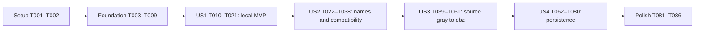

# Tasks: 灰度编码 dBZ 解码与 gray/dbz 口径统一

**Input**: `specs/005-gray-dbz-decoding/` 的 [spec.md](spec.md)、[plan.md](plan.md)、[research.md](research.md)、[data-model.md](data-model.md)、[contracts/cli-sdk.md](contracts/cli-sdk.md)、[contracts/gray-decoding.md](contracts/gray-decoding.md)、[contracts/persistence.md](contracts/persistence.md)、[quickstart.md](quickstart.md)。

**Date**: 2026-10-02；**Revised**: 2026-10-03（分析问题修订）。实际Git分支为`main`，逻辑特性为`005-gray-dbz-decoding`。

**Prerequisites**: 使用现有Rust1.92/edition2024、PyO30.29、image0.25、NetCDF/Zarr v2及薄Python SDK；不新增crate、provider或Python图像业务流水线。constitution仍为占位模板，不将其示例当已批准规则。

**Tests**: FR-013/018及SC-001–007要求逐路径离线验收、独立读回、接口等价与兼容/故障核对，因此按测试先行实施。新能力断言先写并确认失败，再实现和执行验收；历史基准必须继续通过。

**Organization**: 四个故事各一阶段，优先级P1/P1/P1/P2；基础设施先完成，明确依赖后实施。`[ ]`均表示未实施。现有gray passed不代表005 dbz已验收。

## Format: `[ID] [P?] [Story] Description`

- `[P]`仅表示在本节规定的前置任务完成后，可与同一并行组的其他任务同时执行；不允许跨组抢跑或同时写同一文件。
- `[US1]`本地编码读取；`[US2]`命名与兼容；`[US3]`来源闭环；`[US4]`数值保存和历史成果复用。
- 所有路径相对仓库根目录，标为新增的文件在实施时创建。旧spec/plan/tasks与历史验证文件保留；新证据使用新的gray/dbz路径。
- 固定政策：local=`strict-v1`；已匹配passed来源=`source-upper-clip-v1`，仅数值反算`min(gray,224)*5/16`、原gray不改。截断不能清除无效mask。

## Phase 1: Setup（已有仓库的离线验收准备）

**Purpose**: 固定可复核输入，不重复初始化workspace或引入新运行时依赖。

- [X] T001 [P] 新建`tests/fixtures/gray-dbz/paths.json`，从`tests/fixtures/legacy-display/manifest.json`、`validation-results/legacy-display.json`及`crates/radiust-core/tests/legacy_display_parity.rs`固定23条路径的source/product/path/station/frame_index、passed/blocked原因、原规则/config/输入/基准SHA与宽高；只填有依据的time/geometry，其余null，005状态先为planned。另建`tests/fixtures/gray-dbz/protected-artifacts.json`，逐文件列出当前`specs/001-*/`至`specs/004-*/`全部已有文件、`tests/fixtures/legacy-display/`、`python/radiust/resources/legacy_display/`、原`validation-results/legacy-display.json`及paths.json引用的其他原始raw/gray/规则/历史验证文件的SHA；按实施前现状取基线，不覆盖已有改动。保护清单不包含本次要更新的README.md和docs/活动文档。
- [X] T002 [P] 在`tests/fixtures/gray-dbz/local/`生成小型225码、有效黑色、透明隐藏越界、半透明、可见超界/非灰度、8/16-bit PNG和多帧GIF输入；16位alpha覆盖0、1、255、256、65535。另用`tests/fixtures/gray-dbz/local/values.json`定义小数/NaN、非法alpha及数组案例；记录生成关系，不把合成时刻当真实观测时间，不修改旧fixtures。

**Checkpoint**: 23条原证据可定位，local fixture不依赖公网；T001/T002可并行，目录与产物互不覆盖。

## Phase 2: Foundational（所有故事的共用前置）

**Purpose**: 固定共用模型、身份、错误、资源与格式能力边界。T003–T009完成后进入故事阶段。

- [X] T003 [P] 新建`crates/radiust-core/src/raster.rs`，实现RasterInput的Source/Local/NumericFile三分支、RasterInputIdentity/NumericFileIdentity及read receipt、EncodingBasis/GrayRuleIdentity、GrayDecision/GrayFrame、AlphaPlane U8/U16、PixelDbzField、RasterResult/Arc或dataset owner+index、借用RasterView、ProcessingRecord/ModeInfo及GeometryEvidence；校验同形/row-major、optional真实time/geometry、质量/adjustment，区分当前输入与upstream provenance；native/file_dbz不伪填gray依据，保留旧RadarField严格合同。
- [X] T004 [P] 在`crates/radiust-core/src/errors.rs`和`crates/radiust-core/src/error_contract.rs`增加invalid_gray_encoding/unit_mismatch结构化错误及安全row/column/value上下文，明确validate/decode等stage映射；保持原unsupported/decode_unverified/invalid_grid/resource_limit/cancelled分类与序列化。
- [X] T005 [P] 在`crates/radiust-core/src/grid.rs`将内部错误名称QUALITY_RECOVERED=32纠正为QUALITY_BELOW_DETECTION，并核对`crates/radiust-core/src/output/png.rs`的已有质量消费规则；保持数值、native过滤行为及其他bits，必要旧公开常量仅作注明语义的deprecated兼容入口。
- [X] T006 在`crates/radiust-core/src/identity.rs`实现local_gray的content/declaration/time/geometry域与local_numeric的format/content digest/variable/selection域，以及校验后的RasterCommitIdentity/receipt；自包含数值单文件以实际SHA、Zarr以全部安全相对key文件SHA/size排序清单、GeoTIFF以data/quality/provenance固定角色组件SHA/size清单产生摘要，根路径/mtime/别名不入hash。新增decoder/rule/quality/range/writer策略进入005处理hash，来源gray承接取得logical_id/resolved revision，历史ProcessingSpec及native身份不变（依赖T003/T004）。
- [X] T007 在`crates/radiust-core/src/lib.rs`注册新raster类型及兼容导出，确保原RadarField、generic science、旧frame提交和PyO3公开面不因共用模型引入改变；只注册已存在的模块，不用空实现冒充解码支持（依赖T003–T006）。
- [X] T008 在`crates/radiust-core/src/limits.rs`和`crates/radiust-core/src/temp.rs`实现可复用的checked shape/峰值缓冲预算与租约，覆盖RGBA、values、quality、origin、原alpha按U8/U16实际1/2B每像素、派生预览alpha、adjustment及crop/inpaint/resize/writer缓冲，沿用共享deadline、许可和取消，不仅检查max_pixels（依赖T003/T004/T007）。
- [X] T009 在`crates/radiust-core/src/output/mod.rs`建立RasterView输出能力预检：Pixel仅PNG/NetCDF/Zarr，GeoTIFF/bbox/geographic/resolution须完整可信几何和映射，未知time不阻止像素数值；保留原native格式支持，逐format返回明确错误（依赖T007/T008）。

**Checkpoint**: 共用合同可用且无伪FrameRef/time/CRS；T003/T004/T005独立并行，其他基础任务按列出的依赖完成。

## Phase 3: User Story 1 — 从已确认的灰度编码读取 dBZ（P1，MVP）

**Goal**: 无网络、无FrameRef/time/CRS的本地输入，通过显式声明得到可计算Pixel dBZ和质量；CLI及同步/异步SDK均可读取/预览。

**Independent Test**: 全225整数满足`gray*5/16`且误差≤1e-6；opaque0=0、alpha0=NaN+missing、非零alpha不乘值；越界/小数/非灰度/损坏/歧义失败，16-bit不被窄化，结果无伪时刻/坐标。16位alpha先按原值判断并无损导出。此阶段不要求US4保存能力。

### Tests first

- [X] T010 [P] [US1] 新建`crates/radiust-core/tests/gray_dbz_local.rs`，为严格数组/图像解码编写225码、shape/通道/有限整数性、16-bit、原dtype及alpha16的0/1/255/256/65535案例；检查原位深有效性、预览非零保持、原alpha无损、values/quality/adjustment/声明/SHA/unknown time/geometry与safe错误位置，非法alpha明确失败。
- [X] T011 [P] [US1] 新建`crates/radiust-cli/tests/gray_dbz_local.rs`，覆盖`cat --file --raw/--gray/--dbz --frame-index`、默认raw不声明、模式冲突、原gray像素、缺时刻/定位仍预览；核对本地mode_schema_version=1/mode_info与Envelope v1/result类型。覆盖损坏/多帧歧义、着色科学PNG不反算及取消/超限；仅依赖本地fixtures。
- [X] T012 [P] [US1] 新建`tests/contract/test_gray_dbz_local.py`，为Client/AsyncClient显式decode_gray_file、Core严格数组入口和to_xarray编写等价断言；核对unknown time/geometry、原alpha16的0/1/255/256/65535及dtype/质量、输入身份与结构化错误，不使用Python算术实现解码。

### Implementation

- [X] T013 [US1] 新建`crates/radiust-core/src/dbz.rs`，实现gray-dbz-v1严格原值校验及f32反算、225码/有效性、原U8/U16 alpha0 missing与opaque0有效、同形全零adjustment和local ProcessingRecord；规范数组alpha位深由原uint8/uint16 dtype确定，其他dtype拒绝，不先cast。任何gray窄化前检查整数/范围，local不提供clamp开关。
- [X] T014 [US1] 在`crates/radiust-core/src/dbz.rs`实现有界PNG/GIF/WebP本地读取与SHA/read receipt，保留8/16位原gray/alpha、alpha_bit_depth，在原alpha判断可见性后严格校验，只有显示派生非零保持的8位alpha；支持显式frame_index和媒体/编码标注检查。拒绝多帧歧义/已知着色科学成果，不从mtime/文件名推断time/geometry（依赖T013）。
- [X] T015 [US1] 在`crates/radiust-core/src/engine.rs`接入decode_gray_file/decode_gray_values及`crates/radiust-core/src/lib.rs`新dbz导出，使用已有decode许可/spawn_blocking、预算、operation scope/期限和取消，返回携带local身份的RasterResult，不取网络资料（依赖T013/T014）。
- [X] T016 [US1] 在`crates/radiust-core/src/python_types.rs`绑定PixelDbzField/RasterResult、同形质量/origin/adjustment、AlphaPlane原U8/U16及alpha_bit_depth/metadata接口、严格数组/文件方法和radiust_code/radiust_stage错误属性；native backing共享所有权，显式数组复制计预算（依赖T015）。
- [X] T017 [US1] 在`python/radiust/_bridge.py`添加CoreEngineSession本地方法和新类型承接，优先读取结构化错误，旧扩展缺方法时明确能力/版本不足，不在解码/资源/取消失败后fallback（依赖T016）。
- [X] T018 [US1] 在`python/radiust/rust_client.py`实现Client/AsyncClient.decode_gray_file，并在`python/radiust/api.py`、`python/radiust/__init__.py`添加decode_gray_file/adecode_gray_file lazy入口；复用operation scope、loop/thread检查、progress/cancel/close语义（依赖T017）。
- [X] T019 [US1] 扩展`python/radiust/science_adapters.py`，将Pixel结果显式转reflectivity DataArray(row,column)，质量/origin/adjustment/适用原alpha为同形坐标，alpha保留uint8/uint16与alpha_bit_depth；已知time才附带，保留native转换及可选依赖边界（依赖T016/T018）。
- [X] T020 [US1] 在`crates/radiust-cli/src/lib.rs`完成本地`cat --file --raw/--gray/--dbz`及frame-index、互斥/默认raw解析；在`crates/radiust-cli/src/terminal.rs`接入原gray与Pixel dBZ预览，在`crates/radiust-cli/src/report.rs`建立本地additive mode_schema_version=1/mode_info，保持Envelope v1及旧result类型。沿用renderer/图例/退出码与未知time/geo表示，不造地理RadarField（依赖T015）。
- [X] T021 [US1] 执行T010–T012与`specs/005-gray-dbz-decoding/quickstart.md`第2节本地场景，确认Core/CLI/同步异步数值、质量、身份及错误一致，记录`validation-results/gray-dbz-local.json`；只将实际通过断言记为通过（依赖T013–T020）。

**Checkpoint**: US1含本地raw/gray/dbz解析与schema1报告，可完整执行quickstart第2节，不依赖US2的名称扩展；正式数值文件保存留给US4，不以此阻塞本地值读取。

## Phase 4: User Story 2 — raw / gray / dbz 命名与兼容（P1）

**Goal**: CLI/docs/代码/资源/SDK活动名称一致，旧参数/类/报告/身份仍可使用，非反射率generic语义不变。

**Independent Test**: 用既有离线gray规则、native直接反射率、本地gray和非反射率科学文件检查模式、单位、旧入口及JSON形状；新15条来源反算在US3接入，不将未接入能力提前报告成功。

### Tests first

- [X] T022 [P] [US2] 新建`crates/radiust-cli/tests/gray_dbz_modes.rs`，覆盖cat规范/旧模式归一、互斥/默认raw、source/file互斥、gray原像素、dbz单位与decoded generic文件，以及download的raw附加语义/raw-only冲突和本地选择参数拒绝。
- [X] T023 [P] [US2] 新建`tests/contract/test_gray_dbz_reports.py`，检查Envelope v1的旧result/字段类型、mode_schema_version=1、cat层/逐item mode_info、失败actual=null、raw回退actual=raw、真实其他单位、JSON/stderr/quiet/退出码不被迁移提示破坏。
- [X] T024 [P] [US2] 新建`crates/radiust-core/tests/gray_compat.rs`，固定旧规则原序列化config hash、编码wire版本、old module/type入口、canonical资源映射、原gray字节、ProcessingSpec历史身份与tw-legacy-v1 locator不因纯改名变化。
- [X] T025 [P] [US2] 新建`tests/contract/test_gray_decoder_compat.py`，核对GrayDbzDecoder严格入口与LegacyGrayDbzDecoder原参数/tuple/error/浮点窄化/strict=False/max_gray配置；验证historical profile不进入canonical --dbz，旧扩展fallback判定在本阶段用能力辅助层隔离核对：只对缺方法的direct来源适用且不吞失败；真实来源facade闭环在T043/T061验收。

### Implementation

- [X] T026 [US2] 将`crates/radiust-core/src/legacy_display.rs`活动实现迁入`crates/radiust-core/src/gray.rs`，提供GrayPreview/GrayDecision规范入口和旧module/type薄包装，并调整`crates/radiust-core/src/lib.rs`；只保留一套像素算法，旧调用字段/像素行为不变。
- [X] T027 [US2] 在`python/radiust/resources/gray/`建立canonical规则引用，并更新`crates/radiust-core/src/gray.rs`资源加载/旧路径兼容codec；原legacy_reference/ordered_steps/operation/wire版本先按历史字段核对hash再映射活动名称，历史资源与证据字节不改（依赖T026）。
- [X] T028 [US2] 在`crates/radiust-cli/src/report.rs`将T020已有本地schema1/ModeInfo扩展到source、generic科学文件及download/replay逐item，保持Envelope v1/result/旧字段类型；处理raw/gray/dbz/scientific/null、单位/time/geo/clip/limitations与兼容display_mode，不把整张数组塞进JSON（依赖T020）。
- [X] T029 [US2] 在`crates/radiust-cli/src/lib.rs`以T020已有本地三模式解析为基础，扩展source及旧参数归一，download/replay增加dbz声明、source/file和本地选帧解析；保留--decoded generic及download --raw附带raw语义，歧义获取前拒绝，不在尚未接线的local download分支panic（依赖T020/T028）。
- [X] T030 [US2] 在`crates/radiust-cli/src/lib.rs`将cat分派接到规范gray、本地dbz和既有native直接dbz，SCIENCE在本阶段使用既有reader保持generic/真实单位校验，新Pixel数值文件读回由T071后接入；科学文件--gray拒绝，source gray回退actual=raw，dbz失败不能回退为成功（依赖T026–T029）。
- [X] T031 [US2] 在`crates/radiust-cli/src/human.rs`与`crates/radiust-cli/src/terminal.rs`统一活动帮助/报告/图例/错误raw/gray/dbz称谓，迁移提示只进人类stderr；保持renderer选择及generic科学真实变量/单位（依赖T028–T030）。
- [X] T032 [US2] 在`crates/radiust-core/src/dbz.rs`实现独立historical gray数组profile，精确保留旧max_gray/strict/合法浮点窄化/未知mask及tuple数值语义，规范strict-v1代码路径不接受该放宽（依赖T013/T025）。
- [X] T033 [US2] 在`crates/radiust-core/src/python_types.rs`和`python/radiust/_bridge.py`绑定historical数组profile及规范gray预览、结构化错误和能力区分；实现供T025隔离测试的旧扩展能力/fallback判定辅助层，不依赖US3尚未实现的来源facade，旧类错误分类保持，历史结果不标canonical（依赖T026/T032）。
- [X] T034 [US2] 将`python/radiust/decoders/gray_dbz.py`改为GrayDbzDecoder/旧LegacyGrayDbzDecoder两个薄Core入口，更新`python/radiust/decoders/__init__.py`为最小lazy导出；不恢复被排除的Exact/Nearest/Python业务流水线（依赖T033）。
- [X] T035 [US2] 调整`pyproject.toml`wheel include/exclude，仅纳入gray_dbz.py和所需最小__init__、canonical/兼容资源；确保Rust include_str规则与wheel规则同源，不扩大其他Python decoder/sources包范围（依赖T027/T034）。
- [X] T036 [US2] 在`README.md`、`docs/cli.md`、`docs/migration.md`、`docs/architecture.md`迁移活动称谓和已有可执行示例，标明旧入口/historical wire例外、generic真实单位；保留旧specs与历史验证说明，不字面替换通用legacy cache/locator。
- [X] T037 [US2] 新增`crates/radiust-core/examples/compare_gray.rs`与`scripts/validation/compare_gray.py`规范验证入口，保留`crates/radiust-core/examples/compare_legacy_display.rs`和`scripts/validation/compare_legacy_display.py`为兼容包装；新报告用`validation-results/gray.json`，不覆盖旧报告/规则hash（依赖T026/T027）。
- [X] T038 [US2] 执行T022–T025，构建wheel并在干净环境核对规范/旧类及资源导入、旧参数/非反射率调用、JSON管道与身份等价，记录`validation-results/gray-dbz-compat.json`；不以仓库PYTHONPATH冒充wheel成功（依赖T026–T037）。

**Checkpoint**: 规范名称与兼容面独立可验收；US3负责扩展来源dbz，US4负责新增保存/读回完整接线。

## Phase 5: User Story 3 — 全部已通过来源的 gray → dbz 闭环（P1）

**Goal**: 15条passed路径精确匹配并反算，8条blocked不启用；质量伴随原gray算法，direct native优先，CLI与同步/异步/batch/stream结果一致。

**Independent Test**: 15条原始fixture逐条调用与生产一致的Core规则/反算，gray与原golden逐像素相同，有效值`min(gray,224)*5/16`；mask/origin/插值可核对，NZ6个超界保留原gray并记录调整；代表offline receipt通过CLI/SDK/批量；3类direct数值不变。数值成果保存由US4完成，转换与读取在此阶段可独立验收。

### Tests first

- [X] T039 [P] [US3] 新建`crates/radiust-core/tests/gray_quality.rs`，覆盖alpha force前捕获、crop/disk/background/补边、palette unknown、zero_invalid及ES code0特例；检查invalid仍NaN、合法黑色不猜missing、FR/PT alpha衰减只在gray生成时发生。
- [X] T040 [P] [US3] 新建`crates/radiust-core/tests/gray_resize_quality.rs`，覆盖实际inpaint成功/未成功、origin原因、nearest和bicubic正/负非零权重贡献、recovered/interpolated组合、无效贡献传播，同时锁定旧RGBA数值/处理顺序不变。
- [X] T041 [P] [US3] 新建`crates/radiust-core/tests/gray_dbz_paths.rs`，按T001全部15个passed与8个blocked逐路径核对原gray/hash、合法值算术、质量/limitations/规则约束；加入NZ6个坐标、clipped/valid_clipped计数与barefile严格失败，MY east归档、TH frame0/补边及站点约束。
- [X] T042 [P] [US3] 新建`crates/radiust-core/tests/dbz_native.rs`，锁定RainViewer composite/TW grid/RDCAP reflectivity的旧值/质量/坐标/纯改名身份，不受0～70范围限制、不经gray量化；非reflectivity显式dbz报unit_mismatch，generic语义保持。
- [X] T043 [P] [US3] 新建`tests/integration/test_gray_dbz_sdk.py`，使用offline receipt/loopback来源检查cat、Client/AsyncClient fetch/decode、fetch_many/iter_fetch与replay_raw_manifest(path, mode=None/dbz)数值/质量/metadata/error等价；replay覆盖passed gray、3类direct、blocked、raw SHA/绑定错误与取消，核对None仍返回旧科学结果及无网络重取。旧扩展缺方法/失败fallback做实际来源闭环核对；fixture时刻不冒充真实观测证据。
- [X] T044 [P] [US3] 新建`crates/radiust-core/tests/gray_dbz_limits.rs`，覆盖过期规则/错尺寸/路径/frame、shared decode并发、峰值预算/TW大图/shape溢出、deadline/取消和raw fallback不得成为dbz成功，不要求公网或巨大实际分配。

### Implementation

- [X] T045 [US3] 在`crates/radiust-core/src/gray.rs`承接解析后的source/product/path/station/artifact/frame_index和输入约束，区分Applied/Unavailable及stale/blocked原因；精确匹配15passed，保留8blocked，不把单样本推广为整个source。
- [X] T046 [US3] 在`crates/radiust-core/src/gray.rs`为原alpha、palette/background/disk/crop/补边增加同形质量旁路与处理记录，捕获force-alpha前信息；明确unknown/coverage/background原因，zero_invalid/零值抑制不冒充恢复或无雨，保持旧gray算术/字节（依赖T045）。
- [X] T047 [US3] 在`crates/radiust-core/src/gray.rs`记录NS inpaint实际处理、有贡献且有限/合法code的成功位置，仅清除可恢复unknown并加recovered=8，origin保留旧原因；透明/站外/补边不因code写入变有效，算法队列/权重/顺序/取整不改变（依赖T046）。
- [X] T048 [US3] 在`crates/radiust-core/src/gray.rs`按原ResampleKernel.start/weights传播最终quality/origin及可用性：包括负的非零贡献，nearest复制、多点加16，未解决invalid贡献保持NaN；不插值bit整数、不用nearest替代bicubic支持域（依赖T047）。
- [X] T049 [US3] 在`crates/radiust-core/src/dbz.rs`接入Applied GrayFrame的source-upper-clip-v1反算，保留原RGBA，在超224可见位置写adjustment=1和总/有效计数；known invalid仍NaN，保存原规则/wire/hash、量化/clip/alpha/crop/repair/resize/未知几何限制（依赖T045–T048）。
- [X] T050 [US3] 在`crates/radiust-core/src/gray.rs`各crop/inpaint/resize/质量数组分配点使用`crates/radiust-core/src/limits.rs`峰值租约，预算同时存活的原/目标/工作缓冲并检查取消/overflow，不只在最终反算前检查像素数（依赖T046–T049）。
- [X] T051 [US3] 在`crates/radiust-core/src/science.rs`将已有direct reflectivity包装为共享native RasterResult/View，保留原精度/有效性/单位/坐标及native处理身份；仅显式dbz验证reflectivity+dBZ，generic其他科学变量不改语义（依赖T042）。
- [X] T052 [US3] 在`crates/radiust-core/src/engine.rs`实现来源decode_gray/decode_dbz与replay_raw_manifest的可选mode统一分派：mode=dbz先direct native再passed gray质量反算，返回RasterResult；replay mode=None保留旧科学分派/返回合同，其他mode拒绝。复用同一次raw acquisition或raw_manifest真实receipt/SHA/时间/TW-RDCAP绑定校验，不网络重取，不以derived science_revision替代取得revision（依赖T049–T051）。
- [X] T053 [US3] 在`crates/radiust-core/src/download.rs`的现有decoded fetch/batch/stream及`crates/radiust-core/src/engine.rs`、`crates/radiust-core/src/runtime.rs`增加显式gray/dbz mode，复用Rust调度/许可/期限/取消/on_error与逐item成功/空/失败数据，默认generic不变（依赖T052）。
- [X] T054 [US3] 在`crates/radiust-core/src/python_types.rs`绑定来源gray/dbz单项/批量/stream及replay_raw_manifest可选keyword mode，None保持旧返回、dbz承接RasterResult与shared backing/origin/adjustment/processing，FrameResult携带mode_info，旧bound默认generic（依赖T052/T053）。
- [X] T055 [US3] 在`python/radiust/_bridge.py`转发mode/新来源接口及replay_raw_manifest keyword mode和结构化错误；replay解码/单位错误不一概变IntegrityError，真实raw完整性错误保留分类。仅缺新方法时按能力判定允许3类direct使用旧native并核单位，旧扩展无mode参数仅None可直接旧调用；失败绝不fallback，gray/本地不足明确错误（依赖T054）。
- [X] T056 [US3] 在`python/radiust/rust_client.py`、`python/radiust/api.py`、`python/radiust/__init__.py`实现gray/dbz同步/异步convenience及fetch_many/iter_fetch keyword mode；Client/AsyncClient.replay_raw_manifest增加keyword-only mode=None/dbz并转发同一Core。复用Rust调度/生命周期，旧fetch/decode及既有位置参数/默认返回保持（依赖T055）。
- [X] T057 [US3] 在`python/radiust/models.py`和`python/radiust/rust_client.py`为FrameResult/BatchResult增加additive mode_info及新Pixel/native结果承接，保留旧data/status/error、partial_result/on_error与已成功项，失败actual不伪标dbz（依赖T056）。
- [X] T058 [US3] 在`crates/radiust-cli/src/lib.rs`完成source cat --gray/--dbz接线，按已解析路径/真实帧/receipt调用Core一次并输出mode_info/图例；gray仅允许明确raw回退，dbz无原图成功回退，原时间/站点/renderer选择保持（依赖T052/T030）。
- [X] T059 [US3] 执行T039/T040/T044，核对质量有效性与原gray像素、不改变native过滤、峰值/并发/期限/取消，记录`validation-results/gray-dbz-quality.json`及失败证据（依赖T045–T058）。
- [X] T060 [US3] 新增`crates/radiust-core/examples/compare_gray_dbz.rs`和`scripts/validation/validate_gray_dbz.py`离线逐路径runner，以T001固定上下文调用同一Core转换/反算并生成各路径gray/dbz/geometry/live独立结论；原始mask能证明什么就记录什么，缺观测time/几何保持unknown，不为裸fixture造生产FrameRef（依赖T041/T052）。
- [X] T061 [US3] 执行T042/T043及来源Core/CLI/同步异步/批量/stream和SDK replay(None/dbz)等价验收，覆盖3类direct、passed/blocked replay及真实receipt失败；记录`validation-results/gray-dbz-sdk.json`的mode/单位/identity/错误与partial/cancel证据，不据离线成功宣称live或新平台通过（依赖T051–T060）。

**Checkpoint**: 15来源的编码对应dbz、质量及接口闭环有离线证据；direct/blocked边界独立。来源正式写入/CLI replay和SDK保存由US4提供，不能仅靠US3证据宣称完整保存交付。

## Phase 6: User Story 4 — 数值保存、读回及旧成果复用（P2）

**Goal**: Pixel与可信地理dbz使用适用格式保存/独立读回，保留像素级质量/截断与身份；本地不造FrameRef，复用既有事务完整性。

**Independent Test**: xarray/h5netcdf及Zarr独立读回误差≤1e-6，quality/origin/adjustment及已知time/geometry一致；unknown不写伪time/CRS，GeoTIFF/regrid明确拒绝；重复skip/overwrite、历史cache/manifest、partial/取消与故障符合原合同。

### Tests first

- [X] T062 [P] [US4] 新建`crates/radiust-core/tests/pixel_dbz_formats.rs`，定义NetCDF/Zarr Pixel schema1、row/column、optional真实time、typed quality/origin/adjustment、alpha U8/U16及bit_depth/边界值的无损roundtrip；覆盖无FrameRef旧数值文件的NumericFile身份/选择与upstream provenance、native旧reader严格、GeoTIFF/geographic预检和合法地理结果。
- [X] T063 [P] [US4] 新建`tests/contract/test_gray_dbz_formats.py`，用xarray+h5netcdf/Zarr独立核对225码、NaN/zero/整数quality fill、_ARRAY_DIMENSIONS、NZ adjustment位置、origin及已知/未知time/geometry；alpha16的0/1/255/256/65535与dtype/bit_depth原样读回，不通过SDK reader验证自己。
- [X] T064 [P] [US4] 新建`crates/radiust-core/tests/raster_identity_commit.rs`，覆盖local_gray/local_numeric/来源域隔离、自包含单文件SHA、Zarr全树与GeoTIFF全部data/quality/provenance组件清单摘要/读取期间变化拒绝、变量/selection差异与同内容不同根路径；核对来源取得revision、处理策略差异、旧native别名身份不变、read_dbz再保存新身份且不冒用upstream、ref冲突拒绝、receipt/manifest-last及损坏skip/overwrite/取消。
- [X] T065 [P] [US4] 新建`crates/radiust-cli/tests/gray_dbz_download.rs`，覆盖local/source --dbz、--raw附加/--raw-only冲突、无几何replay各format部分成功、file/source/选择歧义、dry-run、完整manifest与旧CLI默认输出行为。
- [X] T066 [P] [US4] 新建`tests/integration/test_gray_dbz_persistence.py`，覆盖Client/AsyncClient.write新Pixel无ref、read_dbz读取无原FrameRef的旧native/新Pixel文件后无ref再保存及真实单位/选择/身份/upstream关系；旧无绑定身份field仍需ref，显式ref冲突拒绝。检查SCIENCE --dbz、alpha16读回、partial/取消/提交中断及同步异步等价。

### Implementation

- [X] T067 [P] [US4] 在`crates/radiust-core/src/output/netcdf.rs`实现Pixel RasterView writer/reader：reflectivity f32、typed quality/origin/adjustment、原alpha uint8/uint16及alpha_bit_depth、row/column、optional真实time和schema1/input/processing attrs；无几何不写地理映射，quality0不作fill，原native profile保持。
- [X] T068 [P] [US4] 在`crates/radiust-core/src/output/zarr.rs`实现对应Pixel writer/reader，沿用Zarr v2/chunk/压缩/预算；_ARRAY_DIMENSIONS、坐标0/quality0可独立读回，原alpha uint8/uint16/bit_depth和全部数组/provenance无损，unknown time/geometry明确，原native支持不变。
- [X] T069 [P] [US4] 在`crates/radiust-core/src/output/png.rs`添加Pixel dbz显示writer及模式/单位/无定位元数据，依quality透明化，原alpha16仅按非零保持公式派生预览alpha，不替换数值alpha；保留adjustment/限制记录，注明PNG非数值容器，gray原RGBA不被截断写回。
- [X] T070 [US4] 在`crates/radiust-core/src/output/geotiff.rs`、`crates/radiust-core/src/grid.rs`与`crates/radiust-core/src/raster.rs`承接可信几何/完整crop-resize映射的borrowed地理view；缺证据拒绝GeoTIFF/bbox/geographic/resolution，不造CRS/time或仅改shape复用错误extent，保持已有direct地理/质量合同。
- [X] T071 [US4] 在`crates/radiust-core/src/science.rs`和`crates/radiust-core/src/output/mod.rs`实现read_raster_result的Pixel及既有native NetCDF/Zarr/GeoTIFF识别/真实单位/选择校验；有界安全读取后生成NumericFileIdentity/NumericReadReceipt，Zarr全树及GeoTIFF实际读取的data/quality/provenance组件digest与期间一致性按契约核验。当前input不冒用嵌入来源身份，历史input/processing作upstream保留；恢复原alpha dtype/bit_depth、quality/origin/adjustment。Pixel缺time合法，旧native reader严格，多变量歧义拒绝，数值不再次乘5/16（依赖T006/T067/T068/T070）。
- [X] T072 [US4] 在`crates/radiust-core/src/storage/commit.rs`增加校验identity/receipt入口，旧frame与local_gray/local_numeric汇入相同锁、stage/size/SHA、skip/overwrite、取消fence及manifest-last事务；嵌入upstream不是取得receipt，ref冲突拒绝。保留Manifest v1与本地raw_complete=false/created_at语义（依赖T006）。
- [X] T073 [US4] 在`crates/radiust-core/src/identity.rs`和`crates/radiust-core/src/download.rs`统一005处理身份，gray反算显式纳入encoding/wire/rule/quality/range，file_dbz纳入当前文件digest/selection和实际读取/再编码writer/grid/format/options，不伪填gray依据，不冒用upstream output_id；来源gray承接取得revision，旧native纯改名及raw/cache身份保持（依赖T067–T072）。
- [X] T074 [US4] 在`crates/radiust-core/src/download.rs`和`crates/radiust-core/src/engine.rs`接入RasterResult Source/Local/NumericFile共用writer/commit，数值文件read→write无需伪FrameRef，native不clone Vec；file_dbz保留upstream且值不再次反算。来源mode=dbz支持附带raw/逐item，默认generic及共享限制/取消保持（依赖T073）。
- [X] T075 [US4] 在`crates/radiust-cli/src/commands/download.rs`和`crates/radiust-cli/src/lib.rs`完成`download --file --dbz`先于Query的本地分派及source --dbz接线，显式声明/格式预检/dry-run/identity提交；拒绝local来源选择/地理无证据要求，不改--raw附加语义（依赖T074/T029）。
- [X] T076 [US4] 在`crates/radiust-core/src/python_types.rs`和`python/radiust/_bridge.py`绑定read_dbz及RasterResult/Pixel write，NumericFile携带已验证文件receipt与upstream provenance，原alpha U8/U16无损；共享backing持有到writer结束，不clone Vec，校验input identity/ref冲突及typed错误（依赖T071/T074）。
- [X] T077 [US4] 在`python/radiust/rust_client.py`和`python/radiust/api.py`接入Client/AsyncClient.read_dbz、write及download(mode=dbz)；Source/Local/NumericFile带已验证receipt的新结果可省ref，旧无绑定身份field仍需ref，ref冲突拒绝。同步异步partial/error/progress/cancel一致（依赖T076）。
- [X] T078 [US4] 在`crates/radiust-cli/src/commands/replay.rs`和`crates/radiust-cli/src/lib.rs`完成replay --dbz，调用T052已有Core replay mode并接RasterResult writer；raw_manifest真实receipt/时间/TW-RDCAP绑定不变，各format分别提交/报错，缺几何GeoTIFF失败不丢成功项，默认native/generic与报告类型保持；将SCIENCE --dbz接到T071新read_raster_result（依赖T052/T071/T074/T028/T029）。
- [X] T079 [US4] 执行T062/T063/T066，核对有/无几何/time的NetCDF/Zarr独立读回、原alpha U8/U16/bit_depth及边界值、origin/adjustment逐像素恢复、旧无FrameRef数值read→write与SDK/CLI不重复反算，PNG显示边界及GeoTIFF/regrid拒绝；记录`validation-results/gray-dbz-formats.json`（依赖T067–T078）。
- [X] T080 [US4] 执行T064/T065及已有manifest/cache/提交故障回归，核对历史hash/locator/read、同字节不同path、skip损坏/overwrite、逐format partial与取消fence、无完整manifest半成品不可复用，记录`validation-results/gray-dbz-commit.json`（依赖T067–T078）。

**Checkpoint**: 编码值/质量/处理身份有适用数值保存与独立读回证据，所有不适用地理操作明确拒绝；旧资料与完整性仍可复核。

## Phase 7: Polish & Cross-Cutting Concerns

**Purpose**: 全故事交付后更新完整使用说明与最终证据，不自动关闭001–004缺材料/云/live/平台验收。

- [X] T081 [P] 完善`README.md`、`docs/cli.md`与`docs/migration.md`的来源raw→gray→dbz、本地声明、多帧、numeric读回/保存及旧参数迁移示例，注明download raw附加语义、generic非反射率行为和模式schema1。
- [X] T082 [P] 完善`docs/python-sdk.md`，覆盖同步/异步gray/dbz、本地decode/write/read、batch/stream/partial/cancel、strict与historical decoder、lazy/wheel接口及显式xarray复制，不宣称Python业务实现或所有旧扩展具备新能力。
- [X] T083 [P] 更新`docs/output-maintenance.md`、`docs/source-development.md`并新增`docs/gray-dbz.md`，说明0/224端点、0.3125步长、alpha/黑色/mask、FR/PT亮度编码、NZ仅反算截断、量化/repair/resize、time/geometry未知与15/8路径资格/四种验证维度。
- [X] T084 核对`crates/radiust-core/src/gray.rs`、`crates/radiust-core/src/dbz.rs`、`python/radiust/decoders/gray_dbz.py`、`pyproject.toml`及活动CLI/docs/验证入口的规范命名与兼容标记，执行已有格式/lint工具；只清理本功能涉及代码，不修改历史spec/evidence/hash或generic旧格式名称（依赖全部故事实现）。
- [X] T085 执行`specs/005-gray-dbz-decoding/quickstart.md`离线流程及本特性/受影响旧合同回归，汇总`validation-results/gray-dbz.json`的225码、15/8、3direct、CLI/SDK/wheel、格式/身份/限制/partial/cancel证据与命令/版本；任何未通过需求保持未完成，不把编码验收升级为独立物理/几何/live。
- [X] T086 在`specs/005-gray-dbz-decoding/checklists/implementation.md`新建FR-001–024/SC-001–008到任务/实际报告的验收索引，逐项核对T001的`tests/fixtures/gray-dbz/protected-artifacts.json`所列历史文件SHA与raw/gray基准；README.md/docs/活动文档按T036/T081–T083评审，不要求旧摘要不变。所有必需任务有实际证据再更新本`specs/005-gray-dbz-decoding/tasks.md`状态；旧任务/roadmap状态不因005自动闭合（依赖T001/T079/T080/T084/T085）。

## Dependencies & Execution Order

### Phase / story dependencies



这是完整交付的保守顺序，源于共用文件/实际接口依赖，不能将所有故事盲目并行。测试编写按故事内tests-first执行，各实现完成后才运行对应验收；标为运行/记录的任务不计入可先启动的并行组。

| Phase | Start prerequisite | Story checkpoint |
| --- | --- | --- |
| Setup | 现有仓库和005设计 | 离线输入/23路径证据固定 |
| Foundation | T001/T002 | 模型/身份/错误/预算/能力边界完整 |
| US1 | T003–T009 | local Core/CLI/同步异步读取，不需要US4 |
| US2 | T021；gray旧算法现存 | 规范名称、报告/旧入口/wheel独立验收 |
| US3 | T038；规范gray模块和strict decoder稳定 | 全15来源转换、direct/blocked、批量读取 |
| US4 | T061；尤其T049/052/053 | source/local_gray/local_numeric保存、读回及事务完整性 |
| Polish | T079/T080；全部故事实现 | 完整用户指南与实际验收索引 |

**Implementation chain**:

- Foundation：并行T003/T004/T005 → T006 → T007 → T008 → T009；T003引用模型合同，不依赖其他并行任务未完成的代码。
- US1：并行T010/T011/T012 → T013 → T014 → T015 → T016 → T017 → T018 → T019；T020在T015后、沿用已定义类型；最终T021等待全部实现。
- US2：并行T022–T025 → T026/T027及T028/T029/T030/T031、T032/T033/T034/T035按各行依赖；同文件gray.rs/lib.rs/python_types.rs/_bridge.py禁止同时修改；T036/T037就绪后T038全验收。
- US3：并行T039–T044 → T045 → T046 → T047 → T048 → T049 → T050；T051 direct实现需既有native基准与稳定RasterResult → T052 → T053 → T054 → T055 → T056 → T057/T058 → T059/T060 → T061。
- US4：并行T062–T066 → 并行T067/T068/T069；T070和T072可按前置定义单独实施，但未标[P]不承诺跨链并行 → T071 → T073 → T074 → T075/T076/T077/T078按各行依赖 → T079/T080。
- 共用的`engine.rs`、`download.rs`、`python_types.rs`、CLI `lib.rs`、`_bridge.py`与`rust_client.py`在不同故事间要串行整合，不能因任务写了不同函数就宣称文件独立。

### Functional coverage

| Requirement / outcome | Tasks |
| --- | --- |
| FR-001/008–011；SC-005模式/名称/报告 | T011/T020、T022–T031、T033–T038、T057/T058、T081–T084 |
| FR-002–005/016；SC-001/002编码/声明/alpha | T002–T004、T010–T021、T032–T034、T039–T041、T049 |
| FR-006/007；质量/处理限制 | T003/T005/T008、T039/T040、T046–T050、T062/T063、T067–T070、T079/T083 |
| FR-012–015；SC-003全部15、8blocked、3direct | T001、T041/T042、T045–T052、T058–T061 |
| FR-017/018；SC-006 time/geometry/数值格式 | T003/T009、T014/T019、T062/T063、T067–T071、T075–T079 |
| FR-019/020；SC-007身份/历史/完整性 | T001/T003/T006/T024/T027、T052、T064/T065、T072–T078、T080/T084/T086 |
| FR-021；SC-004接口与partial等价 | T012/T016–T021、T043、T053–T058/T061、T066/T074–T080 |
| FR-022；限制/取消/共享期限 | T008/T009/T015、T044/T050/T053、T064/T066、T072/T074/T080/T085 |
| FR-023/024；SC-008文档/可追溯/独立验证维度 | T036/T037、T049/T060/T061、T079–T086 |

### Parallel opportunities

共**29项**标`[P]`，限定为下列互不覆盖文件的并行组；组之间须等待相应前置完成。

| Group | Prerequisite | Tasks |
| --- | --- | --- |
| 离线输入准备 | 005设计 | T001/T002 |
| 共用类型/错误/常量 | Setup完成 | T003/T004/T005 |
| US1 tests-first | Foundation完成 | T010/T011/T012 |
| US2 tests-first | T021完成 | T022/T023/T024/T025 |
| US3 tests-first | T038完成 | T039/T040/T041/T042/T043/T044 |
| US4 tests-first | T061完成 | T062/T063/T064/T065/T066 |
| 数值/图像writer | US4测试已编写、T009稳定、US3完成 | T067/T068/T069 |
| 全流程文档 | 全部故事实现完成 | T081/T082/T083 |

## Parallel Examples Per Story

### US1

```text
Foundation完成后同时分配：
T010 → crates/radiust-core/tests/gray_dbz_local.rs
T011 → crates/radiust-cli/tests/gray_dbz_local.rs
T012 → tests/contract/test_gray_dbz_local.py
写好新能力断言并确认失败后，再执行T013–T020；验收T021最后执行。
```

### US2

```text
T021完成后同时分配：
T022 → crates/radiust-cli/tests/gray_dbz_modes.rs
T023 → tests/contract/test_gray_dbz_reports.py
T024 → crates/radiust-core/tests/gray_compat.rs
T025 → tests/contract/test_gray_decoder_compat.py
规范规则/别名、报告和historical profile按依赖串行整合；不要并行改CLI lib.rs。
```

### US3

```text
T038完成后同时分配T039–T044：
质量、resize、15/8路径、3direct、SDK、资源/取消分别使用六个测试文件。
T045–T050写同一gray.rs，按序执行；T052以后共享Engine/SDK接线不并发改同一文件。
```

### US4

```text
T061完成后并行编写T062–T066；新能力断言就绪后同时分配：
T067 → crates/radiust-core/src/output/netcdf.rs
T068 → crates/radiust-core/src/output/zarr.rs
T069 → crates/radiust-core/src/output/png.rs
writer join后接read/identity/commit/CLI/SDK；T079/T080验收在全部接线后执行。
```

## Implementation Strategy

### MVP First — User Story 1

完成T001–T021即可演示“明确声明的本地gray → 可计算Pixel dBZ → CLI/同步异步读取”，不依赖网络、可信time/geometry、全部来源或成果保存。暂停增量实施时先按T021核对该MVP；这不是005全部完成的标准。

### Incremental Delivery

1. Setup/Foundation → 固定输入、模型及资源/身份边界。
2. US1 → 225码严格本地解码，质量及unknown信息诚实。
3. US2 → 活动gray/dbz名称、报告schema覆盖扩展、旧参数/类/wire/wheel兼容。
4. US3 → 15条passed来源及质量闭环、NZ仅反算截断、3direct优先、8blocked保留与SDK replay mode。
5. US4 → Pixel/可信地理适用输出、NumericFile独立读回/再保存、身份/提交与partial/取消。
6. Polish → 完整来源/本地/有无几何示例、实际验收报告与要求索引；所有必需项完成才可声明005交付。

### Notes and completion rules

- 总计86项：Setup2、Foundation7、US1 12、US2 17、US3 23、US4 19、Polish6；29项[P]均有明确并行组。
- 每个故事测试文件先定义契约，代码按模型→服务→接口→验收顺序；source/local政策、有效性与历史profile不可在接线时混用。
- 15条来源首版全部纳入，不能只做少量代表路径后勾选T061。代表CLI/SDK端到端测试是逐路径Core核对之外的接口验收，不替代15条覆盖。
- encoding_adjustment/origin是像素级证据，报告计数不能替代数值保存；恢复成功不凭值改变或函数Ok推定。
- live/cloud/新平台/桌面/新数据源/blocked补材料不属于005交付，不因本清单完成关闭其他spec任务。只有离线证据时明确live未验证。
- before_tasks/after_tasks当前均无注册hook；任务生成本身不改源码、旧spec/plan/tasks、roadmap或历史验证报告。

- 历史不变摘要仅对T001保护清单所列文件核对；README.md/docs/是活动迁移对象。原alpha U8/U16与派生显示alpha分开，NumericFile当前身份与upstream provenance分开。
